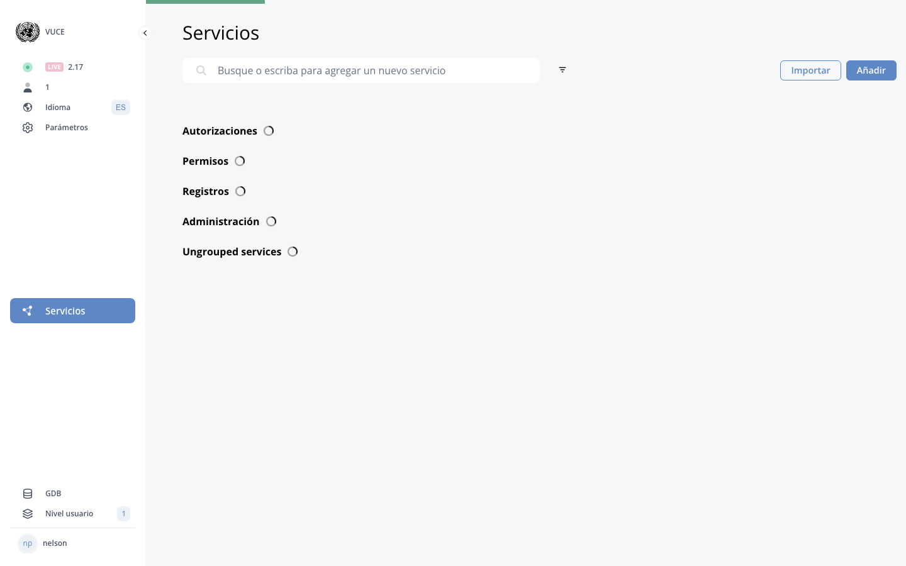

# Introduction

!!! info "Update Summary (1 changes detected)"
    The introduction remains largely accurate.
    The core description of eRegistrations as a no-code platform and the basic applicant-operator-certificate flow are unchanged.
    The terminology (public site, DS, BPA) is still current.
    Minor additions could mention newer capabilities (e-signature, advanced workflows) but the introduction is intentionally high-level and does not require significant revision.

<!-- Live BPA Screenshot: live-introduction -->

{ loading=lazy }
*Current BPA view (2026-02-15) — [Introduction](https://bpa.cuba.eregistrations.org/services){ target=_blank }*

<!-- /Live BPA Screenshot: live-introduction -->

## Manual purpose statement

The purpose of this user manual is to provide an overview of the main functions and features of the eRegistrations system and to explain how to create online services.

---

## No-code platform description

eRegistrations is a no-code development platform allowing to create online services without programming.

---

## Online service flow description

An online service is a succession of online screens and actions through which:
- an applicant can fill a form, upload documents, pay and send his request (application file)
- one or more operators can review the file and approve or reject an application (processing)
- The applicant data is sent to an online registry
- A registration certificate is issued

---

## Public site and administrative site terminology

Online services are visible on the 'public site', also called 'user site' or 'DS' (Display System). They are created through an 'administrative site', also called 'BPA' (Business Process Analyzer).

---

## Potential mention of newer platform capabilities

!!! question "Needs Verification"
    The introduction does not mention e-signature, advanced workflow capabilities, or other features added since July 2025. Since the introduction is meant to be a high-level overview, it may be acceptable as-is, but a subject matter expert should confirm whether any new top-level capabilities warrant mention here.

The introduction may benefit from a brief mention of newer platform capabilities such as e-signature support, advanced workflow features, or other significant additions made after July 2025. However, since the introduction is intentionally high-level, this should be verified with stakeholders before adding.

---
