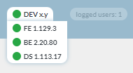
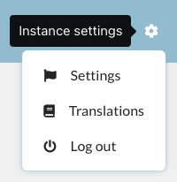
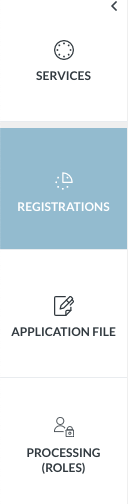
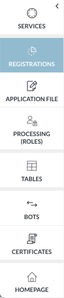
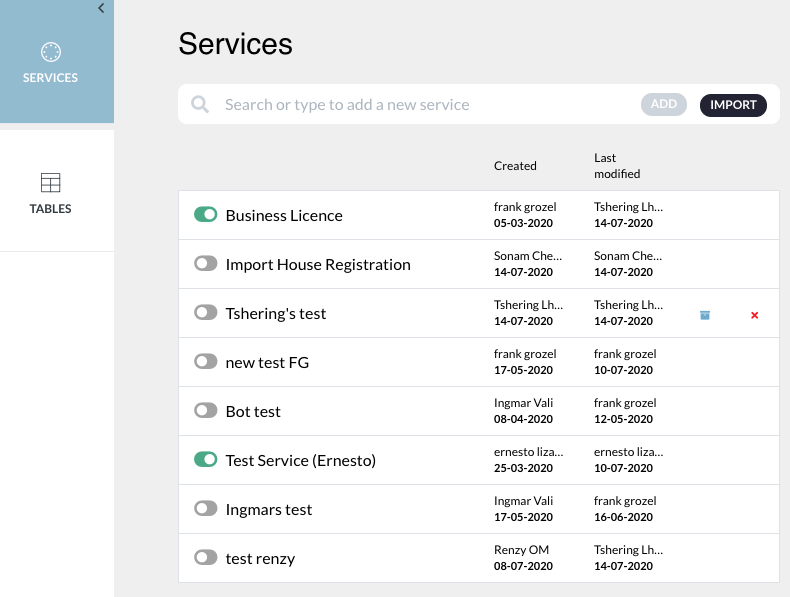

# A. Description of the entry page

??? example "Original Manual Screenshots"
    { loading=lazy }

    { loading=lazy }

    { loading=lazy }

    { loading=lazy }

    { loading=lazy }

    { loading=lazy }

    { loading=lazy }

    { loading=lazy }

{ loading=lazy }
*Current BPA view — A. Entry Page*

## BPA entry page structure - 3 sections

*The BPA entry page showing the three main sections: header/instance bar (top), side menu (left), and workspace (center).*

The BPA entry page has 3 main sections:
- 'Header' also called 'instance bar' (the blue bar at the top)
- Side menu (on the left)
- Work space (in grey)

---

## Instance bar - UNCTAD logo and FE/BE/DS buttons

It consists sequentially of:
- UNCTAD and eRegistrations logo
- 3 buttons FE (front end), BE (back end) and DS (display system). When they are red, it means the corresponding component is getting updated. We can work on the system only when all buttons are green. When you put the cursor over the components name you will see the version number currently running. Versioning is made according to semantic versioning rules.

---

## Instance bar - Logged users and auto-update toggle

'Logged users' show the number of administrators logged into BPA at that moment.
When the toggle is switched on, new feature/bug fixes are allowed to come automatically to the applications in the system.

---

## Instance bar - User level toggle

User level 1 and 2 is a toggle button that minimizes and expands display of elements on the side menu bar.

---

## Instance bar - User ID, language, settings

- User ID of the administrator logged in
- Choice of language
- Instance settings icon: 1. Settings that will apply to all services, 2. Translations icon, 3. Log-out icon

---

## Instance bar - potential additional elements

The instance bar may contain additional elements not present in the July 2025 manual, such as notification indicators, environment labels (dev/staging/production), or audit/history shortcuts.

---

## Side menu - User level 2 items

User level 2: Displays more elements, including Tables, Certificate builder, Print Documents, Notifications, and Messages. Print Documents allows creating and managing document templates for certificates and other outputs. Notifications enables configuration of system notifications. Messages allows managing message templates.

---

## Side menu - User level 1

User level 1: Displays only a limited number of elements on the left side menu.

---

## Work space

This is the gray area which displays the contents of the elements on the side bar, and where services are built.

---
