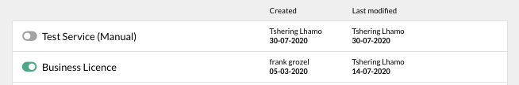

# B. Services

??? example "Original Manual Screenshots"
    { loading=lazy }

    { loading=lazy }

    { loading=lazy }

    { loading=lazy }

    { loading=lazy }

    { loading=lazy }

    { loading=lazy }

    { loading=lazy }

    { loading=lazy }

{ loading=lazy }
*Current BPA view — B. Services*

*The Services page showing grouped services with Import and Add buttons, version numbers, and publish dates.*

## Definition of Service

A service is a succession of screens allowing the applicant to obtain one or more registrations.

---

## Definition of Registration

A registration is any authorization (certificate, permit, clearance, document) issued by a government agency that an applicant wants to obtain.

---

## 1. Create a service

A new service can be created by clicking on the 'Add' button. Additionally, services can be imported from another instance or copied from an existing service within the same instance using the 'Import' or 'Copy' functionality. Then a slider opens, where you can type the name of the service and click save.

---

## Service activation toggle

To activate the service, click on the toggle next to the service name. Green indicates that the service is active. Inactive services will not be available on the public interface.

---

## Archive/Unarchive service

An inactive service can be archived in the system by clicking on the archive button. Archived services can be restored by clicking on 'archived services' and clicking on the unarchive button.

---

## Remove service

A service can be removed from the system by clicking on the cross.

---

## Post-creation note

Once a service has been created, one or more registrations must be created and assigned to the service.

---

## 2. The Service bar

This is the service bar, just below the instance (blue) bar. This appears when you click on a service from the list of services in the work space.

The service bar consists of:
- The name of the service, that can be edited by clicking on the edit button next to it
- The 'preview service' button: this displays the application file as seen from the user interface
- The 'publish service' button: when a service is published, it becomes available on the public interface. Every time a change is made in the BPA that needs to be reflected on the public interface (DS), the service has to be (re)published. The publish flow now supports micro-publish, which allows publishing only specific changes rather than the entire service.
- The 'see service' button: This opens the service in the public interface (DS), in a new tab
- Service settings icon

---

## Micro-publish details

Micro-publish is a feature that allows publishing only specific parts of a service (e.g., form changes, role configuration changes) rather than republishing the entire service. This can speed up the publish process and reduce risk of unintended changes being published.

---

## Service Groups

Services can be organized into groups for better management. When there are many services in an instance, groups help categorize and organize them. Groups appear in the services list view and can be collapsed or expanded.

---

## Import/Copy Service

Services can be imported from other eRegistrations instances or copied within the same instance. Import allows replicating a complete service configuration (forms, roles, BOTs, certificates) from one instance to another. Copy creates a duplicate of an existing service within the same instance.

---

## SmartLink

SmartLink is a feature that allows creating links between services, enabling data sharing and workflow coordination across multiple services.

---
