# C. Registration(s)

??? example "Original Manual Screenshots"
    { loading=lazy }

    { loading=lazy }

    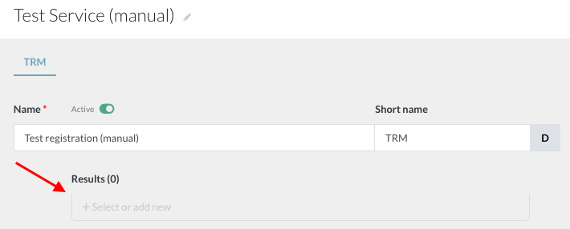{ loading=lazy }

    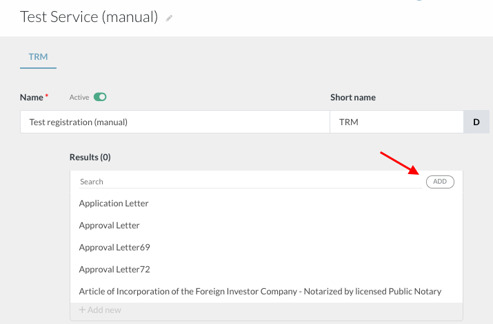{ loading=lazy }

    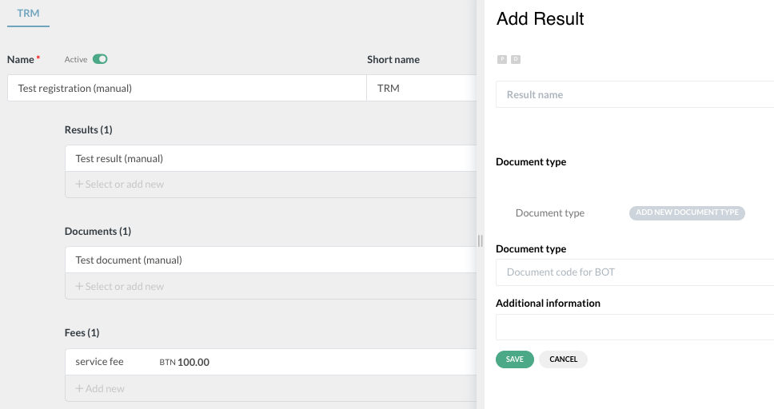{ loading=lazy }

    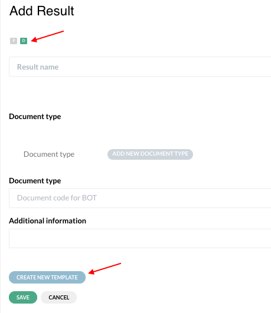{ loading=lazy }

    { loading=lazy }

    { loading=lazy }

    { loading=lazy }

    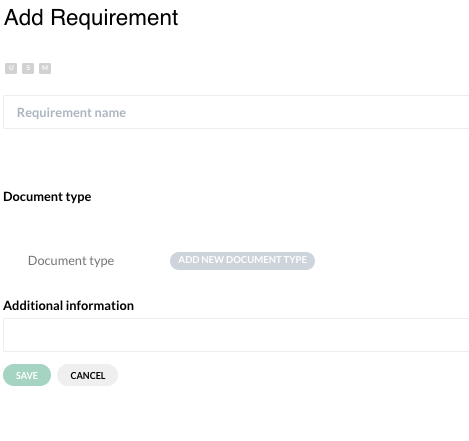{ loading=lazy }

    { loading=lazy }

    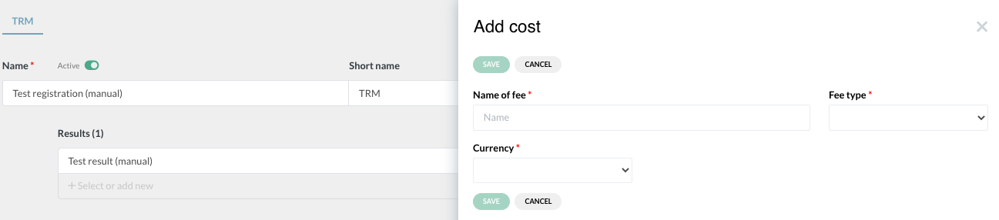{ loading=lazy }

    { loading=lazy }

    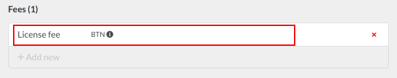{ loading=lazy }

    { loading=lazy }

    { loading=lazy }

    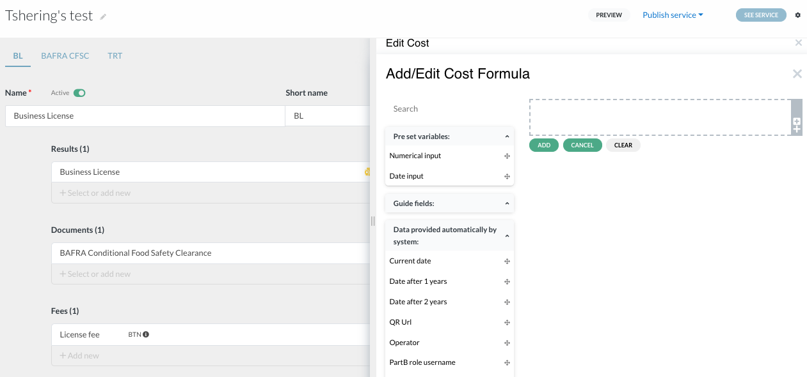{ loading=lazy }

    { loading=lazy }

    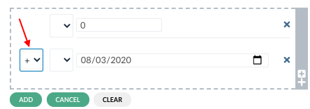{ loading=lazy }

    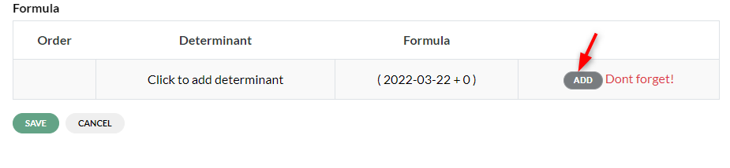{ loading=lazy }

    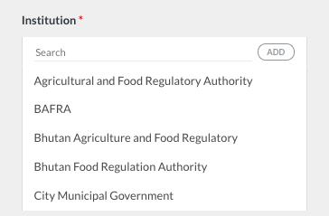{ loading=lazy }

    { loading=lazy }

    { loading=lazy }

    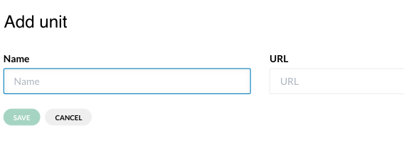{ loading=lazy }

    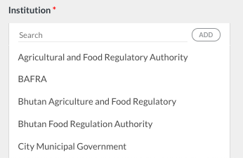{ loading=lazy }

    { loading=lazy }

    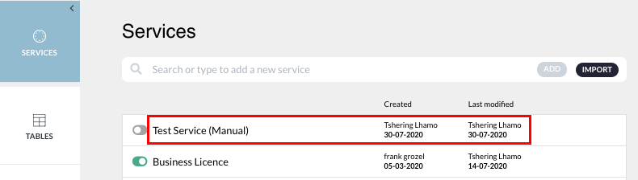{ loading=lazy }

    { loading=lazy }

    { loading=lazy }

    { loading=lazy }

    { loading=lazy }

{ loading=lazy }
*Current BPA view — C. Registrations*

## Registration definition

Registrations are at the core of the eRegistrations system. A registration is any type of authorization (license, permit, registration number, clearance, certificate, etc.) issued by a government institution, for which an applicant will usually need to provide data, documents and fee.

---

## 1. Create a registration

Click on 'add' button. A slider opens. Enter registration name, enter short name (proposed automatically, modifiable). Create. A registration is defined by: a. Name, b. Result, c. Data required, d. Documents required, e. Fees, f. Institution in charge. The 'Registrations' menu tab defines all elements except 'data required' (defined in application file tab). Fields marked with red asterisk are required.

---

## Result (Physical/Digital)

Click on '+ Select or add new' under Results. Click 'add'. A slider opens. Enter result name (required), choose physical ('P') or digital ('D'). Save. Digital result allows building a certificate template. Existing results can be selected from dropdown.

---

## Documents (U/S/M)

Click on '+ Select or add new' under Documents. Click 'add'. A slider opens. Enter document name, choose expectation: 'U' (must be uploaded), 'S' (must be shown at front desk), 'M' (must be signed at collection). Save. Existing documents can be selected from dropdown.

---

## Fees (Fixed/Formula)

Click on '+ Add new' under Fees. Fixed fees: enter name, select 'fixed fee' under Fee Type, select currency, enter value, save. Formula fees: select 'Formula' in fee type, save, click on fee to open, click 'click to add formula', drag and drop variables from left side, select arithmetic symbol, add.

---

## Institution and Units

Click on '+ Select or add new' under Institutions. Click 'add'. A slider opens. Enter institution name, enter URL, save. Add units by clicking 'Add new' under Involved Unit. Existing institutions can be selected from dropdown. Registrations displayed across top menu by short names.

---

## 2. Add registration(s) to a service

Click on service name. Click 'Add'. A slider opens. Enter registration name, click 'Create'. Define result, documents, fees, institution. To add existing registration, click 'add to service' from 'all registrations' list.

---

## Registration activation

Registrations can be activated or deactivated independently from the service. This allows analysts to temporarily disable a registration without removing it from the service configuration.

---

## Document requirement global management

Document requirements can be managed at two levels: globally (reusable document type definitions shared across services) and at the registration level (specific requirements linked to a particular registration). This two-level system allows administrators to maintain a centralized catalog of document types while letting each registration specify which documents are required.

---

## Formula fee enhancements

The formula fee builder may have been enhanced with additional functions or a more capable formula editor.

---
