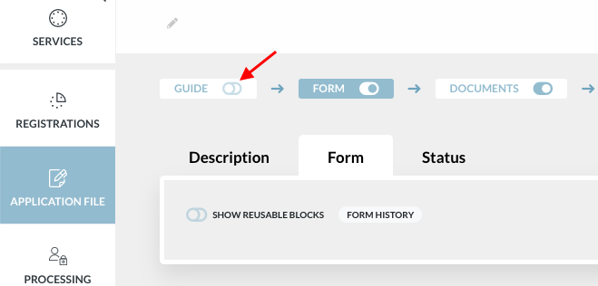
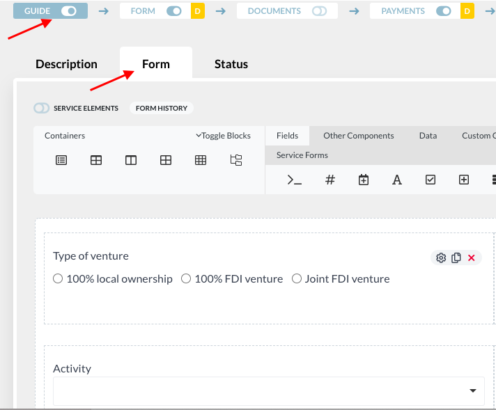
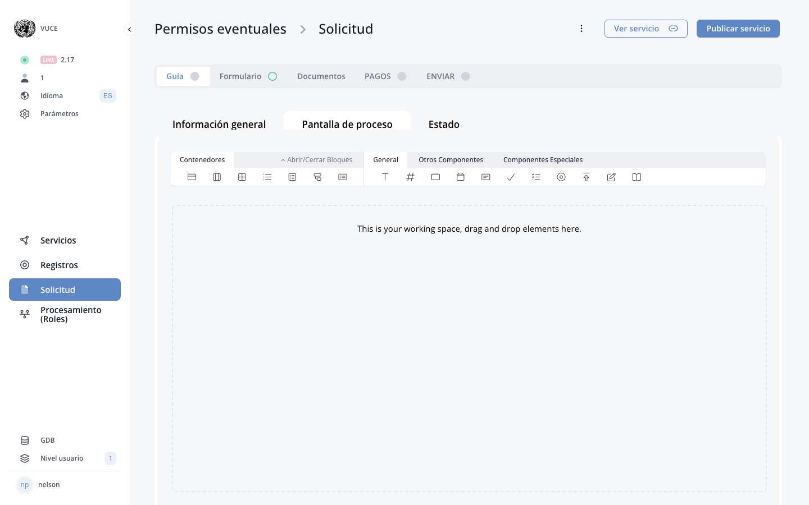

# D.1. The Guide

<!-- PDF Screenshots -->
??? example "Original Manual Screenshots"
    { loading=lazy }

    { loading=lazy }

!!! info "Update Summary (2 changes detected)"
    2 changes detected: Guide core functionality (Description, Form, Status, toggle) is unchanged.
    Shopping cart alternative may have evolved.
    The form_get API confirms guide as a distinct form_type, validating its continued existence as a separate entity.

<!-- Live BPA Screenshot: live-guide -->

{ loading=lazy }
*Current BPA view (2026-02-15) — [D.1. The Guide](https://bpa.cuba.eregistrations.org/services/2c918084887c7a8f01887c99ed2a6fd5/forms/guide-form){ target=_blank }*

<!-- /Live BPA Screenshot: live-guide -->

## Guide purpose

Questions can be created in the guide to help determine, for each specific user, which documents, fees and data are required.

---

## Guide three elements

The guide is defined by three elements: Description (name of the guide question), Form (where guide questions are developed and linked to the requirements and/or application form using determinants), Status.

<!-- Verify screenshot: Guide tabs showing Description, Form, Status -- verify visual appearance. -->

---

## Guide toggle activation

If your service has a Guide, activate the guide toggle.

<!-- Verify screenshot: Guide toggle -- verify visual appearance. -->

---

## Creating guide questions

To create a question in the Guide, click on the 'Guide' tab in the Application File. Under the 'Form' tab, create questions using the form components that will filter the data, requirements and fees for specific users' case.

<!-- Verify screenshot: Guide Form tab with form builder -- verify visual appearance. -->

---

## Shopping cart alternative

!!! question "Needs Verification — [Verify in BPA](https://bpa.cuba.eregistrations.org/services/2c918084887c7a8f01887c99ed2a6fd5/forms/guide-form){ target=_blank }"
    The shopping cart is mentioned briefly in the original manual as an alternative to the guide. Given the platform's evolution, the shopping cart may have gained additional capabilities. The service settings reference 'Shopping cart' as a configurable option. However, the exact current state of shopping cart features cannot be confirmed without live system inspection.

Alternative to the guide: the shopping cart. The shopping cart allows applicants to select registrations directly rather than answering filtering questions. It may have been enhanced with additional features such as registration previews, cost summaries, or document requirement displays.

<!-- Verify screenshot: Shopping cart interface -- verify current appearance and any new features. -->

---

## Potential new guide features

!!! question "Needs Verification — [Verify in BPA](https://bpa.cuba.eregistrations.org/services/2c918084887c7a8f01887c99ed2a6fd5/forms/guide-form){ target=_blank }"
    The componentbehaviour tools in the API suggest a more sophisticated system for controlling component behavior based on determinants. This effects system may apply to guide components, potentially offering more advanced conditional logic than what was documented in the original manual. This needs verification.

The guide may have gained new capabilities such as conditional branching improvements, integration with the effects/behaviours system for dynamic form behavior, or enhanced determinant support. The component behaviours system (visible in the API) may apply to guide components.

---
