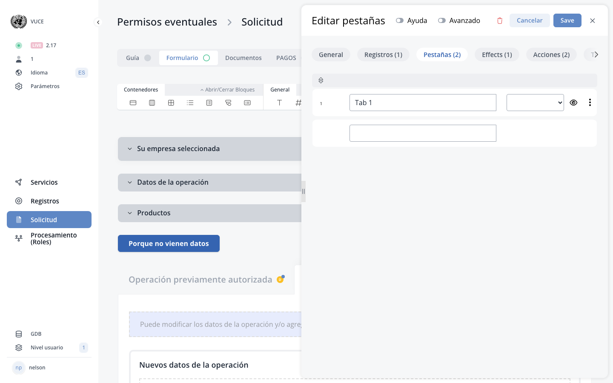

# D.2. Determinants

??? example "Original Manual Screenshots"
    { loading=lazy }

    { loading=lazy }

    { loading=lazy }

    { loading=lazy }

    { loading=lazy }

    { loading=lazy }

{ loading=lazy }
*Current BPA view — D.2. Determinants*
*Click the "D" icon on any form component to open the determinants panel*

## Determinant definition

A determinant is a filter allowing to take into account the particular case of each applicant in a service. It determines/triggers: if an applicant is subject to a registration and/or what requirements the applicant must provide to register (data, documents, fees).

---

## 2.1. Determinants of the registration

For each registration, an analyst must be able to report/input in the rule engine, in clear language, rules defining who/what are the subjects of the registration. Options: 1) The registration is mandatory to all, 2) The registration is mandatory to specific subjects, 3) The registration is optional to all, 4) The registration is optional to specific subjects. Specific subjects can be defined through determinants or a combination of determinants combined by 'AND' and 'OR' operators.

---

## 2.2. Determinants of the requirements - role and purpose

Determinants play a very important role in the application file. They allow to show or hide specific parts of the application form to adapt the form to the particular situation of each applicant. Determinants can be created on the basis of fields/questions in the Guide or in the form and can be applied to any field/block.

---

## Creating a determinant - determinant types

To create a determinant on a block, click on the edit button (gear icon). A slider will open. Click on the Determinant tab, Add. Insert name of determinant, choose the determinant type. The platform supports the following determinant types:

### 1. Text determinant

Evaluates text field values. Operators: `EQUAL`, `NOT_EQUAL`, `CONTAINS`, `STARTS_WITH`, `ENDS_WITH`. Can be used with an empty value to check if a field is empty/not empty.

### 2. Select / Radio determinant

Evaluates select, dropdown, or radio button field values. Operators: `EQUAL`, `NOT_EQUAL`.

### 3. Numeric determinant

Evaluates number field values. Operators: `EQUAL`, `NOT_EQUAL`, `GREATER_THAN`, `LESS_THAN`, `GREATER_THAN_OR_EQUAL`, `LESS_THAN_OR_EQUAL`.

### 4. Boolean determinant

Evaluates checkbox/toggle values. Checks if a boolean field is `True` or `False`.

### 5. Date determinant

Evaluates date/time field values. Can check for specific dates or empty dates.

**Special case — Empty date field**: Create a determinant with a selected date time field with predicate `=` or `!=` without selecting any date. This allows checking whether a date has been filled in or left empty.

### 6. Classification determinant

Evaluates catalog/classification field values. Operators: `EQUAL`, `NOT_EQUAL`. Supports multi-select evaluation with subject modes: `ALL`, `ANY`, `NONE`.

### 7. Grid determinant

Evaluates grid component values. Used with edit grids or data grids to create conditions based on repeatable row data.

---

## Applying determinants via drag and drop

Once created, select and drop the determinant on the right panel under selected determinants, select the behavior of the component (show/hide when determinant condition is true), General Save.

---

## D indicator in orange

If the field configuration has a determinant, it will be indicated by the letter **D** in orange color. If there is more than one determinant, the icon will have a dot in the top right corner. Click the D icon to view and edit the determinant conditions for that component.

---

## Effects and component behaviours system

The platform includes a component behaviours and effects system that extends determinant capabilities beyond simple show/hide. Component behaviours allow configuring multiple effects on a component, each driven by one or more determinants. Effects can control properties such as visibility, required status, disabled state, and other component attributes. This provides more granular control than the original show/hide mechanism.

See [Effects System](../part5-new-features/01-effects-system.md) for detailed documentation.

---

---

**See also:** [Effects System](../part5-new-features/01-effects-system.md) · [Applicant Form](07-applicant-form.md) · [Guide](05-guide.md)
