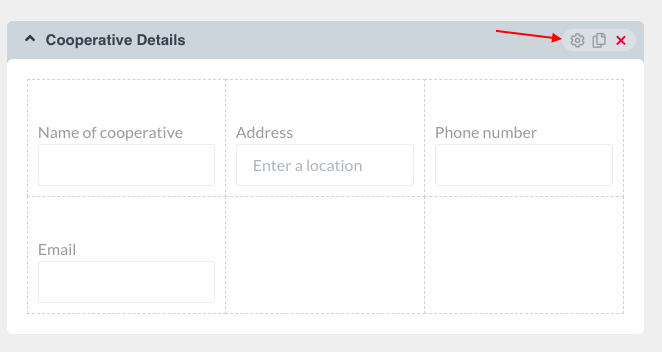
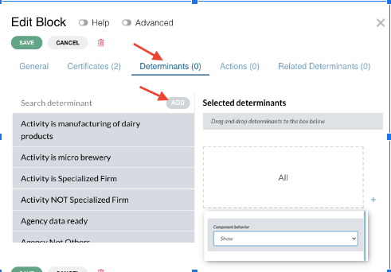

# D.2. Determinants

<!-- PDF Screenshots -->
??? example "Original Manual Screenshots"
    { loading=lazy }

    { loading=lazy }

    { loading=lazy }

    { loading=lazy }

    { loading=lazy }

    { loading=lazy }

!!! info "Update Summary (6 changes detected)"
    6 changes detected: The determinant type system has been significantly expanded.
    The original manual describes determinants generically ('Determinant based on field value').
    The API now reveals 7 distinct typed determinants: text, select, numeric, boolean, date, classification, and grid.
    Classification determinants are entirely new (support ALL/ANY/NONE subjects for multi-select evaluation).
    Grid determinants are new.
    The effects/behaviours system adds a new layer of component-determinant interaction beyond simple show/hide.
    Operators have been expanded (CONTAINS, STARTS_WITH, ENDS_WITH for text; GREATER_THAN, LESS_THAN comparisons for numeric).

## Determinant definition

A determinant is a filter allowing to take into account the particular case of each applicant in a service. It determines/triggers: if an applicant is subject to a registration and/or what requirements the applicant must provide to register (data, documents, fees).

---

## 2.1. Determinants of the registration

For each registration, an analyst must be able to report/input in the rule engine, in clear language, rules defining who/what are the subjects of the registration. Options: 1) The registration is mandatory to all, 2) The registration is mandatory to specific subjects, 3) The registration is optional to all, 4) The registration is optional to specific subjects. Specific subjects can be defined through determinants or a combination of determinants combined by 'AND' and 'OR' operators.

<!-- Verify screenshot: Registration determinant options panel -- verify visual appearance. -->

---

## 2.2. Determinants of the requirements - role and purpose

Determinants play a very important role in the application file. They allow to show or hide specific parts of the application form to adapt the form to the particular situation of each applicant. Determinants can be created on the basis of fields/questions in the Guide or in the form and can be applied to any field/block.

---

## Creating a determinant - determinant types

!!! warning "Modified"
    The original manual described a single generic determinant type ('Determinant based on field value'). The current API reveals 7 distinct typed determinants, each with specific operators and configuration options. This is a significant expansion. The API tools explicitly show: textdeterminant_create (with EQUAL, NOT_EQUAL, CONTAINS, STARTS_WITH, ENDS_WITH operators), selectdeterminant_create (EQUAL, NOT_EQUAL), numericdeterminant_create (EQUAL, NOT_EQUAL, GREATER_THAN, LESS_THAN, GREATER_THAN_OR_EQUAL, LESS_THAN_OR_EQUAL), booleandeterminant_create (True/False), datedeterminant_create, classificationdeterminant_create (EQUAL, NOT_EQUAL with ALL/ANY/NONE subjects), and griddeterminant_create. The creation workflow (gear icon, Determinant tab, Add) is likely the same, but the type selection now shows these specific options.

To create a determinant on a block, click on the edit button (gear icon). A slider will open. Click on the Determinant tab, Add. Insert name of determinant, choose the determinant type. The platform supports the following determinant types:

1. **Text determinant**: Evaluates text field values. Operators: EQUAL, NOT_EQUAL, CONTAINS, STARTS_WITH, ENDS_WITH. Can be used with an empty value to check if a field is empty/not empty.
2. **Select determinant**: Evaluates select/dropdown field values. Operators: EQUAL, NOT_EQUAL.
3. **Numeric determinant**: Evaluates number field values. Operators: EQUAL, NOT_EQUAL, GREATER_THAN, LESS_THAN, GREATER_THAN_OR_EQUAL, LESS_THAN_OR_EQUAL.
4. **Boolean determinant**: Evaluates checkbox/toggle values. Checks if a boolean field is True or False.
5. **Date determinant**: Evaluates date/time field values.
6. **Classification determinant**: Evaluates catalog/classification field values. Operators: EQUAL, NOT_EQUAL. Supports multi-select evaluation with subject modes: ALL, ANY, NONE.
7. **Grid determinant**: Evaluates grid component values.

Select the relevant field, choose the relevant predicate/operator, select value or choose comparison field, save.

??? note "Original manual text"
    To create a determinant on a block, click on the edit button (gear icon). A slider will open. Click on the Determinant tab, Add. Insert name of determinant, choose 'Determinant based on field value' under determinant type, select the relevant field, choose the relevant predicate, select value or choose comparison field, save.

<!-- Screenshot needed: Determinant creation form showing the expanded type dropdown with all 7 determinant types. Also show the operator options for each type. -->
*Screenshot: Determinant creation form showing the expanded type dropdown with all 7 determinant types. Also show the operator options for each type.*

---

## Classification determinant (new type)

!!! success "New Feature"
    Classification determinants are entirely new. The classificationdeterminant_create API tool shows parameters: service_id, name, target_form_field_key, classification_field (UUID), operator (EQUAL/NOT_EQUAL), and subject (ALL/ANY/NONE). This type bridges the determinant system with the classification catalog system, enabling powerful multi-select conditional logic that was not possible with the original generic determinant approach.

Classification determinants are a new determinant type that evaluates catalog/classification field values. They support:
- A classification_field parameter (catalog field UUID) to specify which catalog to evaluate against
- Operators: EQUAL, NOT_EQUAL
- Subject modes for multi-select evaluation: ALL (all selected values must match), ANY (at least one selected value must match), NONE (no selected value should match)

This is particularly useful for services where applicants select from classification catalogs (e.g., economic activity codes, product categories) and the form needs to adapt based on the classification chosen.

<!-- Screenshot needed: Classification determinant creation form showing the classification field selection, operator choice, and ALL/ANY/NONE subject selector. -->
*Screenshot: Classification determinant creation form showing the classification field selection, operator choice, and ALL/ANY/NONE subject selector.*

---

## Grid determinant (new type)

!!! success "New Feature"
    The griddeterminant_create API tool confirms grid determinants as a distinct type. The original manual did not mention the ability to create determinants based on grid component values. The exact parameters and configuration options for grid determinants need verification.

Grid determinants allow creating conditions based on values within grid components (edit grids or data grids). This enables conditional logic based on data entered in repeatable grid rows.

<!-- Screenshot needed: Grid determinant creation form showing configuration options. -->
*Screenshot: Grid determinant creation form showing configuration options.*

---

## Applying determinants via drag and drop

Once created, select and drop the determinant on the right panel under selected determinants, select the behavior of the component (show/hide when determinant condition is true), General Save.

<!-- Verify screenshot: Drag and drop determinant application panel -- verify visual appearance. -->

---

## D indicator in orange

If the field configuration has a determinant, it will be indicated by the letter 'D' in orange color. If there is more than one determinant, the icon will have a dot in the top right corner.

<!-- Verify screenshot: D indicator on a component -- verify orange color and dot indicator for multiples. -->

---

## Special case - Empty date field determinant

Special cases of Determinants: Empty date field determinant - create a determinant with a selected date time field with predicate '=' or '!=' without selecting any date.

<!-- Verify screenshot: Empty date determinant configuration -- verify same approach works. -->

---

## Effects and component behaviours system

!!! success "New Feature"
    The componentbehaviour and effect API tools (componentbehaviour_list, componentbehaviour_get, componentbehaviour_get_by_component, effect_create, effect_delete) indicate a sophisticated effects system that extends determinant functionality. This system allows multiple effects per component, each driven by determinant conditions, going beyond the original binary show/hide behavior documented in the manual. The exact UI representation and configuration workflow need verification.

The platform now includes a component behaviours and effects system that extends determinant capabilities beyond simple show/hide. Component behaviours allow configuring multiple effects on a component, each driven by one or more determinants. Effects can control properties such as visibility, required status, disabled state, and other component attributes. This provides more granular control than the original show/hide mechanism.

<!-- Screenshot needed: Component behaviour configuration showing effects, determinant associations, and property controls beyond show/hide. -->
*Screenshot: Component behaviour configuration showing effects, determinant associations, and property controls beyond show/hide.*

---

## Determinant search and reuse capabilities

!!! question "Needs Verification"
    The determinant_search API tool shows search capabilities (name_pattern, determinant_type, operator, target_field_key filters). This suggests the BPA UI may have a determinant search/discovery interface that helps analysts find and reuse existing determinants rather than creating duplicates. The exact UI for this needs verification.

The platform now supports searching and discovering existing determinants within a service, promoting reuse and consistency. Determinants can be searched by name pattern, type, operator, and target field key.

---

## Text determinant condition_logic and json_condition

!!! question "Needs Verification"
    The textdeterminant_create and selectdeterminant_create API tools include optional condition_logic and json_condition parameters. These suggest support for advanced conditional expressions (possibly JSONLogic-based). Whether this is exposed in the BPA UI needs verification.

Text and select determinants support optional condition_logic and json_condition parameters, enabling more complex conditional expressions beyond simple field-value comparisons.

---
