# D.3. Applicant form

<!-- PDF Screenshots -->
??? example "Original Manual Screenshots"
    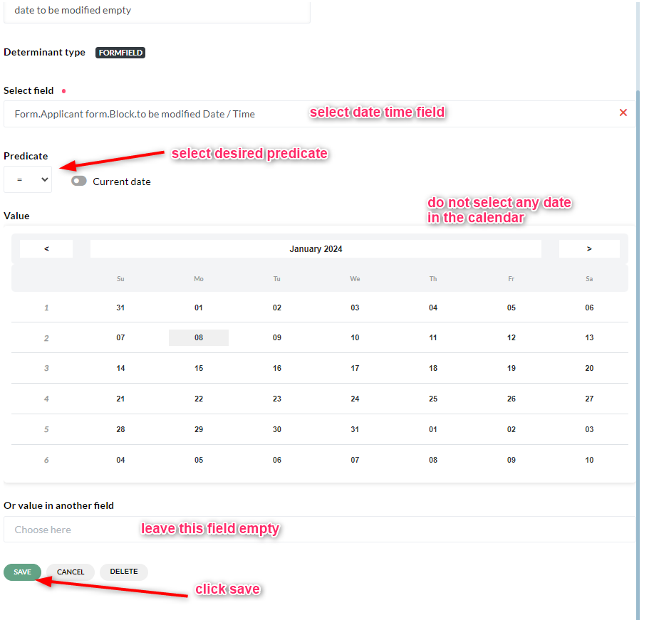{ loading=lazy }

    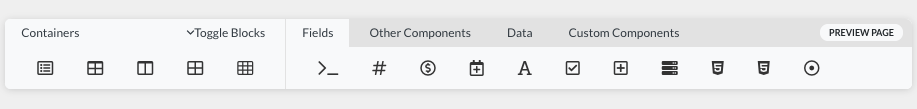{ loading=lazy }

    { loading=lazy }

    { loading=lazy }

    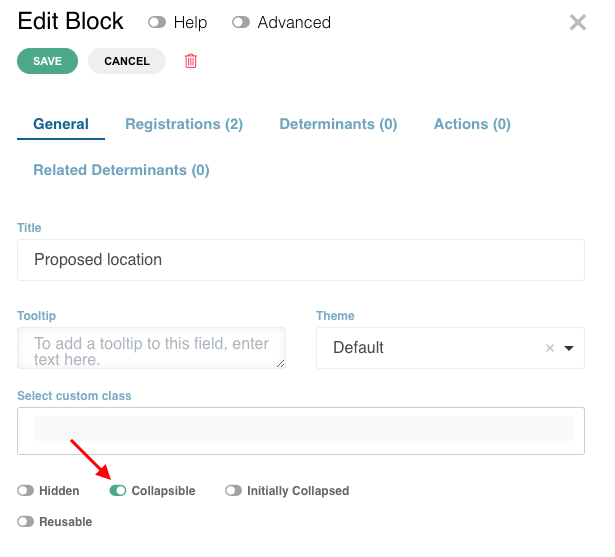{ loading=lazy }

    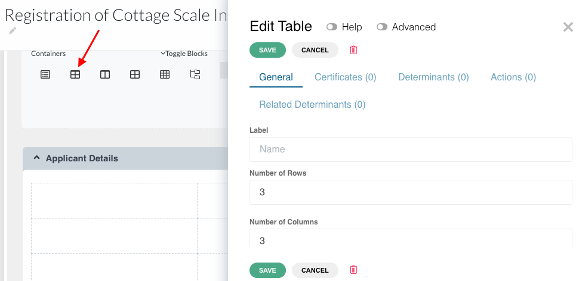{ loading=lazy }

    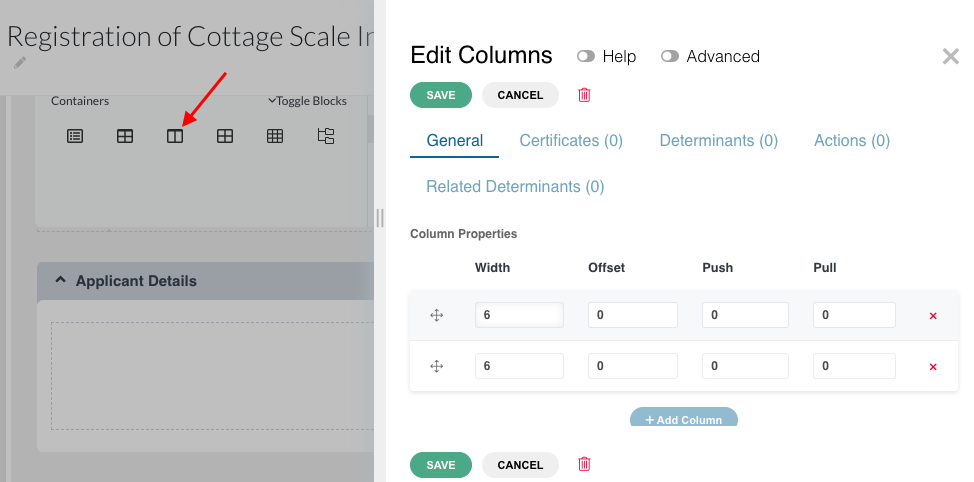{ loading=lazy }

    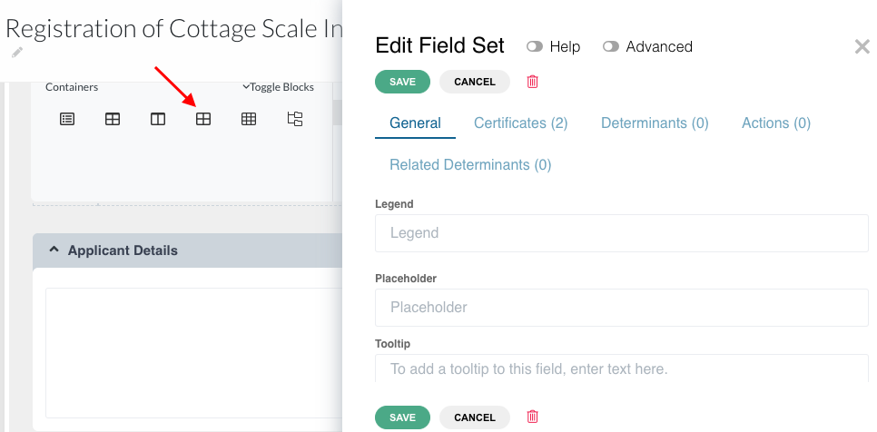{ loading=lazy }

    { loading=lazy }

    { loading=lazy }

    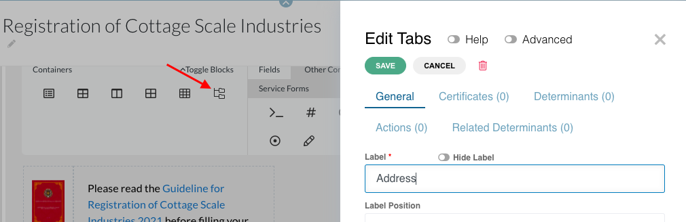{ loading=lazy }

    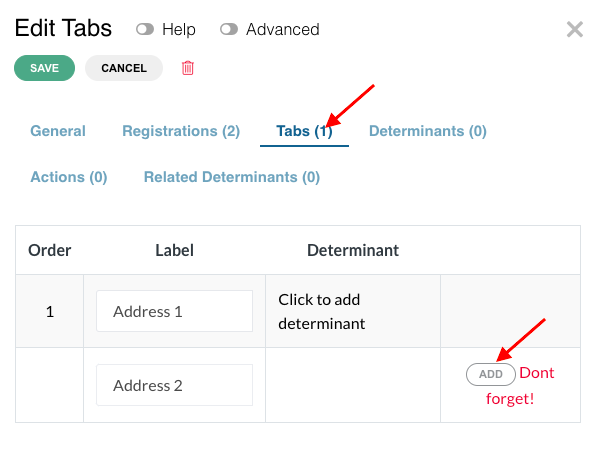{ loading=lazy }

    { loading=lazy }

    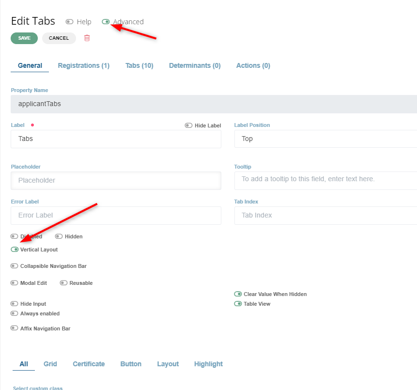{ loading=lazy }

    { loading=lazy }

    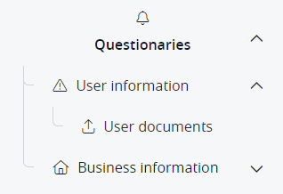{ loading=lazy }

    { loading=lazy }

    { loading=lazy }

    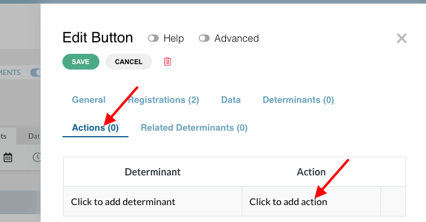{ loading=lazy }

    { loading=lazy }

    { loading=lazy }

    { loading=lazy }

    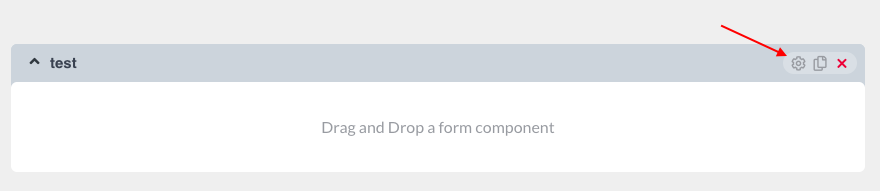{ loading=lazy }

    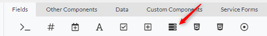{ loading=lazy }

    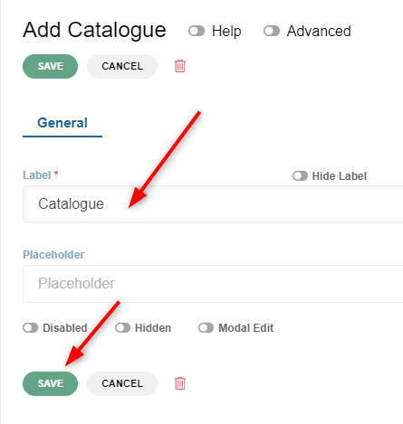{ loading=lazy }

    { loading=lazy }

    { loading=lazy }

    { loading=lazy }

    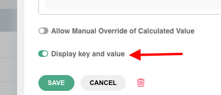{ loading=lazy }

    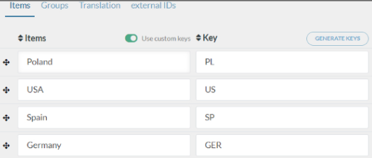{ loading=lazy }

    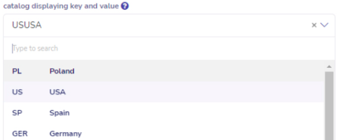{ loading=lazy }

    { loading=lazy }

!!! info "Update Summary (8 changes detected)"
    8 changes detected: Container types (Block, Table, Columns, Field set, Edit grid, Data grid, Tabs) are stable.
    The form builder's drag-and-drop architecture is unchanged.
    New field types may exist (e-signature, card-style radios).
    Collapsible blocks may have enhanced behavior.
    Button actions have a more structured system via component actions API.
    Common properties are largely stable.
    The form_component_add API confirms the same structural paradigm (parent_key, column_index, row_index, cell_index).
    Tabs may have new features.
    The form supports 4 form types (applicant, guide, send_file, payment) confirming the original architecture.

<!-- Live BPA Screenshot: live-applicant-form -->

{ loading=lazy }
*Current BPA view (2026-02-15) — [D.3. Applicant Form](https://bpa.cuba.eregistrations.org/services/2c918084887c7a8f01887c99ed2a6fd5/forms/applicant-form){ target=_blank }*

<!-- /Live BPA Screenshot: live-applicant-form -->

## Form builder overview

This is the section in the application file where the applicant will provide the required data. The form can be developed and customized in any format based on an analysis of the data.

To create a form, drag and drop any type of required field component from the menu bar into the space below it.

<!-- Verify screenshot: Form builder overview -- verify drag and drop interface appearance. -->

---

## Containers - Block

Blocks separate/segregate the different types of information. Blocks are collapsible. If you do not want your blocks to collapse, disable the 'collapsible' toggle under the general tab.

<!-- Verify screenshot: Block container with collapsible toggle -- verify visual appearance. -->

---

## Containers - Block collapsible enhancements

!!! question "Needs Verification — [Verify in BPA](https://bpa.cuba.eregistrations.org/services/2c918084887c7a8f01887c99ed2a6fd5/forms/applicant-form){ target=_blank }"
    The update plan document mentions 'collapsible fields' as a new feature added to the platform. This suggests the collapsible behavior may have been extended beyond blocks to other component types, or blocks may have gained additional collapsible configuration options. This needs verification on a live instance.

Block collapsible behavior may have been enhanced with features such as default collapsed state, animation options, or conditional collapse based on determinants. The MANUAL-UPDATE-PLAN mentions 'collapsible fields' as a new feature.

<!-- Verify screenshot: Block collapsible configuration -- check for any new options beyond the simple toggle. -->

---

## Containers - Table

Table: drag and drop the table component inside the block. Indicate the number of rows and columns.

<!-- Verify screenshot: Table component configuration -- verify visual appearance. -->

---

## Containers - Columns

Columns: will help align the fields. Only up to 12 units are fitted in one row (e.g., 6+6, 4+4+4, 3+3+3+3).

<!-- Verify screenshot: Columns component with 12-unit grid -- verify visual appearance. -->

---

## Containers - Field set

Field set: groups the fields of the same category of data together.

<!-- Verify screenshot: Field set component -- verify visual appearance. -->

---

## Containers - Edit grid

Edit grid: enables replication of the same set of fields within it, and addition of multiple data for the same set of fields. The label can be hidden by activating 'Hide Label' toggle.

<!-- Verify screenshot: Edit grid component -- verify visual appearance. -->

---

## Containers - Data grid

Data grid: very much like an edit grid.

<!-- Verify screenshot: Data grid component -- verify visual appearance. -->

---

## Containers - Tabs

Tabs: can make the form more organized. Can be displayed as a side menu (vertical layout). Structure can be nested.

<!-- Verify screenshot: Tabs component with vertical layout option -- verify visual appearance. -->

---

## Containers - Tabs new features

!!! question "Needs Verification — [Verify in BPA](https://bpa.cuba.eregistrations.org/services/2c918084887c7a8f01887c99ed2a6fd5/forms/applicant-form){ target=_blank }"
    The update plan mentions 'Tabs may have new features'. The effects/behaviours system (componentbehaviour_get_by_component) could enable determinant-driven tab visibility. However, the specific enhancements need verification on a live instance.

Tabs may have gained new features such as conditional tab visibility (driven by determinants), tab validation indicators, or dynamic tab creation. The effects/behaviours system may allow determinant-driven tab control.

---

## Fields - Catalog (dropdown)

Catalog (drop-down menu).

<!-- Verify screenshot: Catalog field -- verify visual appearance. -->

---

## Fields - Sub Catalog

Sub Catalog.

<!-- Verify screenshot: Sub catalog field -- verify visual appearance. -->

---

## Fields - Button with actions

!!! warning "Modified — [Verify in BPA](https://bpa.cuba.eregistrations.org/services/2c918084887c7a8f01887c99ed2a6fd5/forms/applicant-form){ target=_blank }"
    The button action types (event, custom, open link, open service) remain, but the platform has added a structured component actions system. The componentaction_get_by_component, componentaction_save, componentaction_get_system_actions API tools indicate that button actions are now managed through a more formal framework, including system-level predefined actions. The original four action types likely still exist, but the system for assigning and managing actions has been expanded.

Button (various actions: event, custom, open link, open service and data in new tab). The platform now has a structured component actions system. Buttons can have BOT actions assigned through the component actions framework, and system-predefined actions are available. Actions can be viewed and managed per-component.

??? note "Original manual text"
    Button (various actions: event, custom, open link, open service and data in new tab).

<!-- Screenshot needed: Button action configuration showing available action types, including any new system actions and the component actions framework. -->
*Screenshot: Button action configuration showing available action types, including any new system actions and the component actions framework.*

---

## Fields - Card-style radios

!!! success "New Feature"
    The MANUAL-UPDATE-PLAN explicitly mentions 'card-style radios' as a new feature added to the platform. This is a visual enhancement to the radio button field type. The exact configuration (custom class, separate component type, or radio property) needs verification.

Card-style radios are a new radio button presentation style that displays radio options as visual cards rather than traditional radio buttons. This provides a more user-friendly interface for selection-based questions, particularly useful in guides and forms where visual distinction between options improves usability.

<!-- Screenshot needed: Card-style radio buttons showing the card presentation of radio options, and how to configure them. -->
*Screenshot: Card-style radio buttons showing the card presentation of radio options, and how to configure them.*

---

## Fields - E-signature field

!!! question "Needs Verification — [Verify in BPA](https://bpa.cuba.eregistrations.org/services/2c918084887c7a8f01887c99ed2a6fd5/forms/applicant-form){ target=_blank }"
    The MANUAL-UPDATE-PLAN mentions 'e-signature' as a new feature. Whether it manifests as a new field type in the form builder, a custom component, or a separate system needs verification. E-signature is listed alongside other new features like SmartLink and micro-publish.

An e-signature field may have been added as a new field type, allowing applicants to provide electronic signatures within the form. This could be used in the Send File page or other declaration sections.

---

## Common properties - Help toggle

Help toggle (tooltips).

<!-- Verify screenshot: Help toggle -- verify appearance. -->

---

## Common properties - Advanced toggle

Advanced toggle (additional features).

<!-- Verify screenshot: Advanced toggle -- verify appearance. -->

---

## Common properties - standard toggles and options

Hide Label toggle, Placeholder, Tooltip, Prefix and Suffix, Disabled toggle, Hidden toggle, Reusable toggle, Listing value toggle, Allow Spellcheck, Searchable.

<!-- Verify screenshot: Common properties panel -- verify all listed options are still present and check for any new additions. -->

---

## Common properties - potential new properties

!!! question "Needs Verification — [Verify in BPA](https://bpa.cuba.eregistrations.org/services/2c918084887c7a8f01887c99ed2a6fd5/forms/applicant-form){ target=_blank }"
    Given the platform's evolution, new field properties may have been added. The effects system and print document builder suggest properties that may be visible in the field configuration UI. However, without live system inspection, the exact current property list cannot be confirmed.

New common properties may have been added, such as:
- Determinant-aware properties driven by the effects/behaviours system
- Properties related to the print document builder (print visibility, print formatting)
- Properties for inter-service data sharing
- Properties for field-level permissions or restrictions

---
