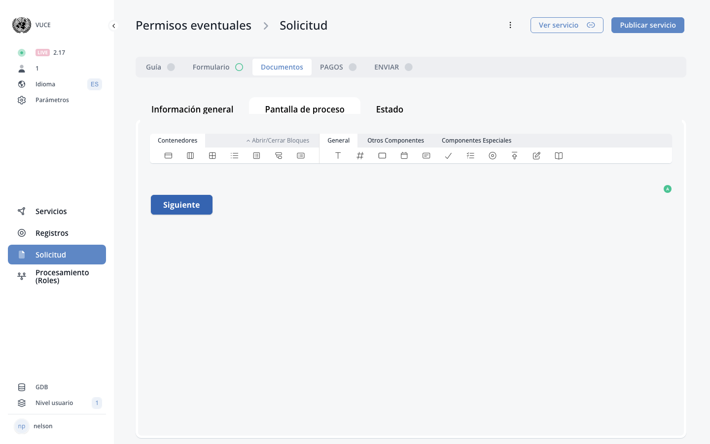

# D.4. Documents

<!-- PDF Screenshots -->
??? example "Original Manual Screenshots"
    { loading=lazy }

    { loading=lazy }

<!-- Live BPA Screenshot: live-documents -->

{ loading=lazy }
*Current BPA view (2026-02-15) — [D.4. Documents](https://bpa.cuba.eregistrations.org/services/2c918084887c7a8f01887c99ed2a6fd5/forms/document-form){ target=_blank }*

<!-- /Live BPA Screenshot: live-documents -->

## Documents tab toggle

The Documents tab can be enabled or disabled for a service. When enabled, it provides a dedicated tab where applicants can see required documents and upload them.

---

## Linking file upload components to required documents

File upload components are linked to required documents through the Data tab. In the Data tab of a file upload component, the Requirement dropdown allows selecting which required document the upload is associated with.

---
