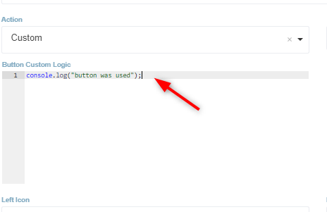
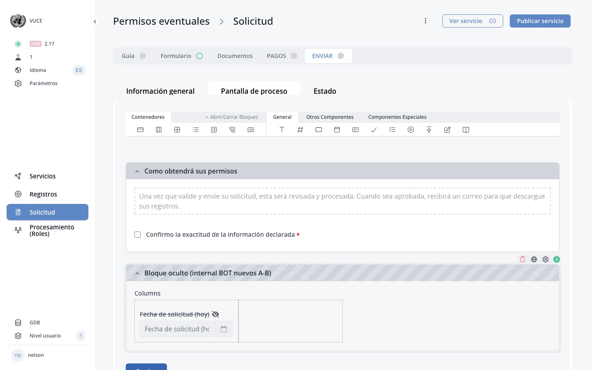

# D.6. Send File

<!-- PDF Screenshots -->
??? example "Original Manual Screenshots"
    { loading=lazy }

    { loading=lazy }

!!! info "Update Summary (2 changes detected)"
    The Send File section has the most significant gap of the sections analyzed.
    The original content correctly describes the declaration and signature page as a customizable form page using the 'I Swear' custom component.
    This base functionality is unchanged.
    However, the e-signature feature is a major addition to the Send page that is entirely absent from the July 2025 manual.
    A new subsection documenting e-signature configuration and behavior on the Send page is needed.

<!-- Live BPA Screenshot: live-send-file -->

{ loading=lazy }
*Current BPA view (2026-02-15) — [D.6. Send File](https://bpa.cuba.eregistrations.org/services/2c918084887c7a8f01887c99ed2a6fd5/forms/sendfile){ target=_blank }*

<!-- /Live BPA Screenshot: live-send-file -->

## Declaration and signature page description

This is the declaration and signature page. It can be developed the same way you develop the form.

---

## I Swear custom component

The declaration can be created using the 'I Swear' component under Custom Components tab.

---

## E-signature feature on Send page

!!! success "New Feature"
    E-signature is a significant new feature added to the eRegistrations platform after the July 2025 manual was written. It directly impacts the Send File page by adding a digital signature step to the declaration and submission process. This is entirely new content that needs to be added to the manual.

The Send page now supports e-signature functionality, allowing applicants to digitally sign their application before submission. This feature must be enabled and configured at the service level. When enabled, a signature component appears on the Send page where applicants can apply their electronic signature to the declaration.

Note: The exact configuration steps, supported signature types, and any prerequisites for enabling e-signature should be documented based on the current platform implementation.

<!-- Screenshot needed: New screenshots needed: (1) The e-signature component on the Send page as seen in the BPA form builder, (2) The e-signature interface as seen by the applicant on the public site, (3) Any e-signature configuration options in the component properties or service settings. -->

---

## E-signature configuration details

!!! question "Needs Verification — [Verify in BPA](https://bpa.cuba.eregistrations.org/services/2c918084887c7a8f01887c99ed2a6fd5/forms/sendfile){ target=_blank }"
    While it is confirmed that e-signature is a new feature affecting the Send page, the exact configuration workflow and available options need to be verified against the live platform by a subject matter expert. This verification is critical to ensure accurate documentation.

The specific configuration steps for e-signature on the Send page need to be documented. This includes: how to enable e-signature for a service, what component or toggle activates it, what signature providers are supported, and what the applicant experience looks like.

---
