# D.7. Focus on some useful functions

<!-- PDF Screenshots -->
??? example "Original Manual Screenshots"
    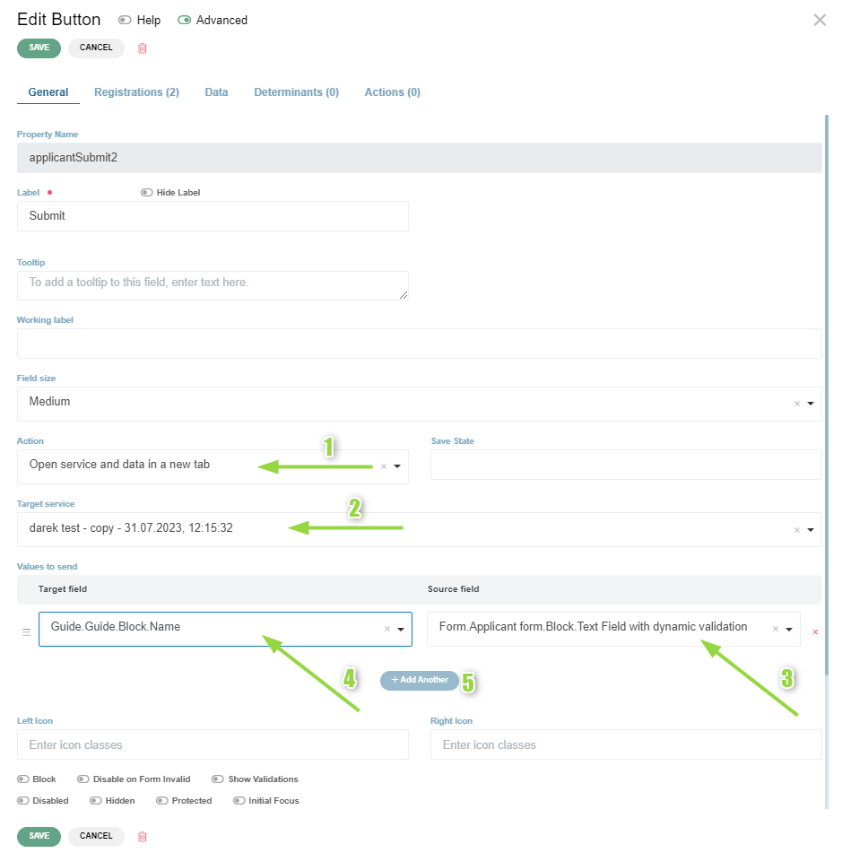{ loading=lazy }

    { loading=lazy }

    { loading=lazy }

    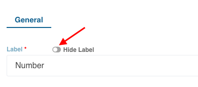{ loading=lazy }

    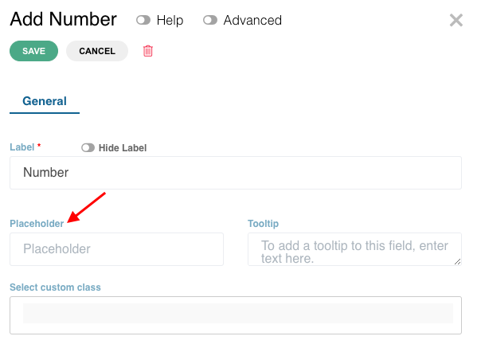{ loading=lazy }

    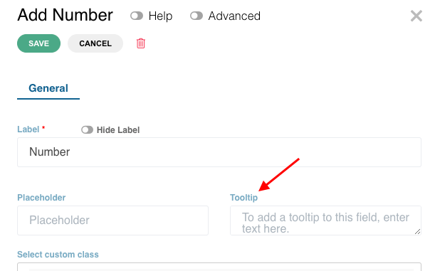{ loading=lazy }

    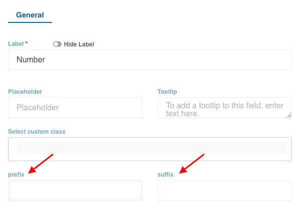{ loading=lazy }

    { loading=lazy }

    { loading=lazy }

    { loading=lazy }

    { loading=lazy }

    { loading=lazy }

    { loading=lazy }

    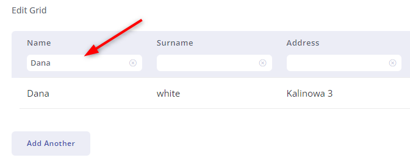{ loading=lazy }

    { loading=lazy }

    { loading=lazy }

    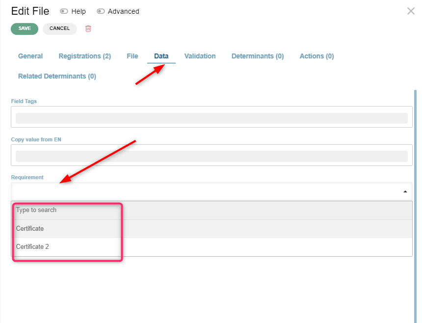{ loading=lazy }

    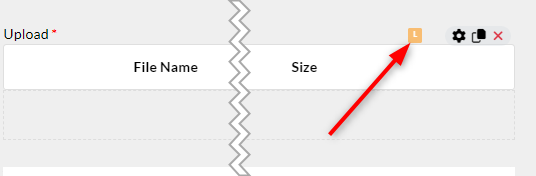{ loading=lazy }

    { loading=lazy }

    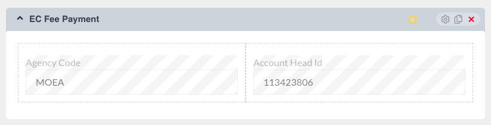{ loading=lazy }

    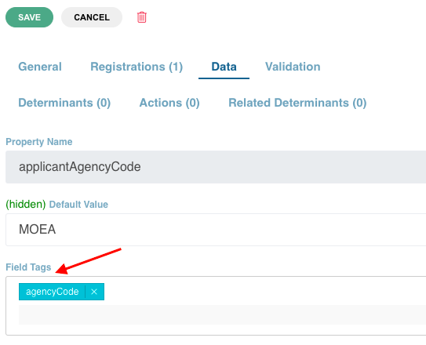{ loading=lazy }

    { loading=lazy }

    { loading=lazy }

    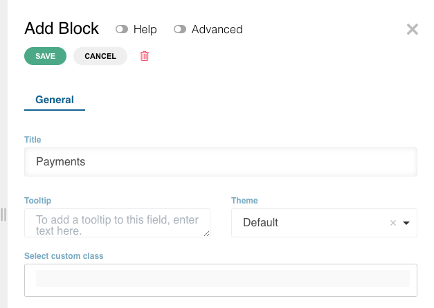{ loading=lazy }

    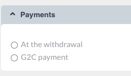{ loading=lazy }

    { loading=lazy }

    { loading=lazy }

    { loading=lazy }

    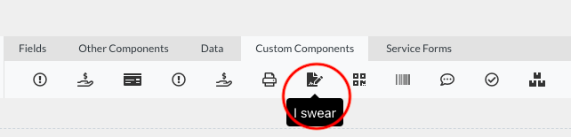{ loading=lazy }

    { loading=lazy }

    { loading=lazy }

    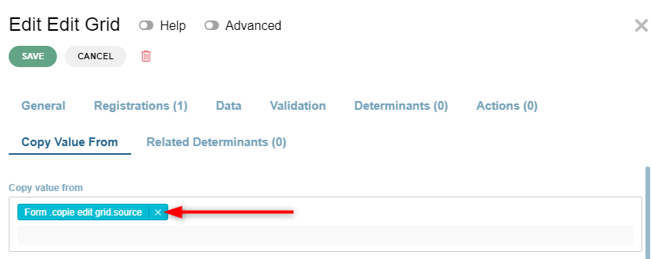{ loading=lazy }

    { loading=lazy }

    { loading=lazy }

    { loading=lazy }

    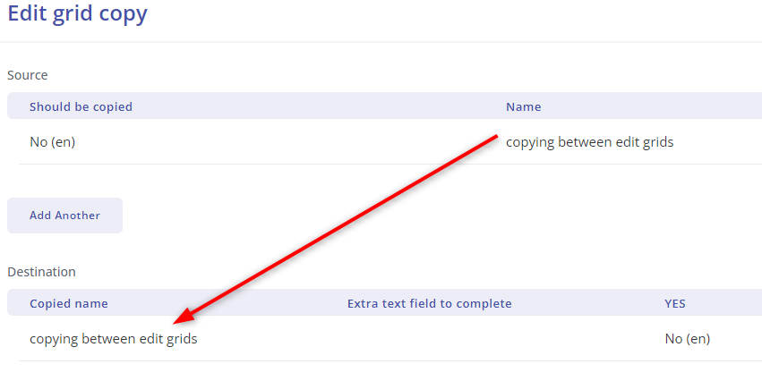{ loading=lazy }

    { loading=lazy }

    { loading=lazy }

    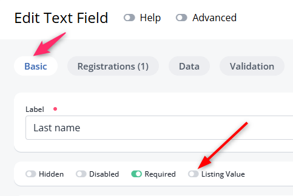{ loading=lazy }

    { loading=lazy }

    { loading=lazy }

    { loading=lazy }

    { loading=lazy }

    { loading=lazy }

    { loading=lazy }

    { loading=lazy }

    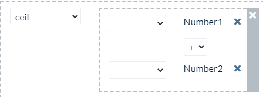{ loading=lazy }

    { loading=lazy }

    { loading=lazy }

    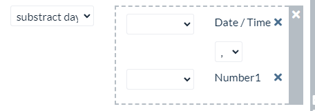{ loading=lazy }

    { loading=lazy }

    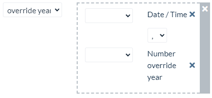{ loading=lazy }

    { loading=lazy }

    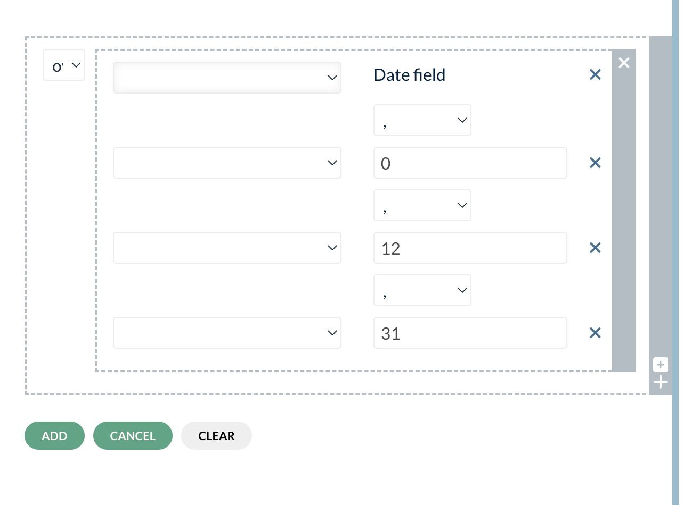{ loading=lazy }

    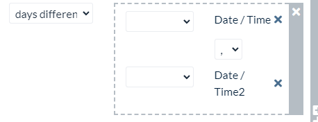{ loading=lazy }

    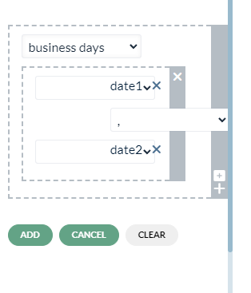{ loading=lazy }

    { loading=lazy }

    { loading=lazy }

    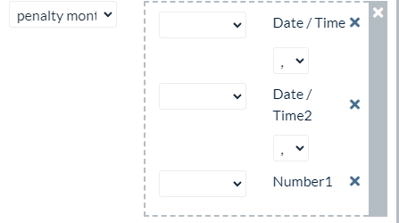{ loading=lazy }

    { loading=lazy }

    { loading=lazy }

    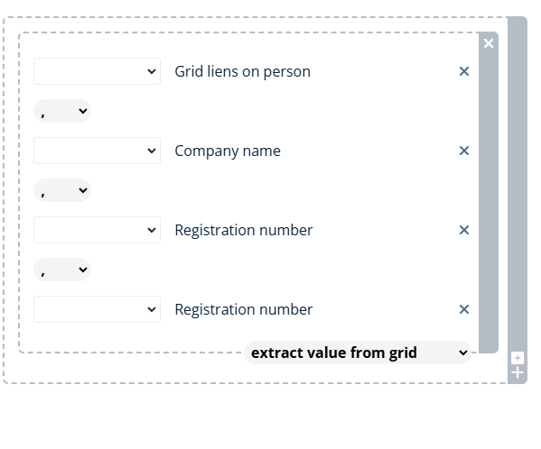{ loading=lazy }

    { loading=lazy }

    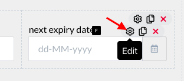{ loading=lazy }

!!! info "Update Summary (5 changes detected)"
    5 changes detected: Copy value (CVF) functionality is stable and unchanged.
    Field tags are stable.
    Formula functions may have expanded beyond the documented list.
    Input mask and blacklist are stable validation features.
    Extract data from documents may have AI-based improvements.
    The component actions system (visible in the API) suggests button actions may have new BOT-related options beyond what was documented.
    The effects system may offer new ways to control field behavior that could be documented as useful functions.

<!-- Live BPA Screenshot: live-useful-functions -->

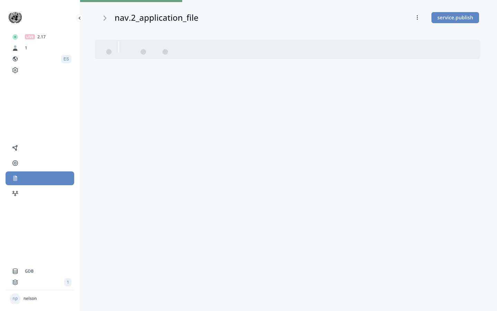{ loading=lazy }
*Current BPA view (2026-02-15) — [D.7. Useful Functions](https://bpa.cuba.eregistrations.org/services/2c918084887c7a8f01887c99ed2a6fd5/templates/messages){ target=_blank }*
*Message templates are configured under Templates > Messages in the BPA*

<!-- /Live BPA Screenshot: live-useful-functions -->

## a. Copy value of a field to another (prefilling a field)

This tool is useful because the applicant does not have to provide the same details repeatedly. To copy value from another field: Edit text field/number field, Data, under 'copy value from', choose the element from the drop down, Save. The order of elements is Name of the page, Block and Field. If the field configuration has the copy value setting, it will be indicated by the letter 'C' in blue color. CVF works only between fields of the same type.

<!-- Verify screenshot: Copy value from dropdown and C indicator -- verify visual appearance is unchanged. -->

---

## b. Copy edit grid values to another edit grid using copy value from

To set it up we need two edit grids - source and destination. In the destination edit grid, specify from which edit grid the data will be copied. You can also use a determinant in the destination edit grid copy value from tab.

<!-- Verify screenshot: Edit grid copy value from configuration -- verify visual appearance. -->

---

## c. Field tags

Field tags are like bookmarks. We can put the same tag to various fields. It is used for concatenation of different fields. Listing-value: enables the name of the company under 'My Applications' on the user dashboard visible.

<!-- Verify screenshot: Field tags dropdown -- verify visual appearance and available tags. -->

---

## c. Field tags - potential new tags

!!! question "Needs Verification — [Verify in BPA](https://bpa.cuba.eregistrations.org/services/2c918084887c7a8f01887c99ed2a6fd5/forms/applicant-form){ target=_blank }"
    The field tags list may have grown as new features were added to the platform. The exact current list of available field tags needs to be verified on a live instance by examining the field tags dropdown.

Additional field tags may have been added since the manual was written. The Payment section references agencyCode and accountHeadId tags. Other system-level tags may exist for integration with new features such as e-signature, classification lookups, or inter-service data sharing.

<!-- Verify screenshot: Complete field tags dropdown showing all currently available tags. -->

---

## d. Use formula with examples - function list

!!! question "Needs Verification — [Verify in BPA](https://bpa.cuba.eregistrations.org/services/2c918084887c7a8f01887c99ed2a6fd5/forms/applicant-form){ target=_blank }"
    The formula builder's function list was comprehensive at the time of writing. However, given the platform's evolution (~9,600 commits), new formula functions may have been added. The exact current list needs to be verified by examining the formula builder's function dropdown on a live instance. Common additions might include string functions, conditional logic functions, or new date/time functions.

Types of functions available in the formula builder: maxValue, round, Ceil, Floor, Roundup hundred/thousands/hundred thousands, Subtract days/months/years, Add days/months/years, Override year, Override date, Days difference, Weeks difference, Months difference, Years difference, Business days, Working hours, Working time, Penalty months, formatDateDD-MM-YYYY, Grid row counter, Extract Value From Grid.

Additional formula functions may have been added since the manual was written. The formula builder is a frequently enhanced component and may include new mathematical, date, or string manipulation functions.

<!-- Verify screenshot: Formula builder function dropdown -- capture complete current list and compare with documented list. -->

---

## d. Formula examples - adding years and date difference

Examples: 1) Adding years to a date using addYears function. 2) Subtracting two dates using daysDifference function.

<!-- Verify screenshot: Formula examples -- verify visual appearance of formula builder. -->

---

## e. Input mask

Used in text field component to auto validate characters. Input mask is under 'Validation' tab under 'Basic validation'. Use '9' for digits, 'A'/'a' for letters, '*' for alphanumeric. Multiple masks can be enabled.

<!-- Verify screenshot: Input mask configuration -- verify visual appearance. -->

---

## f. Blacklist

Used for restricting certain words in a text field. Click on Validation tab, click on Blacklist option. Options: Case sensitive, Exact match, Word match.

<!-- Verify screenshot: Blacklist configuration -- verify visual appearance and options. -->

---

## g. Extract data from documents

!!! question "Needs Verification — [Verify in BPA](https://bpa.cuba.eregistrations.org/services/2c918084887c7a8f01887c99ed2a6fd5/forms/applicant-form){ target=_blank }"
    The document data extraction feature is described at a high level in the manual. Given the platform's evolution and the industry trend toward AI-based document processing, this feature may have been significantly enhanced. However, without live system verification, the exact current state cannot be confirmed. The basic workflow (select document, create model, upload example) likely remains the foundation, but the extraction capabilities may be more advanced.

Used to extract data from documents and putting them automatically onto the form. Under a registration, select the document, open edit modal, create model document, upload an example document. The data extractor lists data available for extraction.

This feature may have been enhanced with AI-based extraction capabilities, improved accuracy, or support for additional document types. OCR and machine learning improvements in the platform may have expanded what can be automatically extracted.

<!-- Verify screenshot: Document data extraction interface -- verify current workflow and any new AI-based features. -->

---

!!! example "Message templates in the Cuba VUCE"
    The platform has **21 email message templates**. Messages are triggered by role status changes.

    **Messages for *Permisos eventuales***:

    | Message | Trigger |
    |---------|---------|
    | **Correcciones requeridas en su solicitud de {{requested-registrations}}** | Solicitud &rarr; SEND BACK TO CORRECTIONS |
    | **Su solicitud de {{requested-registrations}} no ha sido aceptada** | Solicitud &rarr; REJECTED |
    | **Cancelar Permiso Eventual** | Permiso eventual &rarr; CANCELLED |
    | **Permiso eventual aprobado y disponible para descarga** | Permiso eventual &rarr; FILE VALIDATED |
    | **Permiso eventual emitido -- ingrese para completar los datos de ejecucion** | Permiso eventual &rarr; ISSUED |

    **Messages for other services**:

    | Message | Service | Trigger |
    |---------|---------|---------|
    | **Solicitud recibida** | Acreditaciones | On submission |
    | **Su acreditacion en la VUCE esta lista** | Acreditaciones | On validation |
    | **Solicitud aprobada** | Acreditaciones / Autorizaciones | On approval |
    | **Corregir solicitud Permiso Fitosanitario** | Permiso Fitosanitario | Send back for corrections |
    | **Emision de Permiso Fitosanitario** | Permiso Fitosanitario | Issuance notification |
    | **Emitir Permiso Zoosanitario** | Permiso Zoosanitario | Issuance notification |
    | Additional 10 messages | Various services | Correction, rejection, and approval notifications |

    **Template variables**: Messages use placeholders like `{{applicantfullname}}`, `{{applicantusername}}`, `{{requested-registrations}}`, `{{company-name}}`, `{{listing-value}}`, `{{data.field-key}}`, `{{license-url_...}}`, and `{{data.rejection-reasons}}` to personalize content.

    **Message triggers**: Each message is linked to a specific role + status combination (e.g., "Permisos eventuales: Solicitud - FILE VALIDATED", "Permisos eventuales: Revision - SEND BACK TO CORRECTIONS"). All 21 messages use the **EMAIL** channel.

---

## Potential new useful functions

!!! question "Needs Verification — [Verify in BPA](https://bpa.cuba.eregistrations.org/services/2c918084887c7a8f01887c99ed2a6fd5/forms/applicant-form){ target=_blank }"
    The API reveals several systems (component actions, system actions, effects) that may represent new useful functions worth documenting. However, their exact role and whether they belong in this section (vs. other sections) needs verification. Some may be documented elsewhere in the manual or may be platform-internal features not exposed to end users.

The platform may have added new useful functions that are not documented in this section. Potential additions include:
- Component actions system: The API shows component actions (componentaction_get, componentaction_save, componentaction_get_system_actions) suggesting a more structured approach to button and field actions.
- System actions: The componentaction_get_system_actions tool suggests predefined system-level actions available for components.
- Effects system: The effects/behaviours system may offer new ways to dynamically control field properties.
- Print document integration: Direct integration with the print document builder may be a new useful function.

---
