# D.8. Custom classes

<!-- PDF Screenshots -->
??? example "Original Manual Screenshots"
    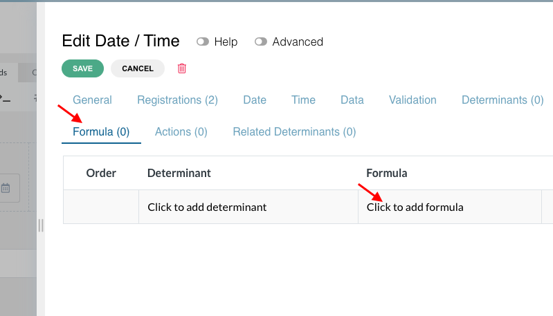{ loading=lazy }

    { loading=lazy }

    { loading=lazy }

    { loading=lazy }

    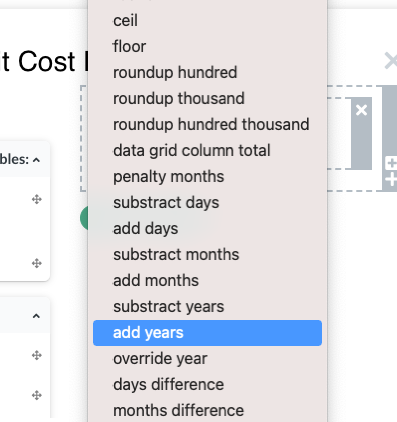{ loading=lazy }

    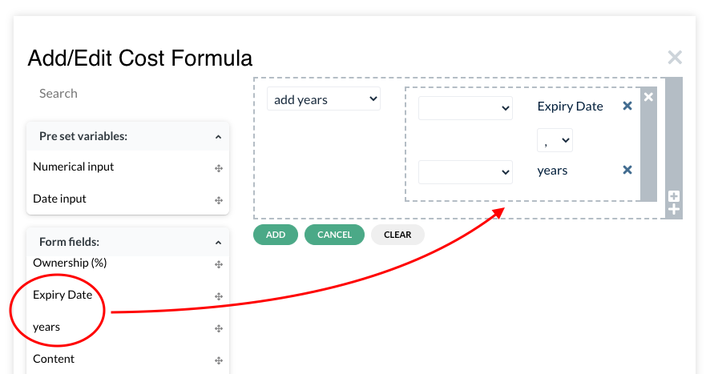{ loading=lazy }

    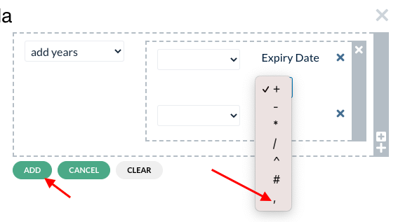{ loading=lazy }

    { loading=lazy }

    { loading=lazy }

    { loading=lazy }

    { loading=lazy }

    { loading=lazy }

    { loading=lazy }

    { loading=lazy }

    { loading=lazy }

    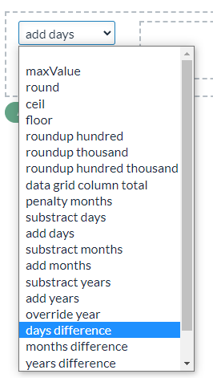{ loading=lazy }

    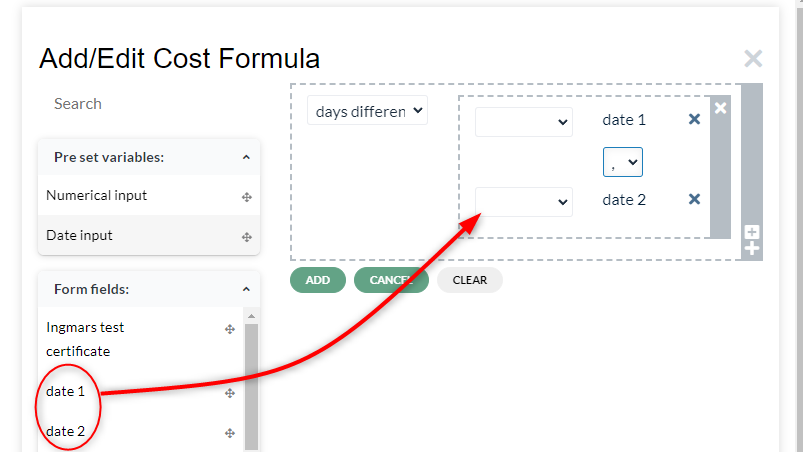{ loading=lazy }

    { loading=lazy }

    { loading=lazy }

    { loading=lazy }

    { loading=lazy }

    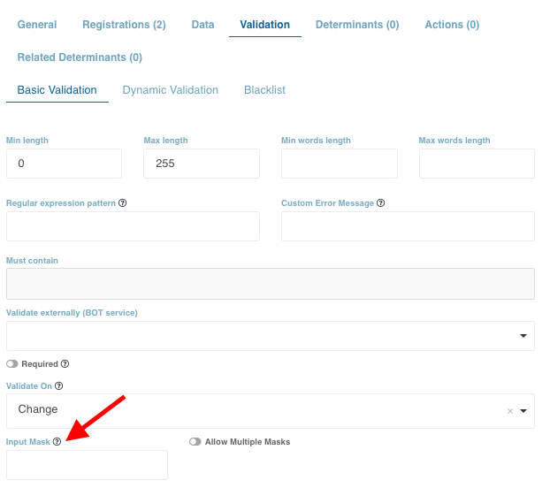{ loading=lazy }

    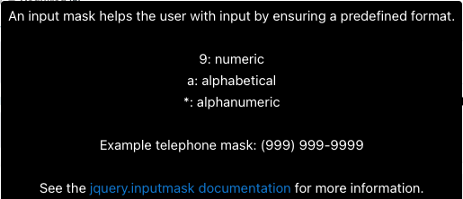{ loading=lazy }

    { loading=lazy }

    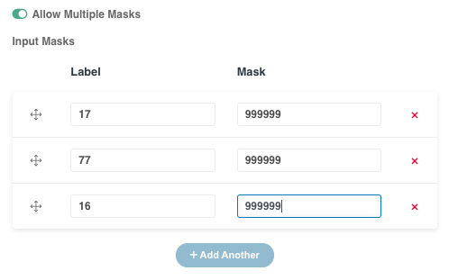{ loading=lazy }

    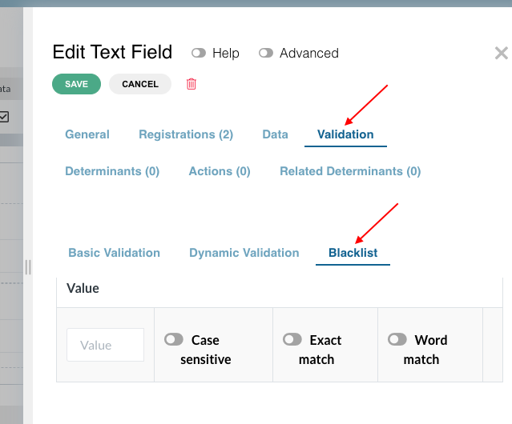{ loading=lazy }

    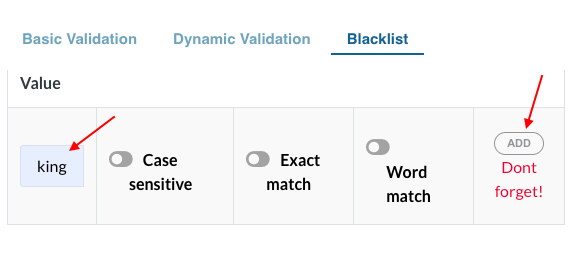{ loading=lazy }

    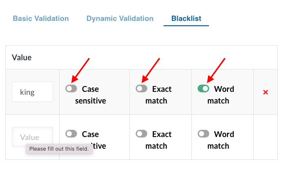{ loading=lazy }

    { loading=lazy }

    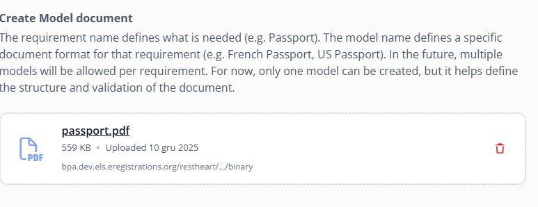{ loading=lazy }

    { loading=lazy }

    { loading=lazy }

    { loading=lazy }

    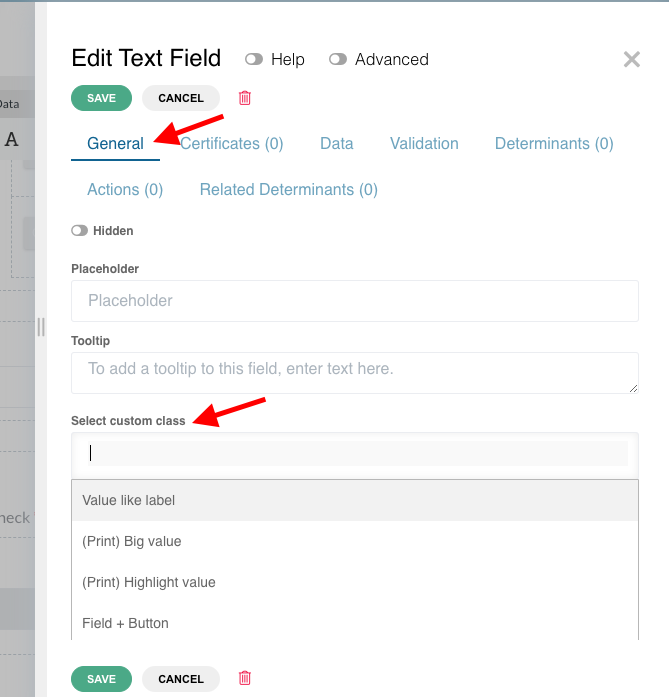{ loading=lazy }

    { loading=lazy }

    { loading=lazy }

    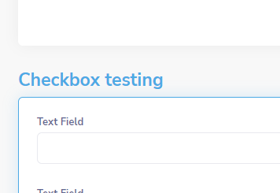{ loading=lazy }

    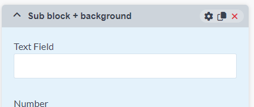{ loading=lazy }

    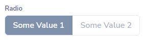{ loading=lazy }

    { loading=lazy }

    { loading=lazy }

!!! info "Update Summary (5 changes detected)"
    5 items identified: The core custom class system and its categories (Appearance, Spacing, Datagrid, Button, Certificate, Other) remain structurally unchanged from the manual.
    The 'List bullet check' class is documented in the raw text but was not listed in the original bullet-point summary.
    Card-style radio class may be new and needs verification.
    The certificate Print Page A4 system documented in the manual is already comprehensive.
    Some new custom classes may have been added since the manual was written.
    The Effects system (activate/deactivate/show/hide/enable/disable) is a new platform feature that may interact with or partially replace certain custom class behaviors.

<!-- Live BPA Screenshot: live-custom-classes -->

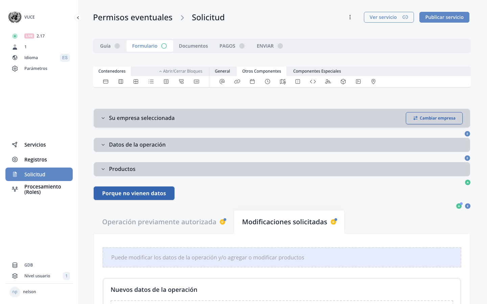{ loading=lazy }
*Current BPA view (2026-02-15) — [D.8. Custom Classes](https://bpa.cuba.eregistrations.org/services/2c918084887c7a8f01887c99ed2a6fd5/forms/applicant-form){ target=_blank }*
*Custom classes are applied via component settings in the form builder*

<!-- /Live BPA Screenshot: live-custom-classes -->

## Custom class introduction

Custom class is a feature that can be applied to the fields in the forms. It is used for customizing fields (in terms of spacing, alignment, color, size, etc.) or to deploy a function to a particular field. Depending on the type of fields, different options to customize will be available for selection.

<!-- Verify screenshot: Custom class dropdown in the edit modal - verify that the dropdown UI appearance has not changed. -->

---

## 1. Appearance changing classes

List of classes: Value like label, Field + Button, Hide, Text right, Align value to right, Highlight block, Background (Blue, Gray, Green, Orange, Red), Fill background, Default notice, Radio Switch, Search results list. Also includes List bullet check (replaces bullets in an unordered list with a check icon).

<!-- Verify screenshot: Screenshots showing each appearance class effect - verify that visual appearance has not changed in current platform version. -->

---

## 2. Spacing and alignment classes

List of classes: Remove top space, Space top (label space), Top space / Top space (2X) / Top space (3X), Remove top inner space, Vertical align top/center/bottom, Full height.

---

## 3. Datagrid related classes

List of classes: Datagrid footer, Add/Remove disabled, Datagrid Condensed, Has footer, Width (width5 through width100 in steps of 5), Datagrid Hide Column Label.

---

## 4. Custom classes for Button

List of classes: Field + Button, Orange/Blue/Green/Red, Disable on success, Show cog during form submit, Light color, Outline button.

---

## 5. Certificate layout classes - New styles (Print Page A4 system)

New certificate styles: Print Page A4, Print text center/right/left, Print center vertical, Print Page top/bottom/horizontal margin small/medium/large (12mm/24mm/36mm), Print corner top/bottom left/right, Print watermark, Print footer distance small/medium/large, Print non latin text, Print color light/dark/brand, Print space xsmall(2mm)/small(4mm)/medium(8mm)/large(12mm)/xlarge(16mm), Print value small(10pt)/large(14pt), Print label small(8pt)/large(10pt).

<!-- Verify screenshot: Certificate style examples - verify that no new Print classes have been added since the manual was written. -->

---

## 5. Certificate layout classes - Old styles

Old certificate styles: print-big-field, print-small-field, (Print) Highlight Value, (Print) Certificate, (Print) Document Section, (Print) Documents last section, (Print) Terms and conditions, (Print) Certificate header, (Print) Certificate document title, (Print) Certificate footer.

---

## 6. Other custom classes

Payment form component and I-swear component.

---

## Card-style radio class (potentially new)

!!! question "Needs Verification — [Verify in BPA](https://bpa.cuba.eregistrations.org/services/2c918084887c7a8f01887c99ed2a6fd5/forms/applicant-form){ target=_blank }"
    The MANUAL-UPDATE-PLAN.md mentions 'card-style radios' as a new platform feature. This could be a new custom class (similar to Radio Switch) that transforms radio groups into card-style selectable elements. This needs verification on a live instance to confirm whether it exists as a custom class and what it is called.

A card-style radio class may have been added to the platform, allowing radio button groups to display as selectable cards rather than traditional radio buttons. This would be an appearance-changing custom class.

<!-- Screenshot needed: Card-style radio custom class example showing radio buttons displayed as selectable cards. -->

---

## New custom classes added since July 2025

!!! question "Needs Verification — [Verify in BPA](https://bpa.cuba.eregistrations.org/services/2c918084887c7a8f01887c99ed2a6fd5/forms/applicant-form){ target=_blank }"
    With ~9,600 commits since the manual was written, there is a reasonable probability that new custom classes have been added. However, without access to a live BPA instance to verify the current dropdown options, these cannot be specifically identified. A human reviewer should check the custom class dropdown on a current instance to confirm the complete list.

Additional custom classes may have been added to the platform in the approximately 9,600 commits since the manual was written. Categories that may have new entries include appearance classes, spacing classes, and certificate layout classes.

<!-- Screenshot needed: Full custom class dropdown list from current BPA to identify any new classes not in the manual. -->

---

## Effects system relationship to custom classes

!!! question "Needs Verification — [Verify in BPA](https://bpa.cuba.eregistrations.org/services/2c918084887c7a8f01887c99ed2a6fd5/forms/applicant-form){ target=_blank }"
    The Effects system is confirmed to exist in the platform (MCP tool effect_create supports effect_type: activate/deactivate/show/hide/enable/disable). While effects operate differently from custom classes (effects are determinant-driven behaviors vs. custom classes being static styling), there may be documentation needed to explain when to use effects vs. custom classes like 'Hide'. A human reviewer should determine if this relationship warrants mention in the custom classes section or should be documented separately.

The Effects system (confirmed via MCP tools to support activate/deactivate/show/hide/enable/disable effect types) is a new platform feature that may partially overlap with or complement custom class functionality for showing/hiding components.

---
