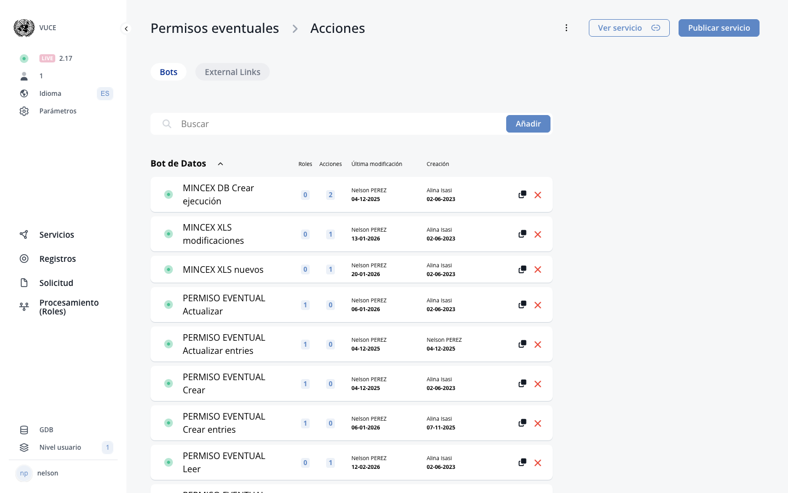

# E. BOT builder

<!-- PDF Screenshots -->
??? example "Original Manual Screenshots"
    { loading=lazy }

    { loading=lazy }

    { loading=lazy }

    { loading=lazy }

    { loading=lazy }

    { loading=lazy }

    { loading=lazy }

    { loading=lazy }

    { loading=lazy }

    { loading=lazy }

    { loading=lazy }

    { loading=lazy }

    { loading=lazy }

    { loading=lazy }

    { loading=lazy }

    { loading=lazy }

    { loading=lazy }

    { loading=lazy }

    { loading=lazy }

    { loading=lazy }

    { loading=lazy }

    { loading=lazy }

    { loading=lazy }

    { loading=lazy }

    { loading=lazy }

    { loading=lazy }

    { loading=lazy }

    { loading=lazy }

    { loading=lazy }

    { loading=lazy }

    { loading=lazy }

    { loading=lazy }

    { loading=lazy }

    { loading=lazy }

!!! info "Update Summary (6 changes detected)"
    6 items identified: BOT type definitions and creation workflows are largely unchanged.
    Data BOT categories have expanded beyond just 'Create' to include read, update, list, exist, log, and other (confirmed via MCP tool muleservice_discover).
    The concurrent BOT execution toggle and system action restrictions are already documented in the manual.
    Mapping transformations list is comprehensive and likely unchanged.
    The Part B system actions concept is mentioned in the manual text.
    New BOT categories and potential mapping UI improvements need verification.

<!-- Live BPA Screenshot: live-bot-builder -->

{ loading=lazy }
*Current BPA view (2026-02-15) — [E. BOT Builder](https://bpa.cuba.eregistrations.org/services/2c918084887c7a8f01887c99ed2a6fd5/actions/bots){ target=_blank }*

<!-- /Live BPA Screenshot: live-bot-builder -->

## BOT definition and types

A BOT is an automated action performed by the system. There are three types of BOTs:

- **Data BOT** — exchanges data between an eRegistrations service and an external system (such as a GDB database or a Mule service). Categories include create, read, update, list, and other.
- **Document BOT** — generates, displays, or uploads a document (such as a PDF certificate). Categories include generate-and-display, generate-and-upload, and generate-upload-display.
- **Internal BOT** — copies data between components within the same service or across different services, without connecting to an external system.

The *Permisos eventuales* service uses **17 bots** across all three types: 11 data bots, 3 document bots, and 3 internal bots.

---

## a) Document BOT creation

Click on BOT Builder tab on the side menu. Click on 'add' button. A slider opens. Enter BOT name. Select 'Document BOT' under Type. Categories field appears. Select 'generate and display', 'generate and upload', or 'generate upload display'. Select document from dropdown. Only one document can be generated under one button.

<!-- Verify screenshot: Document BOT creation slider showing type selection and categories dropdown. -->

!!! example "Document BOTs in *Permisos eventuales* (3 bots)"
    **"Cargar el certificado"** — category: `document_generate_upload_display`

    :   Generates the permit certificate as a PDF, uploads it to the applicant's file, and displays it on screen. This is the most complete document bot category: it performs all three steps (generate, upload, display) in a single action. Connected to external services `generic-pdf-generator` and `generic-pdf-display`.

    **"Mostrar certificado de permiso eventual"** — category: `document_generate_and_display`

    :   Generates and displays the permit certificate PDF on screen without uploading it. Used when the reviewer or applicant needs to preview the certificate before it is finalized. Connected to `generic-pdf-generator` and `generic-pdf-display`.

    **"Carta ZEDmariel"** — category: `document_generate_and_display`

    :   Generates and displays the ZED Mariel letter as a PDF. This letter is specific to companies operating in the Mariel Special Economic Zone. Connected to `generic-pdf-generator` and `generic-pdf-display`.

---

## b) Data BOT creation and categories

Click on BOT Builder tab on the side menu. Click on 'add' button. A slider opens. Enter BOT name. Select 'Data BOT' under Type. Categories field appears. Select the appropriate category: Create, Read, Update, List, Exist, Log, or Other. Create.

The original manual only documented the 'Create' category. The platform now supports a full range of CRUD categories, allowing data bots to read, update, and list records in addition to creating them.

??? note "Original manual text"
    Click on BOT Builder tab on the side menu. Click on 'add' button in the search bar. A slider will open. Enter BOT name. Select 'Data BOT' under Type of BOT. Categories field will appear. Select 'Create' under Categories. Create.

<!-- Screenshot needed: Data BOT creation slider showing the expanded categories dropdown with all available options (Create, Read, Update, List, Exist, Log, Other). -->

!!! example "Data BOTs in *Permisos eventuales* (11 bots)"
    **CRUD bots for permits (GDB):**

    | Bot name | Category | External service | Purpose |
    |----------|----------|-----------------|---------|
    | PERMISO EVENTUAL Crear | `create` | GDB.GDB-PE(1.5)-create | Creates a new permit record in the GDB database |
    | PERMISO EVENTUAL Actualizar | `update` | GDB.GDB-PE(1.5)-update | Updates an existing permit record in GDB |
    | PERMISO EVENTUAL Leer | `read` | GDB.GDB-PE(1.5)-read | Reads permit data from GDB (e.g., to populate form fields) |
    | PERMISO EVENTUAL Listar | `list` | GDB.GDB-PE(1.5)-list | Lists permits from GDB (e.g., to show existing permits) |

    **Product entry bots (GDB):**

    | Bot name | Category | External service | Purpose |
    |----------|----------|-----------------|---------|
    | PERMISO EVENTUAL Listar productos | `list` | GDB.GDB-PERMISOS(1.5)-list | Lists products associated with a permit from GDB |
    | PERMISO EVENTUAL Crear entries | `create` | GDB.GDB-PERMISOS(1.5)-create-entries | Creates new product line entries in GDB |
    | PERMISO EVENTUAL Actualizar entries | `update` | GDB.GDB-PERMISOS(1.5)-update-entries | Updates existing product line entries in GDB |

    **Supporting data bots:**

    | Bot name | Category | External service | Purpose |
    |----------|----------|-----------------|---------|
    | UNIDAD DE MEDIDA Leer | `read` | GDB.GDB-FLAT UM 2(1.0)-read | Reads measurement unit catalog from GDB |
    | MINCEX DB Crear ejecucion | `other` | mincex-actualizar-eventual | Creates execution records in the MINCEX database |
    | MINCEX XLS nuevos | `other` | mincex-excel-pe | Generates an Excel file listing new products for MINCEX |
    | MINCEX XLS modificaciones | `other` | mincex-excel-pe | Generates an Excel file listing modified products for MINCEX |

    Note: The four "PERMISO EVENTUAL" CRUD bots (Crear, Leer, Actualizar, Listar) illustrate a common pattern where a single GDB endpoint is accessed through separate bots for each operation. The `other` category is used for operations that do not fit standard CRUD patterns, such as generating Excel reports or triggering external processes.

---

## c) Internal BOT

Internal BOT enables the analyst to copy data from one component to another. It can be performed on components within the same form, between two different forms, between grid components, or even between forms in different services. Linking services with internal BOT allows pasting data from current service form to another form in a different service. The receiving service can be changed in the mapping page. Can be combined with Polling BOT for awaiting results.

!!! example "Internal BOTs in *Permisos eventuales* (3 bots)"
    **"Interno - Certificado de NUEVO permiso eventual"**

    :   Copies certificate data from the Part B revision role form to the certificate generation form. Used when a reviewer approves a new permit -- the internal bot transfers the approved data so the certificate can be generated with the correct values.

    **"Interno - certificado permiso modificado"**

    :   Handles the same data transfer pattern but for modified permits. Copies the updated certificate data when a permit modification is approved in Part B.

    **"VerDatossolicitud"**

    :   Copies application data to a view-only form, allowing reviewers to see the applicant's submitted data without navigating to the original form.

    Internal bots do not connect to any external service (no muleservice). They operate entirely within eRegistrations, mapping fields between forms.

---

## d) Adding actions (BOT roles) to the form

Three ways to add action (BOT role) to the form: 1. To a button, 2. To an input field, 3. To a block.

BOT applied to button: Drag block, add table, add button. Click Actions, click 'click to add BOT', drag and drop action. Data and/or Document bots can be executed either in sequence or concurrently (designated toggle). System actions cannot be executed concurrently with any Data or Document bots. It is possible to add actions after System actions. Exceptions which always need to be last: 'Validate Send page' and any Part B System actions.

BOT applied to field: Action will be executed after 1.5 seconds from last change in the field.

BOT applied to block: Action will be executed after the block is rendered. If no determinant, executes on form load. If determinant exists, executes when determinant becomes true.

<!-- Verify screenshot: BOT action drag-and-drop interface, concurrent toggle, and system action placement. -->

---

## 2. Mapping between eRegistrations and GDB

Mapping or data mapping is the process of matching fields from one database to another. Select the database from GDB with the correct version. Create map links by clicking on data on eRegistrations database then clicking on same data in GDB. Field types should match (indicated by blue+red line if not). Eye icon to hide fields. Version updates require reselection.

Each data bot has its own mapping configuration. For example, the "PERMISO EVENTUAL Crear" bot maps eRegistrations form fields (such as applicant name, permit type, operation dates) to the corresponding GDB.GDB-PE(1.5)-create service fields. The version number (e.g., 1.5, 1.0) in the external service name indicates the GDB API version; when the GDB version is updated, the bot mapping must be reselected to match the new version.

<!-- Verify screenshot: Mapping page showing field connections, type indicators, and version dropdown - verify UI has not changed significantly. -->

---

## 2b. Mapping in internal BOTs

Map data between forms in the same service. Two trees display all forms available. Click expand all, then create links between matching data by clicking left tree then right tree. Field type must match.

For example, the "Interno - Certificado de NUEVO permiso eventual" bot maps fields from the Part B revision form to the certificate form. Both sides of the mapping show eRegistrations form trees (rather than one side showing a GDB schema), since the data transfer is entirely internal.

---

## 2c. Mapping transformations

Transformations are logic conditions applied to mapping. Click on white circle on existing mapping connection to add. Violet circle indicates transformation applied. List: Equals value without case-sensitive, Not equals value, Not equals value without case-sensitive, Contains value, Contains value without case-sensitive, Not contains value, Not contains value without case-sensitive, Less than value, Less or equal than value, Greater than value, Greater or equal than value, Starts with, Similarity (with ordering parameter), Fuzzy and fuzzy with precision class 1-8, Regex expression, Regex expression without case-sensitive, Nullable, Not nullable, IN.

---

## External services (Muleservices) used by bots

The bots in *Permisos eventuales* connect to the following external services:

| External service | Type | Used by |
|-----------------|------|---------|
| GDB.GDB-PE(1.5)-create | GDB | PERMISO EVENTUAL Crear |
| GDB.GDB-PE(1.5)-read | GDB | PERMISO EVENTUAL Leer |
| GDB.GDB-PE(1.5)-update | GDB | PERMISO EVENTUAL Actualizar |
| GDB.GDB-PE(1.5)-list | GDB | PERMISO EVENTUAL Listar |
| GDB.GDB-PERMISOS(1.5)-create-entries | GDB | PERMISO EVENTUAL Crear entries |
| GDB.GDB-PERMISOS(1.5)-update-entries | GDB | PERMISO EVENTUAL Actualizar entries |
| GDB.GDB-PERMISOS(1.5)-list | GDB | PERMISO EVENTUAL Listar productos |
| GDB.GDB-FLAT UM 2(1.0)-read | GDB | UNIDAD DE MEDIDA Leer |
| mincex-actualizar-eventual | Mule | MINCEX DB Crear ejecucion |
| mincex-excel-pe | Mule | MINCEX XLS nuevos, MINCEX XLS modificaciones |
| generic-pdf-generator | Mule | All 3 document bots |
| generic-pdf-display | Mule | All 3 document bots |

---

## BOT summary for *Permisos eventuales*

This service uses **17 bots** across all three types:

| Bot name | Type | Category | External service |
|----------|------|----------|-----------------|
| PERMISO EVENTUAL Crear | Data | create | GDB.GDB-PE(1.5)-create |
| PERMISO EVENTUAL Actualizar | Data | update | GDB.GDB-PE(1.5)-update |
| PERMISO EVENTUAL Leer | Data | read | GDB.GDB-PE(1.5)-read |
| PERMISO EVENTUAL Listar | Data | list | GDB.GDB-PE(1.5)-list |
| PERMISO EVENTUAL Listar productos | Data | list | GDB.GDB-PERMISOS(1.5)-list |
| PERMISO EVENTUAL Crear entries | Data | create | GDB.GDB-PERMISOS(1.5)-create-entries |
| PERMISO EVENTUAL Actualizar entries | Data | update | GDB.GDB-PERMISOS(1.5)-update-entries |
| UNIDAD DE MEDIDA Leer | Data | read | GDB.GDB-FLAT UM 2(1.0)-read |
| MINCEX DB Crear ejecucion | Data | other | mincex-actualizar-eventual |
| MINCEX XLS nuevos | Data | other | mincex-excel-pe |
| MINCEX XLS modificaciones | Data | other | mincex-excel-pe |
| Cargar el certificado | Document | generate, upload, display | generic-pdf-generator |
| Mostrar certificado de permiso eventual | Document | generate and display | generic-pdf-generator |
| Carta ZEDmariel | Document | generate and display | generic-pdf-generator |
| Interno - Certificado de NUEVO permiso eventual | Internal | -- | (none) |
| Interno - certificado permiso modificado | Internal | -- | (none) |
| VerDatossolicitud | Internal | -- | (none) |

**By type:**

| Type | Count | Categories used |
|------|-------|----------------|
| Data | 11 | create (3), read (2), update (2), list (2), other (2) |
| Document | 3 | generate-upload-display (1), generate-and-display (2) |
| Internal | 3 | -- |

This demonstrates a realistic distribution: data bots are the most common, handling the full CRUD lifecycle for permits and product entries. Document bots handle PDF generation for certificates and letters. Internal bots handle data transfer between forms during the review workflow.

---

## Mapping UI improvements

The mapping UI may have received visual or functional improvements since the manual was written. The platform provides bot_mapping_summary and bot_suggest_mappings capabilities, suggesting that automated mapping suggestions may now be available to help analysts create field connections more efficiently.

<!-- Verify screenshot: Current mapping UI to check for any new features like auto-suggest, search, or improved visualization. -->

---

## BOT input/output visibility

The platform includes bot_input_visibility_update and bot_output_visibility_update operations, allowing analysts to control which BOT input and output fields are visible in the mapping interface. This can be used to hide irrelevant fields and simplify the mapping view when working with external services that expose many fields.

---
