# E. BOT builder

<!-- PDF Screenshots -->
??? example "Original Manual Screenshots"
    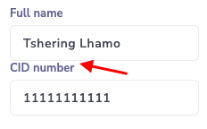{ loading=lazy }

    { loading=lazy }

    { loading=lazy }

    { loading=lazy }

    { loading=lazy }

    { loading=lazy }

    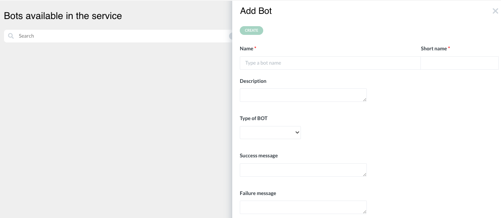{ loading=lazy }

    { loading=lazy }

    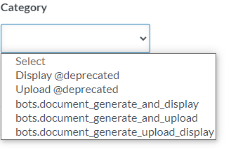{ loading=lazy }

    { loading=lazy }

    { loading=lazy }

    { loading=lazy }

    { loading=lazy }

    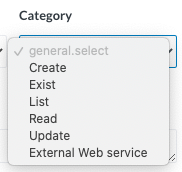{ loading=lazy }

    { loading=lazy }

    { loading=lazy }

    { loading=lazy }

    { loading=lazy }

    { loading=lazy }

    { loading=lazy }

    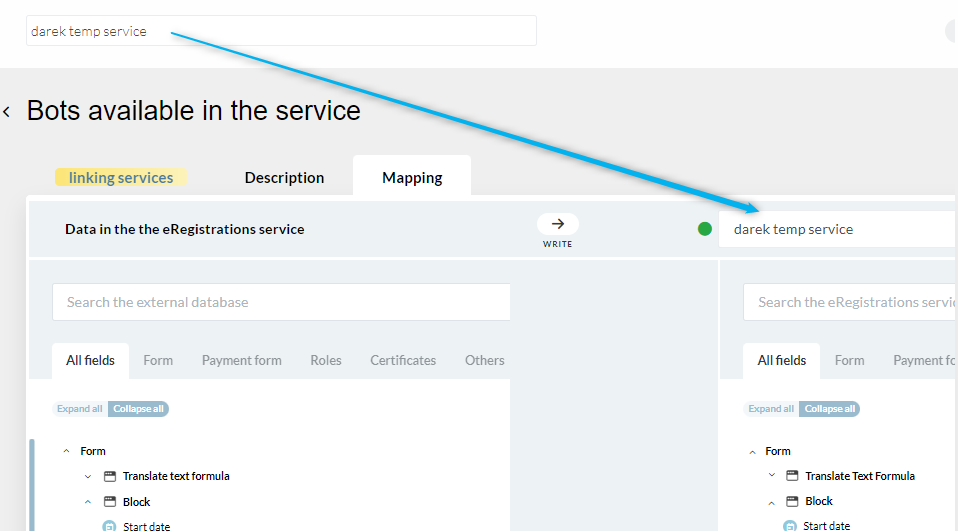{ loading=lazy }

    { loading=lazy }

    { loading=lazy }

    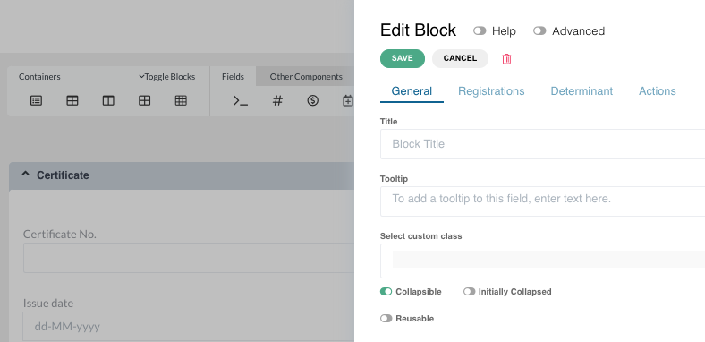{ loading=lazy }

    { loading=lazy }

    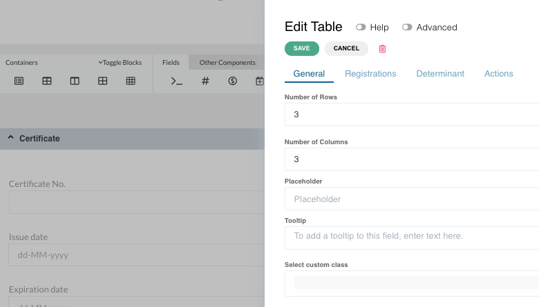{ loading=lazy }

    { loading=lazy }

    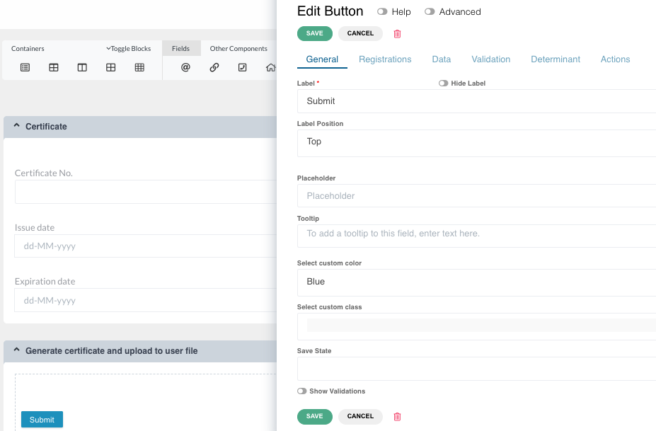{ loading=lazy }

    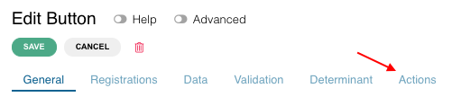{ loading=lazy }

    { loading=lazy }

    { loading=lazy }

    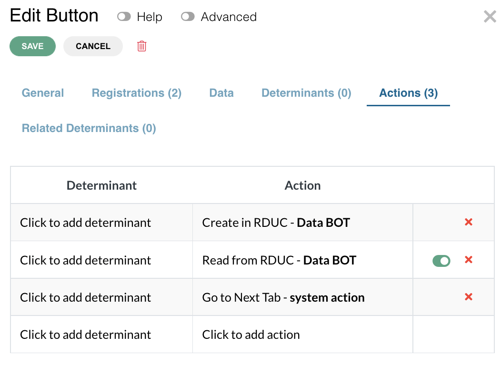{ loading=lazy }

    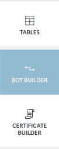{ loading=lazy }

    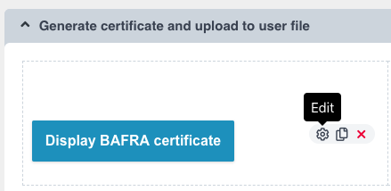{ loading=lazy }

!!! info "Update Summary (6 changes detected)"
    6 items identified: BOT type definitions and creation workflows are largely unchanged.
    Data BOT categories have expanded beyond just 'Create' to include read, update, list, exist, log, and other (confirmed via MCP tool muleservice_discover).
    The concurrent BOT execution toggle and system action restrictions are already documented in the manual.
    Mapping transformations list is comprehensive and likely unchanged.
    The Part B system actions concept is mentioned in the manual text.
    New BOT categories and potential mapping UI improvements need verification.

## BOT definition and types

A BOT is an automated action performed by the system. There are two types of BOTs: data BOT (to exchange data between an eRegistration service and an external system like a GDB database) and document BOT (to display a document on the screen or upload it to the user file).

---

## a) Document BOT creation

Click on BOT Builder tab on the side menu. Click on 'add' button. A slider opens. Enter BOT name. Select 'Document BOT' under Type. Categories field appears. Select 'generate and display', 'generate and upload', or 'generate upload display'. Select document from dropdown. Only one document can be generated under one button.

<!-- Verify screenshot: Document BOT creation slider showing type selection and categories dropdown. -->

---

## b) Data BOT creation and categories

!!! warning "Modified"
    The original manual only mentions 'Create' as a data BOT category. The MCP tool muleservice_discover confirms that data BOT categories now include: read, create, update, list, exist, log, and other. This is a significant expansion that allows data BOTs to perform various CRUD operations and other actions against external databases. The manual should be updated to list all available categories with brief descriptions.

Click on BOT Builder tab on the side menu. Click on 'add' button. A slider opens. Enter BOT name. Select 'Data BOT' under Type. Categories field appears. Select the appropriate category: Create, Read, Update, List, Exist, Log, or Other. Create.

??? note "Original manual text"
    Click on BOT Builder tab on the side menu. Click on 'add' button in the search bar. A slider will open. Enter BOT name. Select 'Data BOT' under Type of BOT. Categories field will appear. Select 'Create' under Categories. Create.

<!-- Screenshot needed: Data BOT creation slider showing the expanded categories dropdown with all available options (Create, Read, Update, List, Exist, Log, Other). -->
*Screenshot: Data BOT creation slider showing the expanded categories dropdown with all available options (Create, Read, Update, List, Exist, Log, Other).*

---

## c) Internal BOT

Internal BOT enables the analyst to copy data from one component to another. It can be performed on components within the same form, between two different forms, between grid components, or even between forms in different services. Linking services with internal BOT allows pasting data from current service form to another form in a different service. The receiving service can be changed in the mapping page. Can be combined with Polling BOT for awaiting results.

---

## d) Adding actions (BOT roles) to the form

Three ways to add action (BOT role) to the form: 1. To a button, 2. To an input field, 3. To a block.

BOT applied to button: Drag block, add table, add button. Click Actions, click 'click to add BOT', drag and drop action. Data and/or Document bots can be executed either in sequence or concurrently (designated toggle). System actions cannot be executed concurrently with any Data or Document bots. It is possible to add actions after System actions. Exceptions which always need to be last: 'Validate Send page' and any Part B System actions.

BOT applied to field: Action will be executed after 1.5 seconds from last change in the field.

BOT applied to block: Action will be executed after the block is rendered. If no determinant, executes on form load. If determinant exists, executes when determinant becomes true.

<!-- Verify screenshot: BOT action drag-and-drop interface, concurrent toggle, and system action placement. -->

---

## 2. Mapping between eRegistrations and GDB

Mapping or data mapping is the process of matching fields from one database to another. Select the database from GDB with the correct version. Create map links by clicking on data on eRegistrations database then clicking on same data in GDB. Field types should match (indicated by blue+red line if not). Eye icon to hide fields. Version updates require reselection.

<!-- Verify screenshot: Mapping page showing field connections, type indicators, and version dropdown - verify UI has not changed significantly. -->

---

## 2b. Mapping in internal BOTs

Map data between forms in the same service. Two trees display all forms available. Click expand all, then create links between matching data by clicking left tree then right tree. Field type must match.

---

## 2c. Mapping transformations

Transformations are logic conditions applied to mapping. Click on white circle on existing mapping connection to add. Violet circle indicates transformation applied. List: Equals value without case-sensitive, Not equals value, Not equals value without case-sensitive, Contains value, Contains value without case-sensitive, Not contains value, Not contains value without case-sensitive, Less than value, Less or equal than value, Greater than value, Greater or equal than value, Starts with, Similarity (with ordering parameter), Fuzzy and fuzzy with precision class 1-8, Regex expression, Regex expression without case-sensitive, Nullable, Not nullable, IN.

---

## New BOT categories or types

!!! question "Needs Verification"
    While the basic BOT types (Document, Data, Internal) are confirmed, the data BOT categories have expanded significantly. The manual should list all current data BOT categories. A human reviewer should verify the complete list of categories and any new BOT types on a live instance.

The platform may have additional BOT types or categories beyond what is documented. The MCP tools confirm data BOT categories include read, create, update, list, exist, log, and other. There may be additional specialized BOT types.

<!-- Screenshot needed: Data BOT categories dropdown showing all current options. -->
*Screenshot: Data BOT categories dropdown showing all current options.*

---

## Mapping UI improvements

!!! question "Needs Verification"
    With ~9,600 commits since the manual, the mapping UI may have been enhanced. The MCP tools show bot_mapping_summary and bot_suggest_mappings tools, suggesting that automated mapping suggestions may now be available. A human reviewer should check the current mapping UI for any new features.

The mapping UI may have received visual or functional improvements since the manual was written, including better field search, improved connection visualization, or new mapping options.

<!-- Verify screenshot: Current mapping UI to check for any new features like auto-suggest, search, or improved visualization. -->

---

## BOT input/output visibility

!!! question "Needs Verification"
    The MCP tools expose bot_input_visibility_update and bot_output_visibility_update, which suggest a feature to control which BOT input/output fields are visible. Additionally, bot_suggest_mappings suggests an automated mapping suggestion feature. These may warrant documentation.

The MCP tools include bot_input_visibility_update and bot_output_visibility_update operations, suggesting that BOT field visibility can now be configured. This may be a new feature not documented in the original manual.

---
