# F. Roles

??? example "Original Manual Screenshots"
    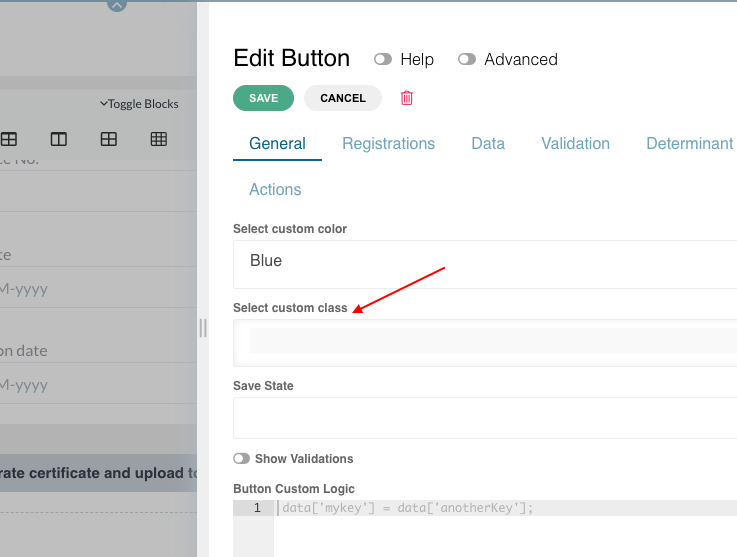{ loading=lazy }

    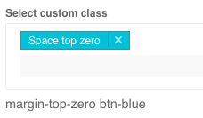{ loading=lazy }

    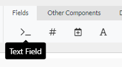{ loading=lazy }

    { loading=lazy }

    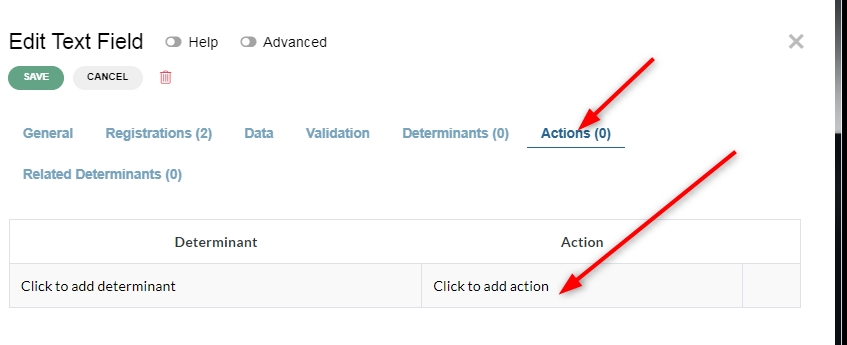{ loading=lazy }

    { loading=lazy }

    { loading=lazy }

    { loading=lazy }

    { loading=lazy }

    { loading=lazy }

    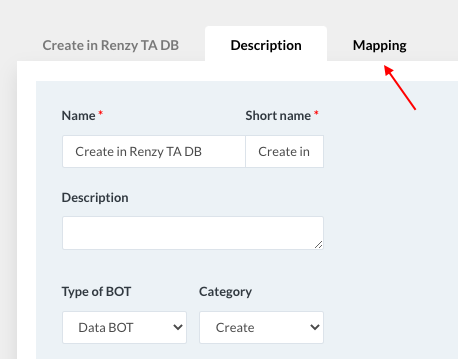{ loading=lazy }

    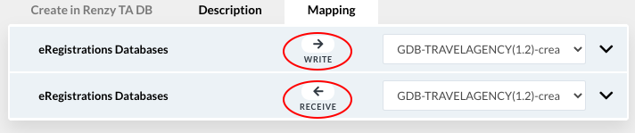{ loading=lazy }

    { loading=lazy }

    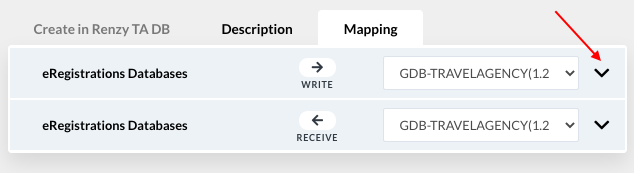{ loading=lazy }

    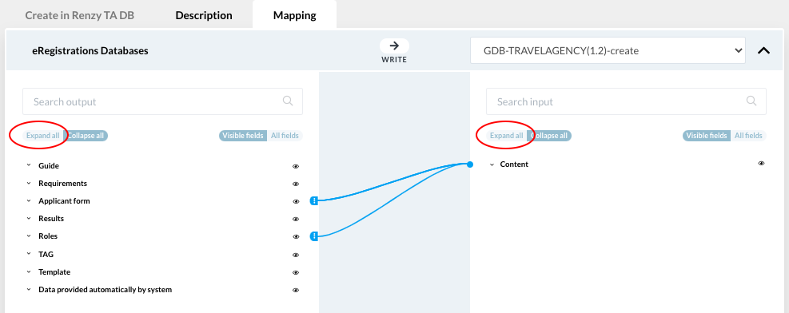{ loading=lazy }

    { loading=lazy }

    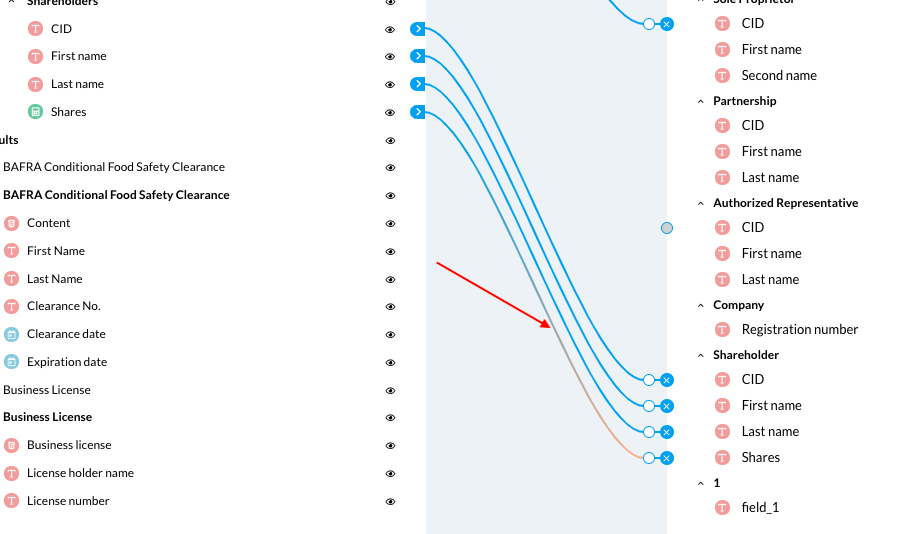{ loading=lazy }

    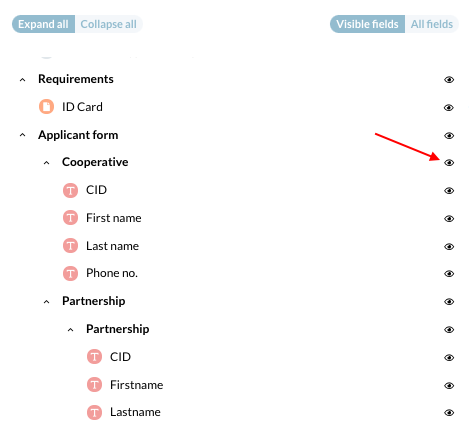{ loading=lazy }

    { loading=lazy }

    { loading=lazy }

    { loading=lazy }

    { loading=lazy }

    { loading=lazy }

    { loading=lazy }

    { loading=lazy }

    { loading=lazy }

    { loading=lazy }

    { loading=lazy }

    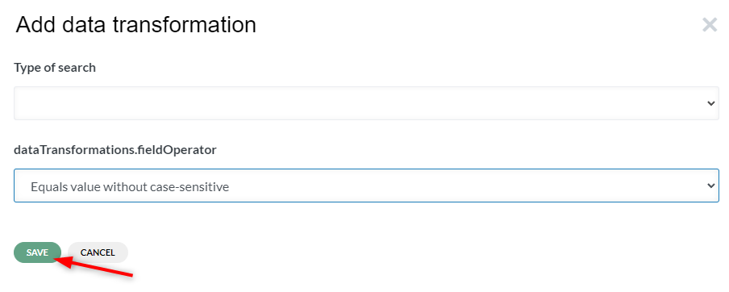{ loading=lazy }

    { loading=lazy }

    { loading=lazy }

    { loading=lazy }

    { loading=lazy }

    { loading=lazy }

    { loading=lazy }

    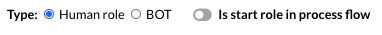{ loading=lazy }

    { loading=lazy }

    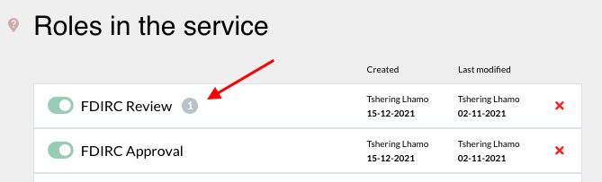{ loading=lazy }

    { loading=lazy }

    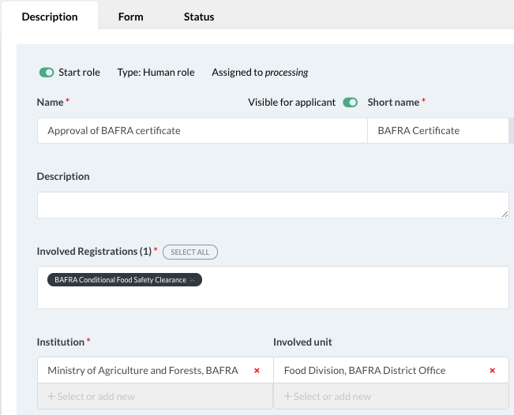{ loading=lazy }

    { loading=lazy }

    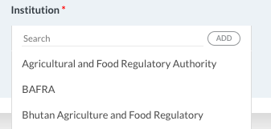{ loading=lazy }

    { loading=lazy }

    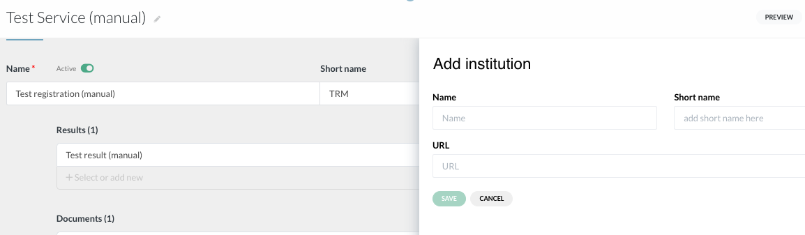{ loading=lazy }

    { loading=lazy }

    { loading=lazy }

    { loading=lazy }

    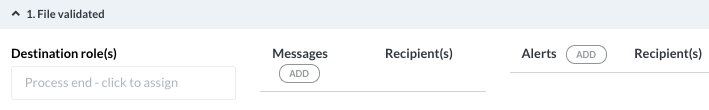{ loading=lazy }

    { loading=lazy }

    { loading=lazy }

    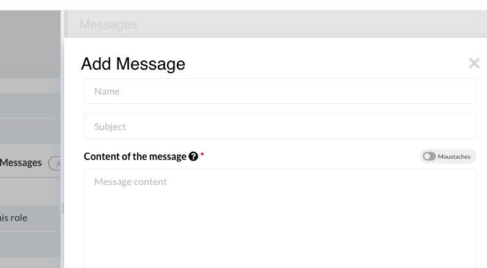{ loading=lazy }

    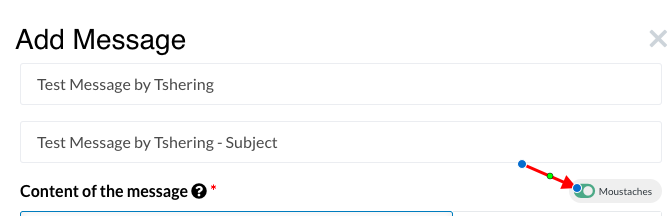{ loading=lazy }

    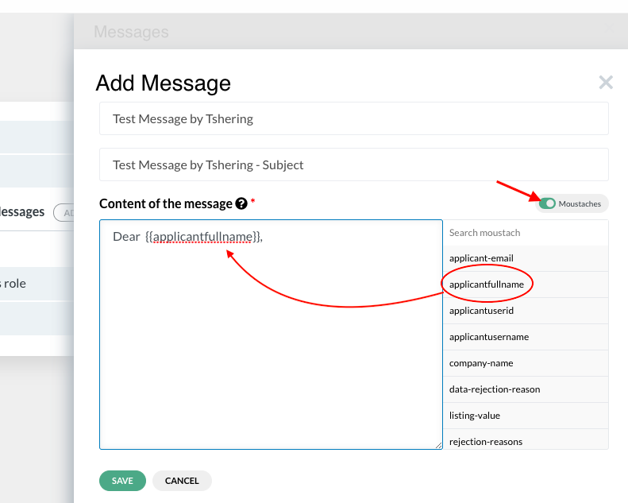{ loading=lazy }

    { loading=lazy }

    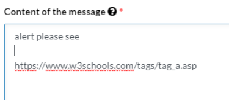{ loading=lazy }

{ loading=lazy }
*Current BPA view — F. Roles*

## Role definition and types

A role is a necessary action by a public institution for a registration to be processed. There are 2 types of roles: Human role (a person reviews the file, adds information, and approves, rejects or sends back the file; various types including review role and processing role) and BOT role (automatic processing role performed by a BOT).

---

## 1. Create human roles

Click on Processing (Roles) tab. Click 'add'. 'Human role' is selected by default. Activate 'Is start role in process flow' if first role. Select Role Type. Activate 'Visible for applicant'. Enter name and short name. Additional options may include: 'Allow to confirm payments' and 'Allow access to financial reports'. Create.

---

## Human role elements: a. Description

A human role is defined by 3 elements: Description (name of the role, institution in charge, registrations linked), Form (describes the action), Status (0=pending, 1=approved, 2=send back, 3=rejected). The Description tab shows name, short name (editable), registrations linked (select from dropdown or select all), institution in charge (select or add new with name, short name, URL), and involved units.

---

## Human role elements: b. Form

The Form tab allows incorporating the action the operator should perform. Example: providing certificate number. Data from fields in this section can be copied to the certificate using 'copy value from' function.

---

## Human role elements: c. Status

4 basic statuses: 0=Pending, 1=Approved/successfully passed, 2=Sent back for correction, 3=Rejected. Statuses 2 and 3 must be specifically authorized by the Analyst. Under statuses 1 and 2, destination role must be indicated. Messages at various stages use moustache template syntax to copy values from application file. Rejection-reasons and file-rejected mustache variables available. Links can be added to messages. Receiver and delays configurable.

---

## 2. Create BOT roles

Click 'BOT role'. Activate 'Is start role' if first. Enter name and short name. Create. Select preceding role to activate. A BOT role is defined by 3 elements: Description (name, type, institution, registrations), BOT (type prefilled from Description, select BOT, mapping), Status (same as human role but BOT cannot reject). Under BOT tab, select API version from GDB. APIs generated automatically for each database version.

---

## 2.1 Polling BOT

Configure a BOT role to query the database periodically for a set amount of time. Toggle 'roles repeat until successful'. Set query interval (how often) and active duration (how long before failure). If data appears before time expires, role succeeds and file continues flow.

---

## 3. Revision role

Revision role obliges operator to verify and validate documents and data before sending to next role. Usually the start role. Documents revision tab shows uploaded documents on left, data and requirements on right. If operator chooses 'NO', rejection reason field appears (reasons managed in Tables > Instance Catalog > Document Rejection reasons). Data revision tab displays all applicant file components. Field-by-field verification enabled in service settings under 'Revision by field' toggle. Approval button activates only after all documents and data are validated.

---

## Effects system interaction with roles

The Effects system (activate/deactivate/show/hide/enable/disable) is a new platform feature that may interact with role form components, allowing determinant-driven behavior on processing forms.

---

## E-signature integration in roles

E-signature may be integrated into the role processing workflow, allowing operators to digitally sign documents or approvals during processing.

---

## New role permissions and options

Roles support additional permission flags including the ability to confirm payments and access financial reports. These permissions can be set during role creation and control what operators in each role are authorized to do.

---

## Part B system actions in roles

Processing roles can include system actions -- built-in platform actions that handle standard workflow operations such as file validation, rejection, sending back for corrections, and printing. These system actions are assigned to buttons within the role's processing form and execute predefined logic without requiring custom BOT configuration. See the Part B (Processing) section for the full list of available system actions.

---

**See also:** [BOT Builder](13-bot-builder.md) · [Part B (Processing)](../part5-new-features/06-part-b.md) · [Certificates](15-certificates.md)
