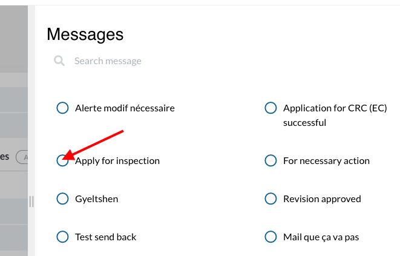
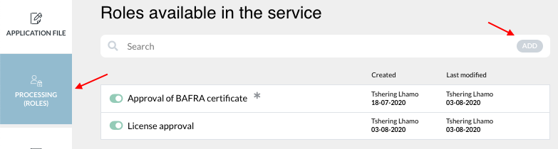
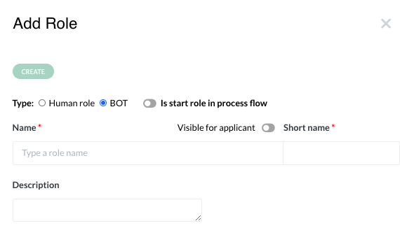
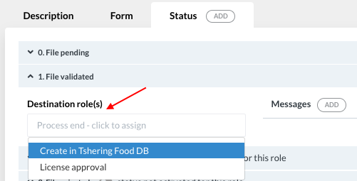
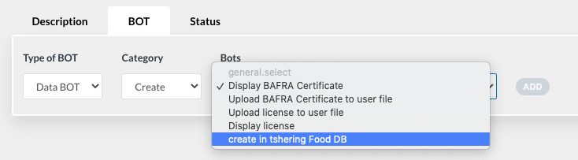
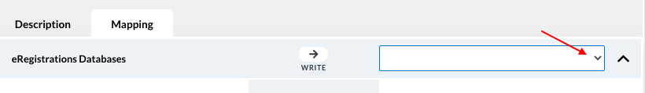
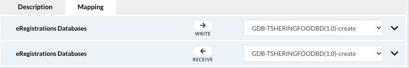
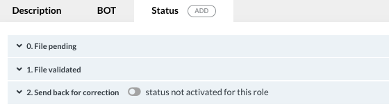
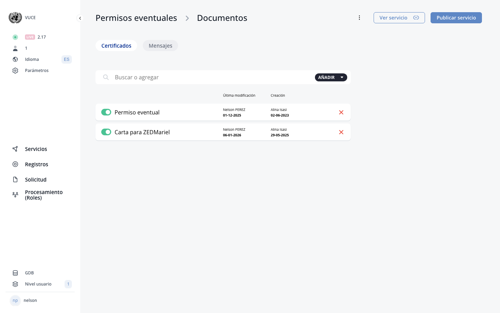

# G. Certificates

<!-- PDF Screenshots -->
??? example "Original Manual Screenshots"
    { loading=lazy }

    { loading=lazy }

    { loading=lazy }

    { loading=lazy }

    { loading=lazy }

    { loading=lazy }

    { loading=lazy }

    { loading=lazy }

    { loading=lazy }

    { loading=lazy }

    { loading=lazy }

    { loading=lazy }

    { loading=lazy }

    { loading=lazy }

    { loading=lazy }

    { loading=lazy }

    { loading=lazy }

    { loading=lazy }

    { loading=lazy }

    { loading=lazy }

    { loading=lazy }

    { loading=lazy }

    { loading=lazy }

    { loading=lazy }

    { loading=lazy }

!!! info "Update Summary (6 changes detected)"
    6 items identified: The two methods for building certificates (certificate builder and through registration) remain unchanged.
    QR code component is unchanged.
    The Print Page A4 styling system is already documented in D.8 Custom classes.
    The MCP tools reveal a 'print document' system (print_document_list, print_document_create, print_document_component_add/update/remove/move, print_document_sort, print_document_templates, print_document_history, print_document_revert) which may represent a newer or additional certificate management approach.
    E-signature on certificates needs verification.

<!-- Live BPA Screenshot: live-certificates -->

{ loading=lazy }
*Current BPA view (2026-02-15) — [G. Certificates](https://bpa.cuba.eregistrations.org/services/2c918084887c7a8f01887c99ed2a6fd5/templates/certificates){ target=_blank }*

<!-- /Live BPA Screenshot: live-certificates -->

## 1. Build certificates - Two methods

Templates/certificates for electronic results can be built in two ways: 1) Through certificate builder on the left hand side bar of user level 2, 2) Through the registration.

---

## 1a. Creating certificate through certificate builder

Click on 'Certificate' on the side menu under user level 2. Click on 'Add' to add a new certificate template. A slider opens. Enter name, Create. Certificate appears in list. Click on certificate name to configure. Form builder page appears. Other certificates for the service appear on top menu. Click on 'cert.form' tab to build the certificate.

<!-- Verify screenshot: Certificate builder side menu, creation slider, and form builder page - verify UI has not changed. -->

---

## 1b. Creating certificate through registration

Choose the registration. Click on 'Digital result' (green button). Activate the digital result button. Scroll down and click on 'create template'. Enter name. The certificate form can be built just like the application form. Values for text fields can be copied from application file or processing role through edit text field, data, copy value from. Value of expiration date can be fixed from the 'data' tab.

<!-- Verify screenshot: Digital result button, create template slider, and certificate form builder. -->

---

## 2. Add QR Code

The QR technology merges the physical world with the digital world. Signatures and other authentications are replaced by QR codes. They manifest the legitimacy of a document. To add QR code on a template, drag and drop the 'QR code' from the Custom Component tab on the template.

---

## Print document system

Print documents are the certificate/document templates that the platform generates as PDF output for applicants. Each service can have one or more print documents, and each print document is built with the same form-builder approach used for application forms -- panels, columns, text fields, data grids, select fields, QR codes, and content blocks.

Print documents are managed through the BPA API with operations for listing, creating, updating, deleting, adding/removing/moving components, sorting, and version history with revert capability.

!!! example "Print documents in *Permisos eventuales*"
    The *Permisos eventuales* service has **2 print documents**:

    | # | Name | Active | External | Sort order |
    |---|------|--------|----------|------------|
    | 1 | **Permiso eventual** | Yes | No | 0 |
    | 2 | **Carta para ZEDMariel** | Yes | No | 0 |

    **"Permiso eventual"** -- the main permit certificate (58 components). Built as an A4-style document containing:

    - MINCEX logo, certificate title, and **QR code** for authenticity verification
    - Application data: solicitante, fecha de solicitud, fecha de autorizacion
    - Operation details: tipo de operacion, regimen especial, tipo de solicitud, numero de solicitud, numero de aprobacion
    - Trade parties: origen, embarque, proveedor extranjero, cliente nacional, destino, proveedor nacional, cliente extranjero
    - **"Productos autorizados"** data grid: subpartida, producto, descripcion, cantidad, valor, capitulo 10
    - **"Productos adicionales"** data grid: subpartida adicional, producto, descripcion, cantidad, valor, capitulo 20
    - Fundamentacion (justification text area)
    - Execution data: numero de contrato, numero de factura, numero de donacion, cantidad de embarques, fecha del ultimo embarque
    - Permit data: nombres, apellidos, fecha de autorizacion, fecha de expiracion

    **"Carta para ZEDMariel"** -- a supplementary letter for the ZED Mariel special economic zone (25 components). Contains:

    - Header content and **QR code**
    - Fecha de solicitud
    - Operation details: tipo de operacion, regimen especial
    - Trade parties: origen, destino, embarque, proveedor extranjero, cliente nacional
    - **"Productos autorizados"** data grid: subpartida, descripcion, cantidad, valor
    - Fundamentacion and solicitante

---

## Certificate generation workflow

Certificates are generated through a coordinated chain of internal bots and document bots. The workflow for the *Permisos eventuales* service illustrates how the pieces fit together.

!!! example "Certificate workflow in *Permisos eventuales*"
    **Step 1 -- Approval**: The operator approves the permit in the "Permiso eventual" processing role (Part B).

    **Step 2 -- Data copy via internal bot**: The internal bot **"Interno - Certificado de NUEVO permiso eventual"** (`bot_type: internal`) copies the approved data from the Part B revision role into the certificate template fields. Its description reads: *"Este bot guarda los datos del certificado desde la parte B rol revision al certificado."*

    **Step 3 -- PDF generation and upload**: The document bot **"Cargar el certificado"** generates the PDF. This bot uses the `generic-pdf-generator` external service with category `document_generate_upload_display` -- meaning it generates the PDF, uploads it to the applicant's file, and displays it.

    **Step 4 -- Applicant download**: The applicant can view and download the certificate via the document bot **"Mostrar certificado de permiso eventual"**, which uses `generic-pdf-display` with category `document_generate_and_display`.

    **ZED Mariel letter**: For operations involving the Mariel Special Economic Zone, the document bot **"Carta ZEDmariel"** generates and displays the ZED Mariel letter using `generic-pdf-display` with category `document_generate_and_display`.

### Document bots for certificates

The three document bots involved in certificate delivery for *Permisos eventuales*:

| Bot name | Type | GDB service | Category | Purpose |
|----------|------|-------------|----------|---------|
| **Cargar el certificado** | document | `generic-pdf-generator` | generate, upload, display | Generates the permit PDF, uploads it to the file, and displays it |
| **Mostrar certificado de permiso eventual** | document | `generic-pdf-display` | generate and display | Shows the permit PDF to the applicant for download |
| **Carta ZEDmariel** | document | `generic-pdf-display` | generate and display | Generates and displays the ZED Mariel letter |

The supporting internal bot:

| Bot name | Type | Description |
|----------|------|-------------|
| **Interno - Certificado de NUEVO permiso eventual** | internal | Copies certificate data from Part B revision role to the print document template |

---

## E-signature on certificates

!!! question "Needs Verification — [Verify in BPA](https://bpa.cuba.eregistrations.org/services/2c918084887c7a8f01887c99ed2a6fd5/templates/certificates){ target=_blank }"
    E-signature is mentioned as a new platform feature. It could be relevant to certificates if digital signatures can be embedded in generated documents. This needs verification on a live instance. The QR code section currently mentions that 'signatures and other authentications are replaced by QR codes' -- if e-signature is now available, this statement may need updating.

E-signature capability may have been added to certificates, allowing digital signatures to be applied to generated documents.

---

## Certificate builder UI changes

!!! question "Needs Verification — [Verify in BPA](https://bpa.cuba.eregistrations.org/services/2c918084887c7a8f01887c99ed2a6fd5/templates/certificates){ target=_blank }"
    With ~9,600 commits since the manual, the certificate builder UI may have been enhanced. The print_document_history and print_document_revert MCP tools suggest version control features that may now exist for certificates. A reviewer should check the current certificate builder for any new features.

The certificate builder interface may have received UI improvements since the manual was written. The API exposes print_document_history and print_document_revert operations, indicating that version control is now available for print document templates.

<!-- Verify screenshot: Current certificate builder to check for new features like version history, templates, or component management improvements. -->

---
