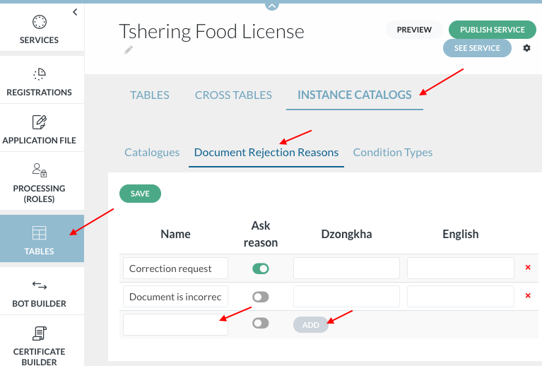
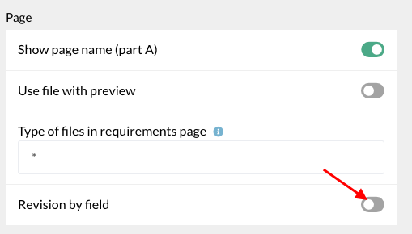
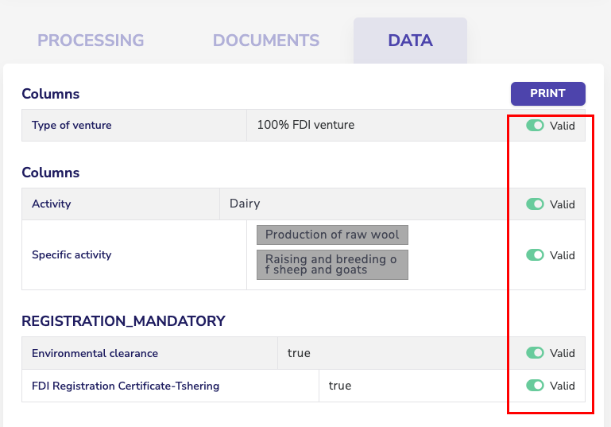
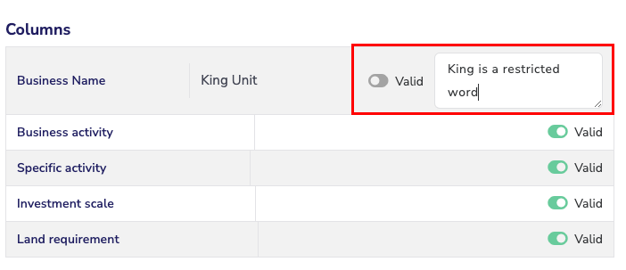
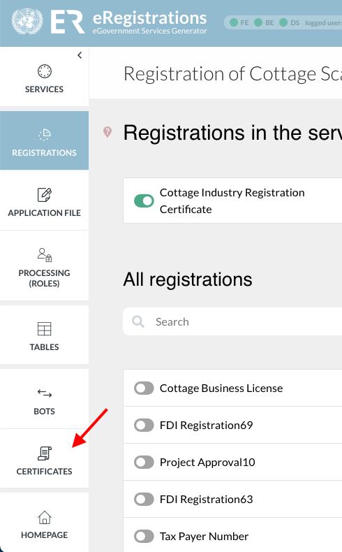
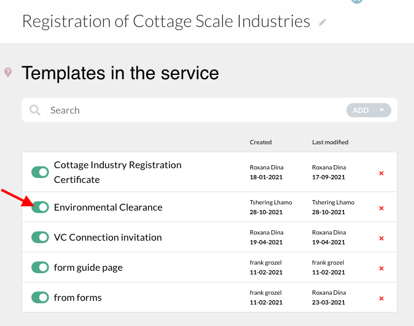
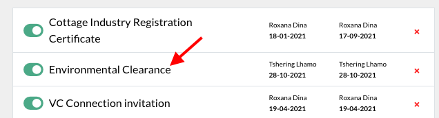
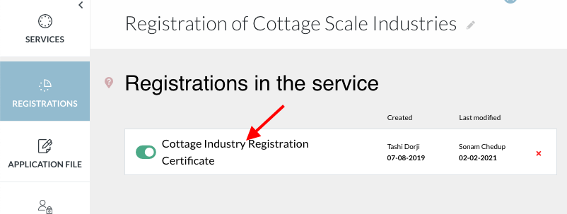
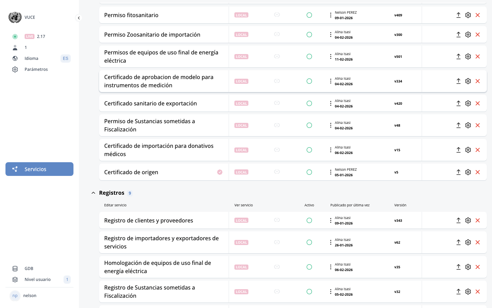

# H. Tables

<!-- PDF Screenshots -->
??? example "Original Manual Screenshots"
    { loading=lazy }

    { loading=lazy }

    { loading=lazy }

    { loading=lazy }

    { loading=lazy }

    { loading=lazy }

    { loading=lazy }

    { loading=lazy }

    { loading=lazy }

    { loading=lazy }

    { loading=lazy }

    { loading=lazy }

    { loading=lazy }

    { loading=lazy }

    { loading=lazy }

    { loading=lazy }

    { loading=lazy }

    { loading=lazy }

!!! info "Update Summary (5 changes detected)"
    5 items identified: The three types of catalogs (service, cross-tables, instance) remain unchanged.
    Catalog creation, subcatalogs, GDB-based catalogs, import/export with templates, groups, and document rejection reasons are all accurately documented.
    The MCP tools reveal a 'classification' system (classification_list, classification_create, classification_update, classification_delete, classification_export_csv, classification_apply_country_codes) that may relate to or extend the catalog system.
    Import/export may have improvements.

<!-- Live BPA Screenshot: live-tables -->

{ loading=lazy }
*Current BPA view (2026-02-15) — [H. Tables](https://bpa.cuba.eregistrations.org/services){ target=_blank }*
*Tables/Classifications are accessible from within service configuration.*

<!-- /Live BPA Screenshot: live-tables -->

## Tables overview and three types

Tables is a list of catalogs in the system. Three types: 1. Service catalogs (or simply tables) - group all elements created in services, 2. Cross-tables - see elements linked to each registration, 3. Instance catalogs - catalogs used by all services in one instance.

---

## 1. Tables/Service catalogs

Service catalogs group by nature all elements created in services (data fields, fees, documents, institutions, units, determinants, questions, etc.). The number within brackets indicates the number of elements available.

---

## 2. Cross-tables

Cross-tables show elements linked to each registration (data/registrations, documents/registrations, fees/registrations, roles/registration, etc.).

---

## 3. Instance catalogs

Catalogs used by all services in one instance (list of countries, cities, company types, economic activities, etc.). Includes: a) How to create a catalog (BPA instance catalog with add/create, add values up to 500 characters, subcatalogs, GDB-based catalogs), b) How to import a catalog with subcatalogs and/or multiple translations (upload items modal with template download, XLS format with level, parent, and language columns), Groups (segregate catalog items into categories, usable as determinants), c) Document rejection reasons (for revision role).

---

## Classification system

!!! question "Needs Verification — [Verify in BPA](https://bpa.cuba.eregistrations.org/services){ target=_blank }"
    The MCP tools expose a classification system that appears to be a data source or catalog management feature. classification_export_csv suggests the ability to export classification data. classification_apply_country_codes suggests a country-code standardization feature. A human reviewer should determine: (1) Is the classification system visible in the Tables section or elsewhere in the BPA? (2) Is it an evolution of the catalog system or a separate concept? (3) Does it need its own documentation section?

The MCP tools reveal a 'classification' system with operations: classification_list, classification_get, classification_create, classification_update, classification_delete, classification_export_csv, classification_apply_country_codes. This may relate to or extend the catalog/tables system.

<!-- Screenshot needed: Classification system interface if visible in BPA. -->

---

## Catalog import/export improvements

!!! question "Needs Verification — [Verify in BPA](https://bpa.cuba.eregistrations.org/services){ target=_blank }"
    The classification_export_csv tool suggests that CSV export is available for catalog data. The import template system (XLS format with levels, parents, and translations) documented in the manual may have been enhanced. A reviewer should verify the current import/export options.

The catalog import/export functionality may have received improvements since the manual was written, including CSV export capability and additional import formats.

<!-- Verify screenshot: Current import/export modal showing all available formats and options. -->

---

## GDB-based catalog enhancements

!!! question "Needs Verification — [Verify in BPA](https://bpa.cuba.eregistrations.org/services){ target=_blank }"
    The original manual documents GDB-based catalogs with system source selection, database selection, and column mapping. With platform evolution, this functionality may have been enhanced. A reviewer should check the current GDB-based catalog creation workflow.

GDB-based catalogs (catalogs populated from GDB data) may have received improvements in how they reference databases, handle versioning, or display values.

<!-- Verify screenshot: GDB-based catalog creation showing system source, database, and column selection. -->

---
