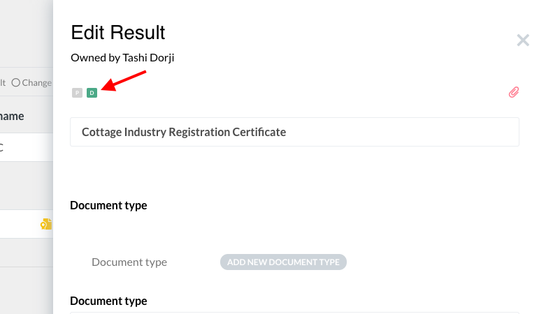
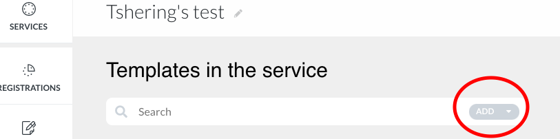
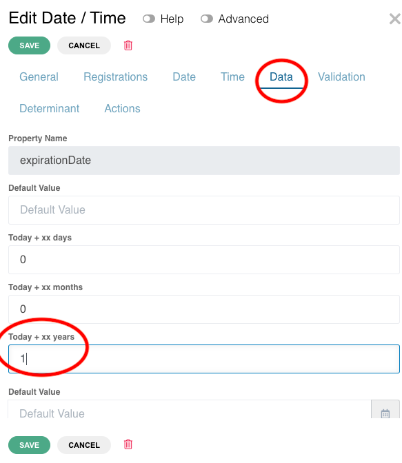
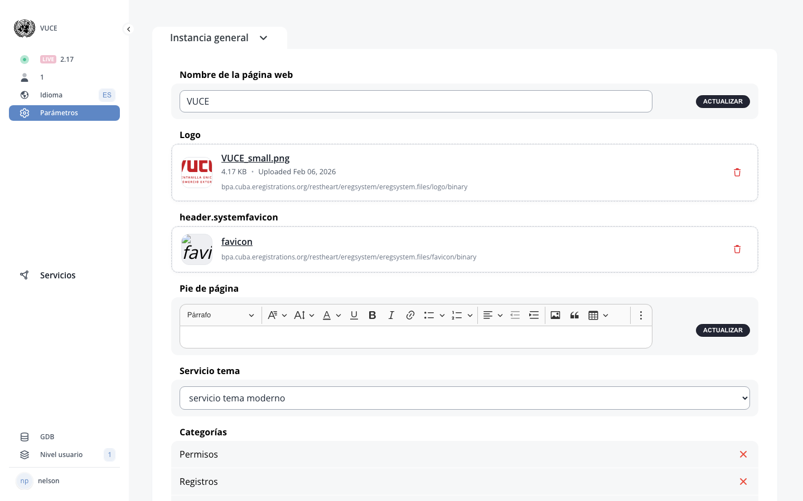

# I. Settings

??? example "Original Manual Screenshots"
    { loading=lazy }

    { loading=lazy }

    { loading=lazy }

    { loading=lazy }

    { loading=lazy }

    { loading=lazy }

    { loading=lazy }

    { loading=lazy }

    { loading=lazy }

{ loading=lazy }
*Current BPA view — I. Settings*

*The Settings page showing instance configuration: website name, logo, favicon, footer, theme, and categories.*

## Instance Settings - Logo

The instance logo can be configured in the Settings area. This allows administrators to upload or change the logo displayed on the public site.

---

## Instance Settings - Language and Currencies

Language and currency settings allow administrators to configure the default language and available currencies for the instance.

---

## Instance Settings - Footer Messages

Footer messages can be configured to display custom text at the bottom of the public site pages.

---

## Instance Settings - Display System Options

Display System options control the appearance and behavior of the public-facing portal. These settings affect how applicants see and interact with services, including language preferences, branding, and navigation layout.

---

## Translations

The Translations section allows administrators to manage text translations for the platform interface and service content.

---

## Log out

The Log out option is available in the Settings area to end the current administrator session.

---

## Service Settings - Pages/buttons/fields

Service-level settings include configuration of pages, buttons, and fields that control the service behavior and appearance.

---

## Service Settings - Service Options toggles

Service Options toggles control specific behaviors for individual services, such as enabling or disabling features like revision by field, payment confirmation, Part B system buttons, and other per-service configuration options.

---

## Service Settings - Publish History

Publish history shows a log of when the service was published and by whom.

---

## Service Settings - Export Service

The Export service feature allows administrators to export the service configuration.

---

## Service Settings - Databases

The Databases section in service settings provides access to database-related configuration.

---

## Potential new settings sections or categories

New settings sections or categories may have been added to either Instance Settings or Service Settings since July 2025.

---

## E-signature related settings

E-signature functionality may require new settings at either the instance or service level for configuration of signature providers, certificate authorities, or signature appearance options.

---

## Micro-publish related settings

Micro-publish functionality may have introduced new settings or modified existing publish-related settings.

---
