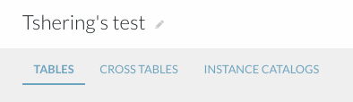
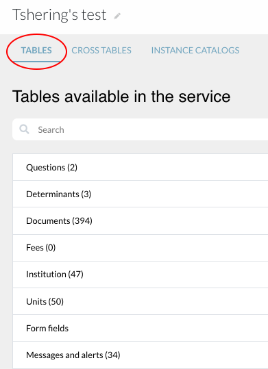
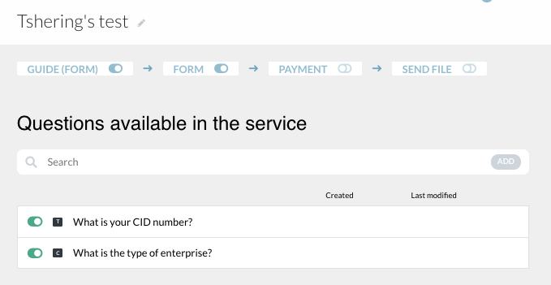
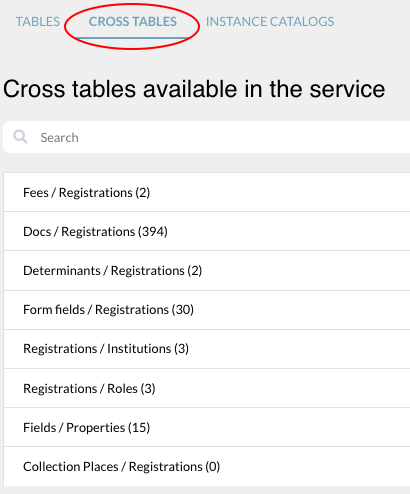
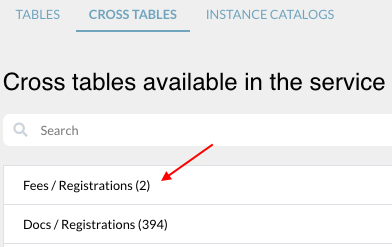
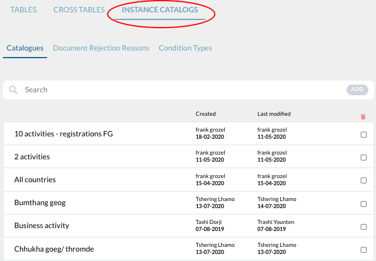
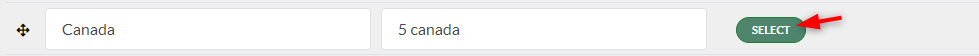
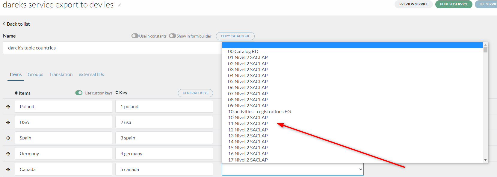
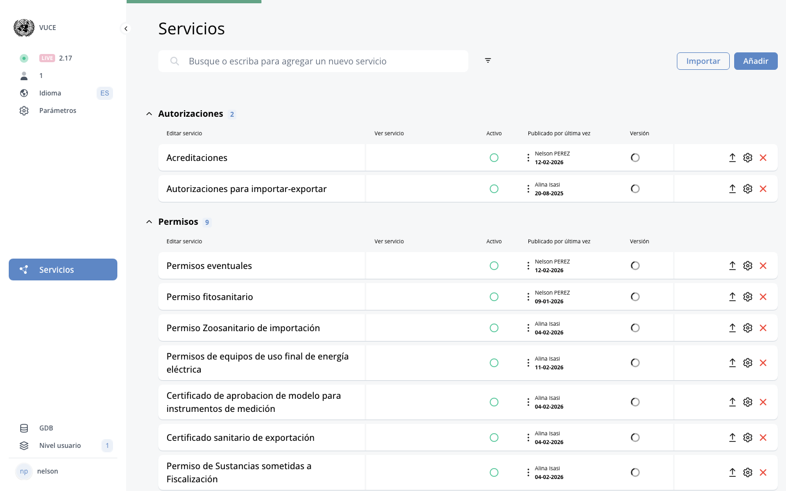

# A. The user dashboard

<!-- PDF Screenshots -->
??? example "Original Manual Screenshots"
    { loading=lazy }

    { loading=lazy }

    { loading=lazy }

    { loading=lazy }

    { loading=lazy }

    { loading=lazy }

    { loading=lazy }

    { loading=lazy }

    { loading=lazy }

    { loading=lazy }

    { loading=lazy }

    { loading=lazy }

    { loading=lazy }

!!! info "Update Summary (5 changes detected)"
    5 changes detected: Header/menu bar may have UI theme updates, shopping cart integration on dashboard, status display colors and filters may have changed, My Applications table may show additional columns or layout changes, overall DS UI theme may have been refreshed.

<!-- Live BPA Screenshot: live-user-dashboard -->

{ loading=lazy }
*Current BPA view (2026-02-15) — [A. User Dashboard](https://bpa.cuba.eregistrations.org/services){ target=_blank }*
*The Display System is the public-facing side. Click "Ver servicio" in the BPA to preview it.*

<!-- /Live BPA Screenshot: live-user-dashboard -->

## DS definition

The user site or the Display System is the user dashboard.

---

## 1. For new users - Header and menu bar

!!! question "Needs Verification"
    The header layout with logo, home, login, register buttons, and language selector is a standard DS pattern. However, the DS has undergone UI theme changes since July 2025. The exact visual appearance, button styling, and layout of the header may have changed. The core elements (logo, login, register, language) are likely still present but their visual presentation needs verification.

The header and menu bar consists of: The home button (national logo), home button, login button, register button. Choice of language. The home page displays all available online services.

<!-- Verify screenshot: DS header bar for new (non-logged-in) users showing logo, home, login, register buttons, and language selector -- verify current visual appearance -->

---

## Registration / Create account flow

When the user clicks register, the create account page will be displayed. User provides information and clicks RegisterForAccount. Verification email will be sent.

<!-- Verify screenshot: Create account page -- verify visual appearance has not changed significantly -->

---

## Home page services list

The home page displays all available online services.

<!-- Verify screenshot: Home page services list -- verify if card layout or list format has changed -->

---

## 2. For logged in users - Menu bar

!!! question "Needs Verification"
    The logged-in user menu bar elements are core DS functionality. However, UI theme changes may have altered the layout or added new elements. The exact arrangement and visual styling needs verification on the current platform.

Menu bar consists of: home button and My Account page, name of user, choice of language.

<!-- Verify screenshot: Logged-in user menu bar -- verify current layout, buttons, and visual styling -->

---

## My Applications tab

The Home button/My Account page displays: My Applications tab (list of applications saved/submitted). Under My Applications: service name, business name, date started, date submitted, status, certificates (can be printed from dashboard).

<!-- Verify screenshot: My Applications tab showing applications table with columns -- verify if additional columns or layout changes exist -->

---

## My Documents tab

My Documents tab displays documents submitted by the user.

<!-- Verify screenshot: My Documents tab -- verify visual appearance -->

---

## My Messages tab

My Messages tab displays messages from administrations/processing roles.

<!-- Verify screenshot: My Messages tab -- verify visual appearance -->

---

## Filter function

Filter: search for specific application by service or business name.

<!-- Verify screenshot: Filter function on My Applications -- verify if additional filter options have been added -->

---

## Application history

Application history: click on a service to see stages.

<!-- Verify screenshot: Application history view -- verify current visual presentation -->

---

## Application status colors

!!! question "Needs Verification"
    The status color system is a core DS feature. However, the specific colors used and the status filter UI at the bottom of the page may have been updated as part of UI theme changes. The exact color mapping (which color means which status) and the filter button layout need verification on the current platform.

Application status shown by different colors. Status filters available at bottom.

<!-- Verify screenshot: Status colors and status filter buttons -- verify current color scheme and filter button layout -->

---

## Shopping cart integration on dashboard

!!! question "Needs Verification"
    The shopping cart is mentioned in the original manual as an alternative to the Guide (in the BPA settings and DS application file sections). Its visibility on the main dashboard or services list -- as opposed to only within an active application -- needs verification. The manual's settings section mentions a 'Shopping cart' toggle under service settings, suggesting it is a per-service option. Whether and how it appears on the user dashboard itself (before entering a service) needs to be confirmed.

The shopping cart feature, as an alternative to the Guide, may be visible or accessible from the user dashboard when starting a new application. The shopping cart shows a summary of registrations, fees, and required documents.

---

## Overall DS UI theme changes

!!! question "Needs Verification"
    The BPA service settings mention a 'UI theme' option. Since the platform has had approximately 9,600 commits since the manual was written, the DS visual theme may have been refreshed. All DS screenshots likely need to be recaptured to reflect the current visual appearance, even if the underlying functionality has not changed. A human reviewer should compare the current DS appearance against the manual screenshots to determine which need updating.

The DS (Display System) may have undergone visual theme updates since July 2025, including changes to fonts, colors, button styles, spacing, and overall layout. The BPA service settings include a 'UI theme' option that controls the DS appearance.

<!-- Screenshot needed: All DS screenshots in this section should be compared against the current platform to check for UI theme changes -->
*Screenshot: All DS screenshots in this section should be compared against the current platform to check for UI theme changes*

---
