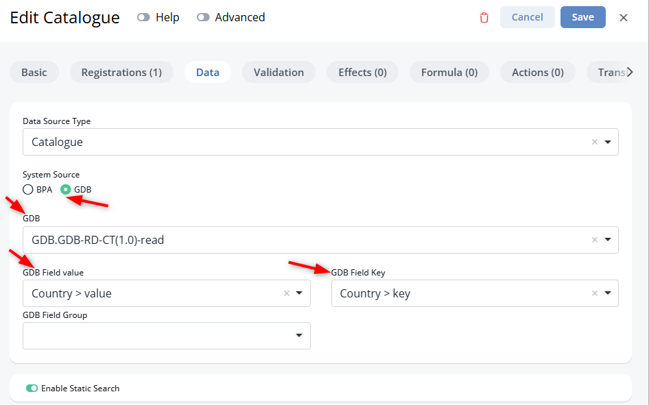
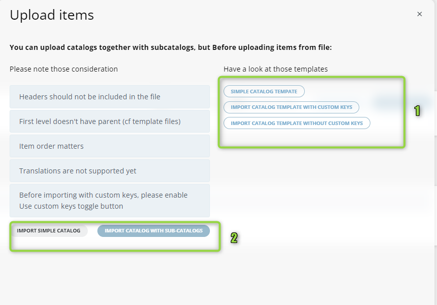
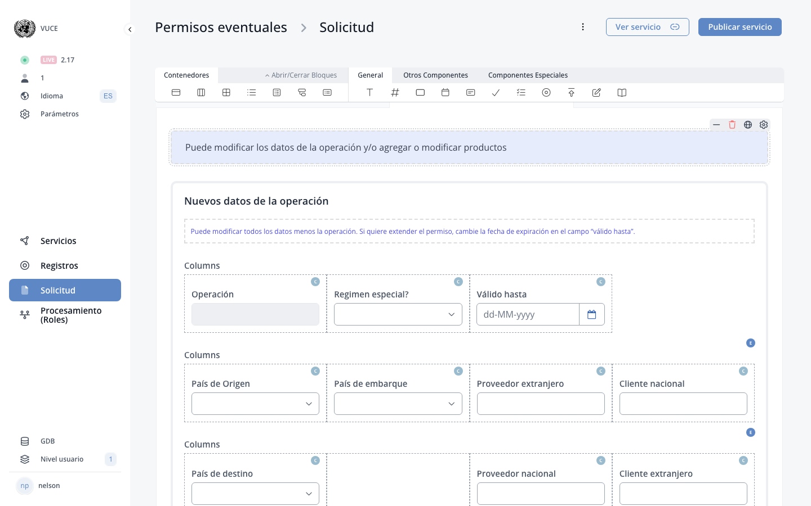

# B. Application file (DS)

??? example "Original Manual Screenshots"
    { loading=lazy }

    { loading=lazy }

    { loading=lazy }

    { loading=lazy }

    { loading=lazy }

{ loading=lazy }
*Current BPA view — B. Application File*
*The applicant sees this form after starting a new application in the Display System.*

## 1. Guide

Answers provided in the Guide will help determine, for each specific user, which documents, fees and data are required.

---

## Shopping cart as alternative to Guide

Shopping cart: Alternative to the Guide, improved version. Shows summary of registrations, how much to pay and what documents to upload. Accessible on all pages. The shopping cart is enabled via a toggle in service settings and replaces the Guide page for services that use it.

---

## 2. Applicant form

This is where the applicant provides all the relevant data that pertains to his objective.

---

## 3. Documents

This is the documents upload page. This tab will appear only if documents need to be uploaded.

---

## 4. Payment

Payment tab will appear only if there is a payment in the process.

---

## 5. Send page - E-signature

The confirmation page usually consists of a set of terms and conditions that the applicant needs to abide by. The Send page may now include e-signature functionality, allowing applicants to digitally sign their application before submission.

---

## UI theme changes across application file pages

All application file pages (Guide, Form, Documents, Payment, Send) may have received visual updates as part of DS UI theme changes.

---
