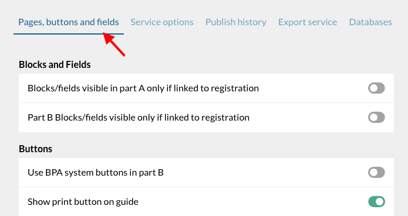
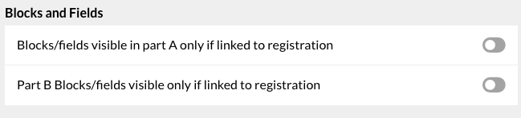
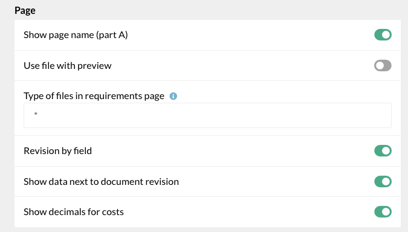
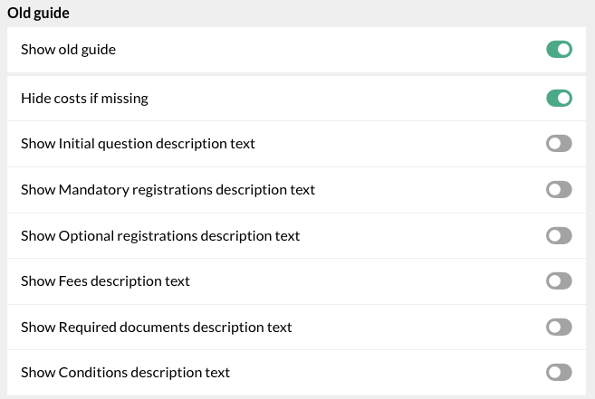
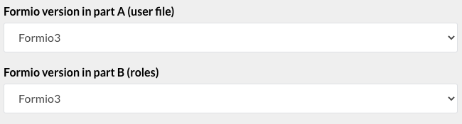

# C. Operators processing pages

<!-- PDF Screenshots -->
??? example "Original Manual Screenshots"
    { loading=lazy }

    { loading=lazy }

    { loading=lazy }

    { loading=lazy }

    { loading=lazy }

    { loading=lazy }

    { loading=lazy }

    { loading=lazy }

    { loading=lazy }

    { loading=lazy }

    { loading=lazy }

    { loading=lazy }

    { loading=lazy }

    { loading=lazy }

    { loading=lazy }

    { loading=lazy }

    { loading=lazy }

    { loading=lazy }

    { loading=lazy }

    { loading=lazy }

!!! info "Update Summary (6 changes detected)"
    6 changes detected: Part B system actions integration in processing, e-signature verification capability for operators, effects system may alter processing behavior, file list page may have UI updates, processing page may show new tabs or features, clearing old files functionality needs verification.

<!-- Live BPA Screenshot: live-operators-processing -->

{ loading=lazy }
*Current BPA view (2026-02-15) — [C. Operators Processing](https://bpa.cuba.eregistrations.org/services/2c918084887c7a8f01887c99ed2a6fd5/roles){ target=_blank }*
*Operators process applications through the roles/workflow defined in the BPA.*

<!-- /Live BPA Screenshot: live-operators-processing -->

## Processing pages overview

Processing pages are what operators of the institutions which offer registrations in a service see. As a super administrator, you can access the operators' processing pages from the display system (through Part B).

---

## 1. The file list page - Status filters

!!! question "Needs Verification"
    The file list page with status filters, service/role dropdowns, and calendar filter is a core processing feature. The underlying functionality is likely the same but the visual presentation may have changed with UI theme updates. The exact layout of filters and status buttons should be verified.

The list of files filtered by status (pending, approved, rejected, sent back for corrections) is displayed. The drop down list displays all services. Select the service, then select the role from the first dropdown. Calendar icon allows viewing applications submitted at a certain day/time range. The first screen displays all pending files by default.

<!-- Verify screenshot: File list page showing status filters, service dropdown, role dropdown, calendar filter -- verify current layout and appearance -->

---

## File list sub menu

Sub menu: Status of file, Business name, Date of receipt, status of registrations, operator in charge. Status filter on bottom corner with different colors. Other filters: all files, validated, sent back, rejected.

<!-- Verify screenshot: File list sub menu columns and status filter colors -- verify current appearance -->

---

## 2. The processing page - Application details and history

This is the 2nd screen of the operator's role. The top part displays application details (zip folder of documents) and application history.

<!-- Verify screenshot: Processing page top section with application details and history -- verify current layout -->

---

## a) Revision role

Revision role: Requires operator to verify documents and data. If operator chooses 'NO' under documents revision, field appears for rejection reason. Documents revision tab shows uploaded documents on left, data and requirements on right. Data revision tab displays all components.

<!-- Verify screenshot: Revision role with documents revision and data revision tabs -- verify current appearance -->

---

## b) Processing role

Processing role: Form/action developed by analyst. Operator can generate action (display/upload certificate). Validate, reject, or send back the application. Documents tab shows uploaded documents and certificates. Data tab shows all BPA application file components.

<!-- Verify screenshot: Processing role showing form, action buttons, documents tab, data tab -- verify current appearance -->

---

## Part B system actions

!!! question "Needs Verification"
    The BPA service settings mention 'enabling BPA system buttons in Part B' under the Buttons options in Pages/buttons/fields settings. This suggests that Part B (the operator's processing interface) can now display system action buttons that were previously only available in the BPA. The exact nature, appearance, and functionality of these Part B system actions needs verification on the current platform. This could be a significant addition to the operator's processing workflow.

Part B may now include system action buttons that can be enabled via BPA service settings. These buttons allow operators to perform additional system-level actions during processing, such as triggering BOTs, generating documents, or executing automated workflows directly from the processing page.

<!-- Screenshot needed: Part B system actions -- capture any system action buttons visible in the processing page if they exist -->
*Screenshot: Part B system actions -- capture any system action buttons visible in the processing page if they exist*

---

## E-signature verification in processing

!!! question "Needs Verification"
    E-signature is a known new platform feature. If applicants can e-sign their applications on the Send page, it follows that operators would need to see and verify this signature during processing. However, the exact implementation -- whether there is a dedicated signature verification panel, a status indicator, or integration with the documents revision tab -- is not confirmed and needs verification on the current platform.

Operators may now be able to verify e-signatures on submitted applications during the processing stage. If applicants use e-signature on the Send page, operators should be able to see and verify the signature status.

---

## Effects system in processing

!!! question "Needs Verification"
    The effects system is mentioned as a new platform feature (in the MANUAL-UPDATE-PLAN.md). Effects allow creating automated reactions to events in the system. In the context of operator processing, effects could be triggered by status changes (approval, rejection, send-back). However, whether effects are visible to operators during processing or are purely backend automation is unknown. The exact relationship between effects and the processing page UI needs verification.

The effects system may influence operator processing by automatically triggering actions based on operator decisions. For example, when an operator approves or rejects a file, effects may automatically trigger BOTs, send notifications, or update database records.

---

## 3. Clearing old files from the service

The section on clearing old files from the service describes the process for removing outdated application files.

<!-- Verify screenshot: Clearing old files -- verify the feature is still present and accessible in the same location -->

---
