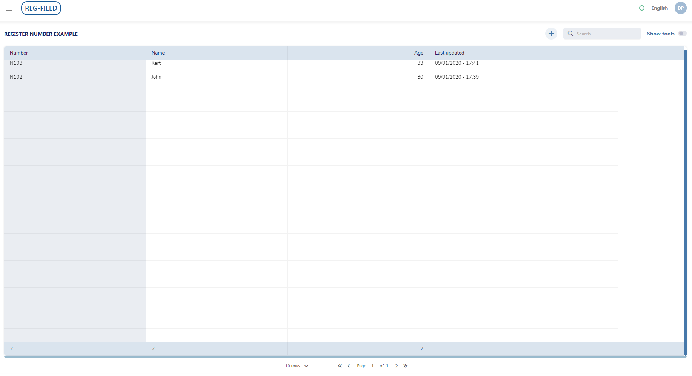
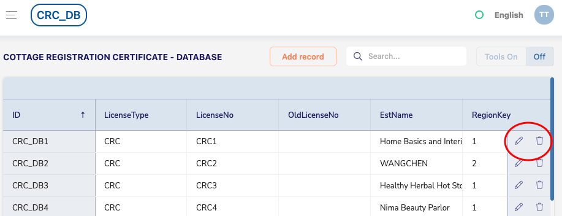
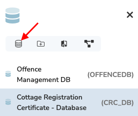
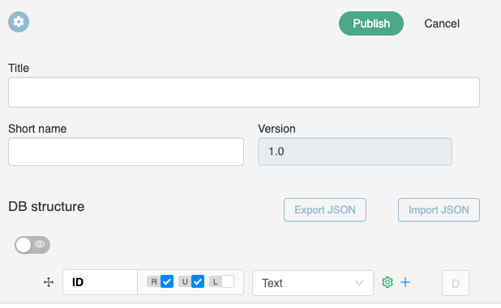
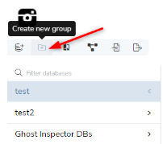
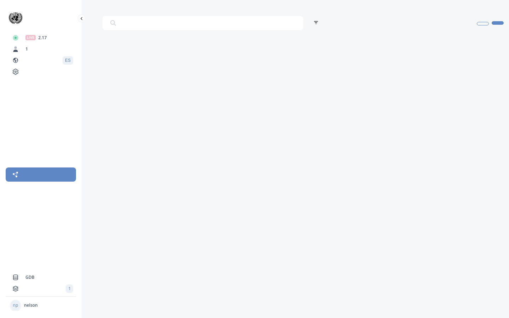

# B.4. Database management

<!-- PDF Screenshots -->
??? example "Original Manual Screenshots"
    { loading=lazy }

    { loading=lazy }

    { loading=lazy }

    { loading=lazy }

    { loading=lazy }

    { loading=lazy }

    { loading=lazy }

    { loading=lazy }

    { loading=lazy }

    { loading=lazy }

    { loading=lazy }

    { loading=lazy }

    { loading=lazy }

    { loading=lazy }

    { loading=lazy }

    { loading=lazy }

    { loading=lazy }

    { loading=lazy }

    { loading=lazy }

    { loading=lazy }

    { loading=lazy }

    { loading=lazy }

    { loading=lazy }

    { loading=lazy }

    { loading=lazy }

    { loading=lazy }

    { loading=lazy }

    { loading=lazy }

!!! info "Update Summary (5 changes detected)"
    5 changes detected: API types list may have expanded beyond the 9 documented types.
    Views feature may have new options.
    Import/export formats may have changed.
    Filters and columns functionality is stable.
    DB Structure management is stable.

<!-- Live BPA Screenshot: live-gdb-management -->

{ loading=lazy }
*Current BPA view (2026-02-15) — [B.4. Database Management](https://gdb.cuba.eregistrations.org){ target=_blank }*
*Database management is handled in the GDB system.*

<!-- /Live BPA Screenshot: live-gdb-management -->

## Database management menu

The 'tools on' button displays the database management menu: Version, creation date, administrator login.

---

## Filters

Filters allow selective data viewing. Complex filters available for nested conditions.

---

## Columns

Columns tab displays selected data.

---

## Reports

Reports tab for creating/viewing reports.

---

## Import data

!!! question "Needs Verification — [Verify in BPA](https://gdb.cuba.eregistrations.org){ target=_blank }"
    The import functionality is core GDB feature. However, the supported import formats and options may have expanded. The current import dialog should be verified to ensure all available formats and options are documented.

Import data from external files/databases.

<!-- Verify screenshot: Import data dialog -- verify current supported formats and import options -->

---

## Export data

!!! question "Needs Verification — [Verify in BPA](https://gdb.cuba.eregistrations.org){ target=_blank }"
    The export formats documented (JSON, XLS, CSV) are the standard set. Additional export formats may have been added. The current export dialog should be verified to confirm available formats.

Export data in JSON, XLS, CSV formats.

<!-- Verify screenshot: Export data dialog -- verify current supported formats -->

---

## Log

Log displays change history.

---

## Delete data

Delete data button (irreversible).

---

## a) Views

!!! question "Needs Verification — [Verify in BPA](https://gdb.cuba.eregistrations.org){ target=_blank }"
    Views are a mature GDB feature. The core workflow (create, filter, select fields, publish) is likely the same. However, views may have gained new features such as additional filter options, improved multi-database views, new embed options, or enhanced URL/sharing capabilities. The current views interface should be verified for any additions.

Subset of GDB displaying selected data defined by filters. Create view by clicking Views tab, '+' button, enter name, add filters, drag fields to 'view fields'. Publish for visibility. Complex views involving multiple databases possible through linked databases.

<!-- Verify screenshot: Views creation and configuration -- verify if new features or options have been added -->

---

## b) APIs

!!! question "Needs Verification — [Verify in BPA](https://gdb.cuba.eregistrations.org){ target=_blank }"
    The manual documents 9 API types: Create, Create-entries, Read, List, Update, Listen, Update-entries, Exists, Delete. This is a comprehensive list but additional API types may have been added to the platform since July 2025. The API dashboard with its statistics, versioning, and visibility toggle are mature features. A review of the current API type dropdown is recommended to confirm whether new types exist.

Tool for web services enabling data exchange between DS and GDB. API types: Create, Create-entries, Read, List, Update, Listen, Update-entries, Exists, Delete. Dashboard shows creation date, name, URL, usage counts. APIs versioned per database version. Visibility toggle controls BPA availability.

<!-- Verify screenshot: API creation -- verify the current list of available API types and whether new ones have been added beyond the 9 documented -->

---

## API Dashboard

Dashboard shows creation date, name, URL, usage counts. Statistics visualization available. Copy URL button and visibility toggle for BPA availability. Delete API button available.

<!-- Verify screenshot: API dashboard -- verify current appearance and any new dashboard features -->

---

## c) DB Structure

Modify database structure. Duplicate database. Add/delete/reorder fields. Version updates on save. Publish and remap in BPA required.

---
