# B.5. Special features

<!-- PDF Screenshots -->
??? example "Original Manual Screenshots"
    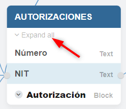{ loading=lazy }

    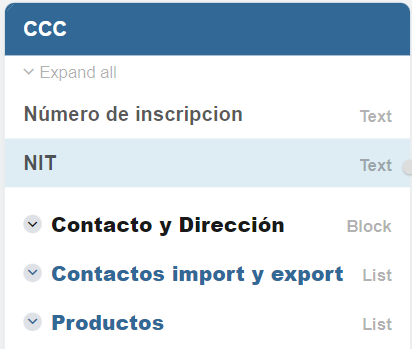{ loading=lazy }

    { loading=lazy }

    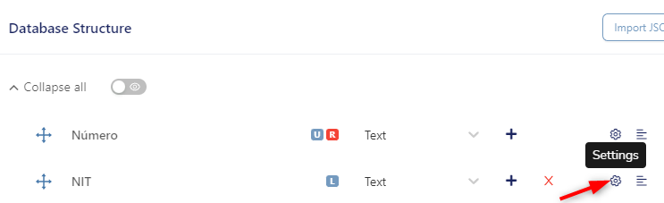{ loading=lazy }

    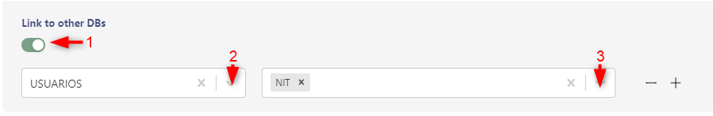{ loading=lazy }

    { loading=lazy }

    { loading=lazy }

    { loading=lazy }

    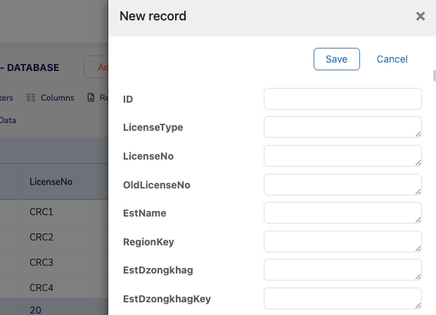{ loading=lazy }

    { loading=lazy }

    { loading=lazy }

    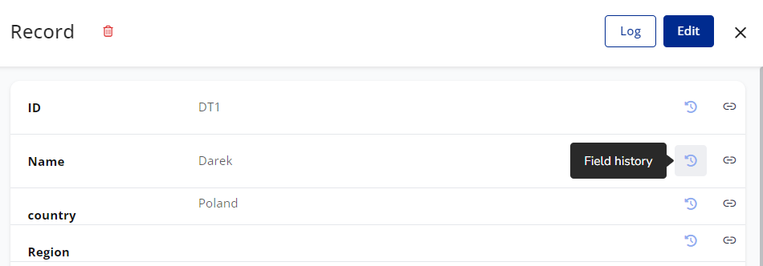{ loading=lazy }

    { loading=lazy }

    { loading=lazy }

    { loading=lazy }

    { loading=lazy }

    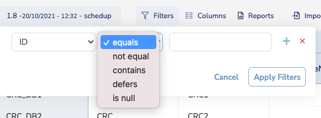{ loading=lazy }

    { loading=lazy }

    { loading=lazy }

    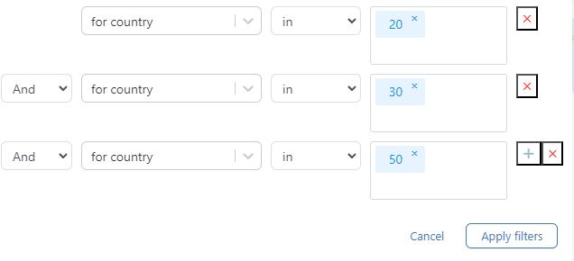{ loading=lazy }

    { loading=lazy }

    { loading=lazy }

    { loading=lazy }

    { loading=lazy }

    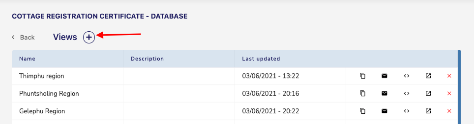{ loading=lazy }

    { loading=lazy }

    { loading=lazy }

    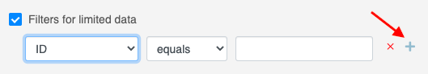{ loading=lazy }

    { loading=lazy }

!!! info "Update Summary (2 changes detected)"
    2 changes detected: Special features are largely stable.
    ID format tags and triggers may have new options.
    Some features may have minor improvements but the documented functionality is accurate.

<!-- Live BPA Screenshot: live-gdb-special -->

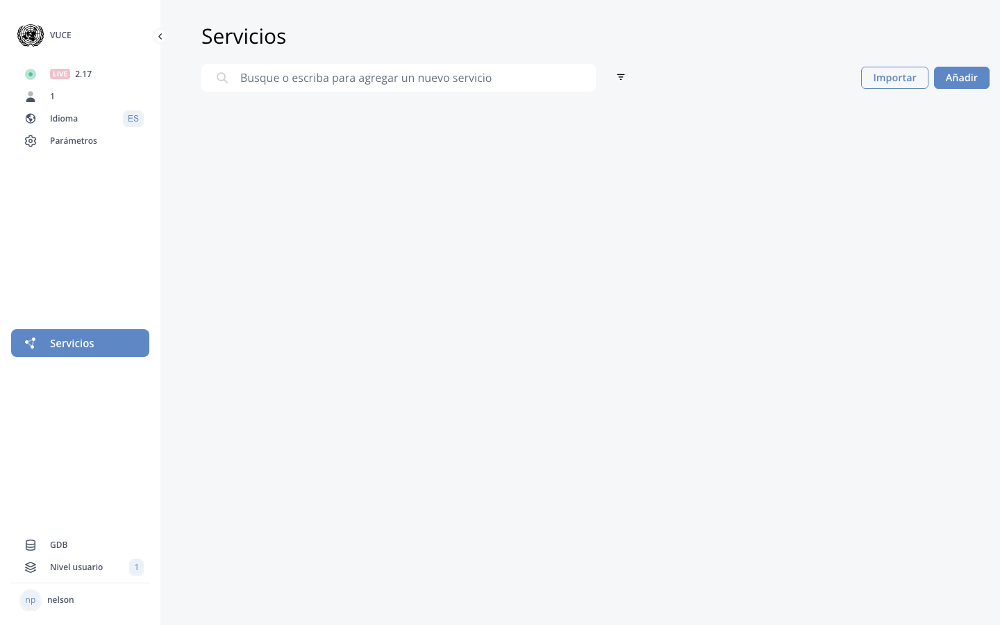{ loading=lazy }
*Current BPA view (2026-02-15) — [B.5. Special Features](https://gdb.cuba.eregistrations.org){ target=_blank }*
*Special features are part of the GDB system.*

<!-- /Live BPA Screenshot: live-gdb-special -->

## a) Change format of ID

Click DB Structure, click settings cog on ID column. Advanced Settings, Triggers tab. Configure with available tags: Short name, Index no, Index no by database code, Current year, End of number current year.

---

## ID format tags - possible new tags

!!! question "Needs Verification"
    The ID format tag list is specific and may have been expanded. New tags could have been added for additional formatting options (e.g., month, custom prefix, sequential numbering variations). The current tag dropdown should be verified to confirm the complete list.

The documented tags are: Short name, Index no, Index no by database code, Current year, End of number current year. Additional tags may have been added to the platform.

<!-- Verify screenshot: ID format tags dropdown -- verify if new tags have been added -->

---

## b) Show catalog key in database structure

Click Settings, activate 'Show key and value' toggle.

---

## c) Migrate data between databases

Open target table, click 'Import Data', Database tab, Create. Select source database, drag and drop column labels to map data, click Migrate.

---

## d) Import data to other database on trigger

Import data to other database on trigger.

---

## e) Setting readonly field property

Setting readonly field property on GDB.

---

## f) Pattern label (regex)

How to apply pattern label (regex using) on GDB.

---

## g) Listing value in edit grids

How to add listing value in GDB edit grids.

---

## h) Compare databases

How to compare two databases.

---

## i) Textfield to select

How to make a textfield into a select predefined values field.

---

## j) Limit document type

Where to limit the document type accepted by the file field.

---

## k) Multiple files

How to configure database file field to accept multiple files: Open DB structure, add file field, open advance settings, Base settings tab, activate Multiple toggle, publish.

---

## Possible new special features

!!! question "Needs Verification"
    GDB special features is a collection of various configuration options and tips. While the documented features are all likely still valid, new special features or configuration options may have been added. A comprehensive review of the current GDB settings and advanced options is recommended to identify any undocumented features.

Additional special features or GDB triggers may have been added to the platform since July 2025.

---
