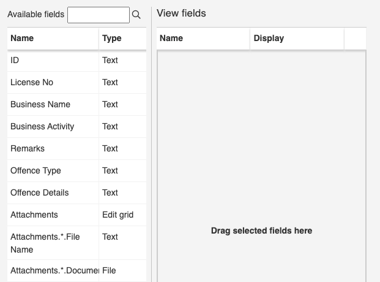
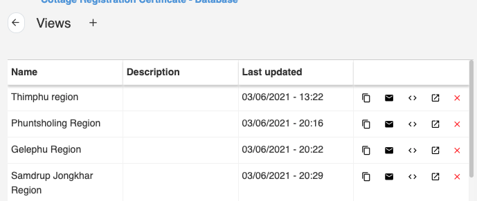
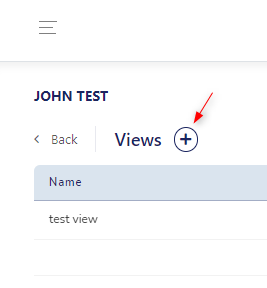
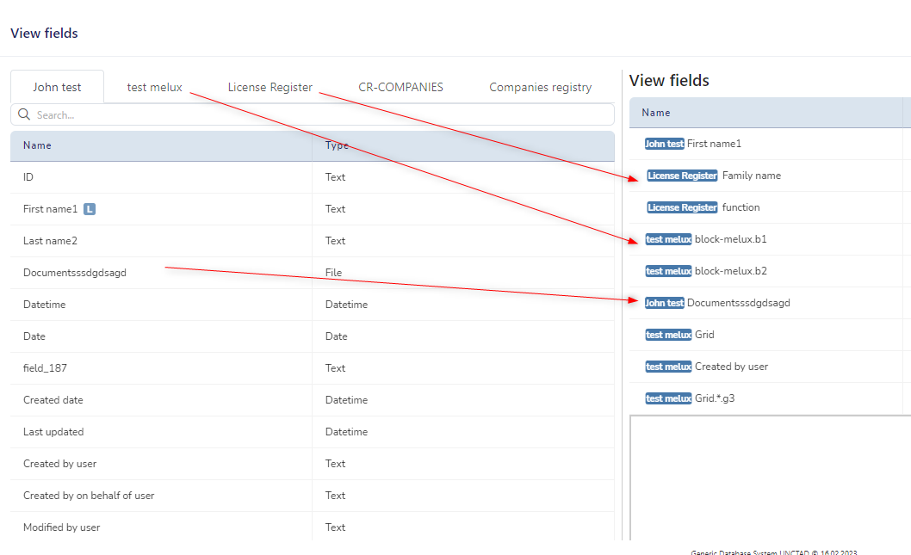
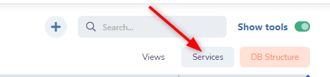
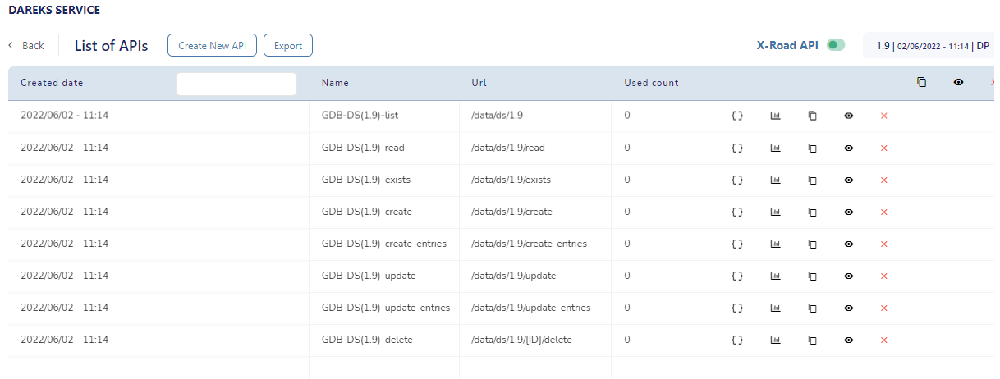
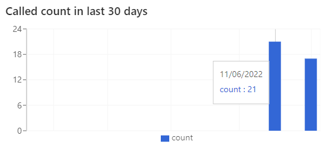
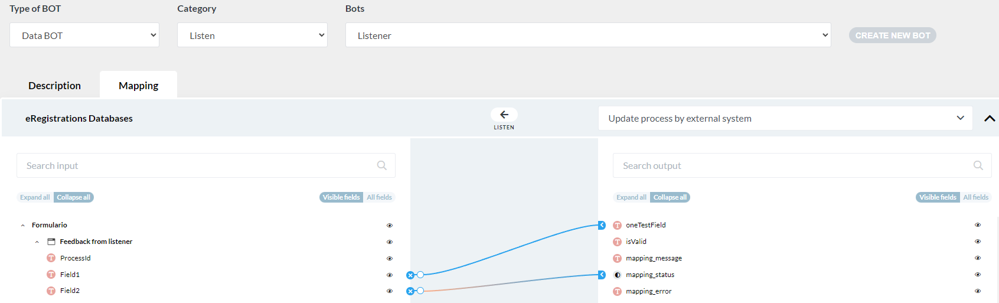
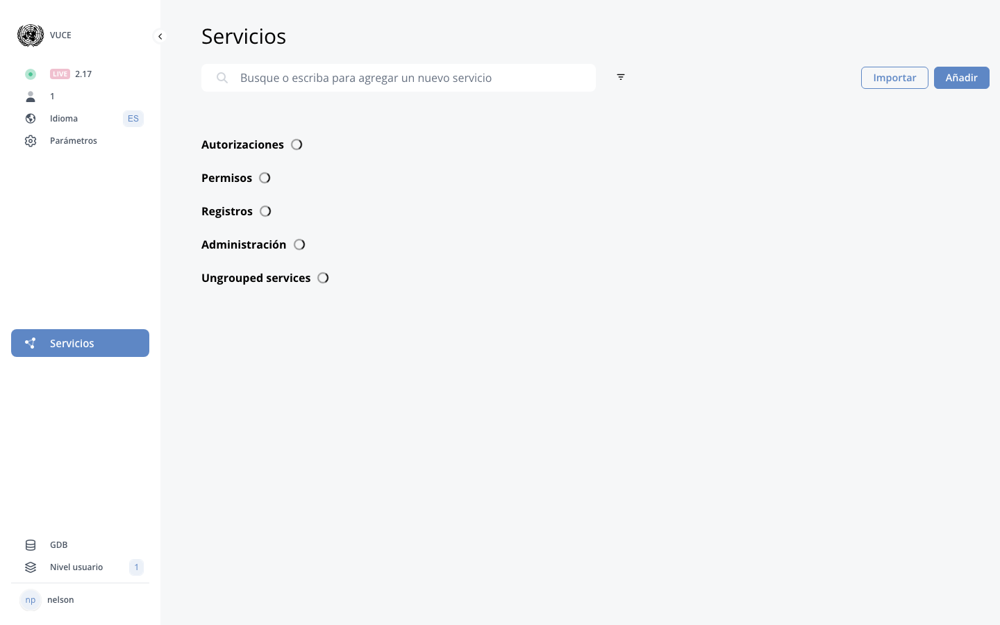

# B.6. User rights in GDB

<!-- PDF Screenshots -->
??? example "Original Manual Screenshots"
    { loading=lazy }

    { loading=lazy }

    { loading=lazy }

    { loading=lazy }

    { loading=lazy }

    { loading=lazy }

    { loading=lazy }

    { loading=lazy }

    { loading=lazy }

    { loading=lazy }

    { loading=lazy }

    { loading=lazy }

    { loading=lazy }

    { loading=lazy }

    { loading=lazy }

    { loading=lazy }

    { loading=lazy }

!!! info "Update Summary (2 changes detected)"
    2 changes detected: Rights system is mature and stable.
    Keycloak integration may have evolved with new import features or SSO improvements.
    Toggle behavior (GREEN/GREY/YELLOW) is unchanged.

<!-- Live BPA Screenshot: live-gdb-rights -->

{ loading=lazy }
*Current BPA view (2026-02-15) — [B.6. User Rights](https://gdb.cuba.eregistrations.org){ target=_blank }*
*User rights for GDB are managed within that system.*

<!-- /Live BPA Screenshot: live-gdb-rights -->

## User rights overview

User rights management enables admin users to grant or take away rights and privileges to other users.

---

## a) User rights page layout

Click user button, select User management. Left side: list of registered users. Right side: rights granted to selected user.

---

## Search existing user

Search an existing user from the list of registered users.

---

## Import user from CAS/Keycloak

!!! question "Needs Verification — [Verify in BPA](https://gdb.cuba.eregistrations.org){ target=_blank }"
    The CAS/Keycloak user import feature is documented and likely still works the same way. However, Keycloak integration may have evolved since July 2025 -- for example, there may be new import options, batch import capabilities, or changes to how Keycloak IDs are handled. The basic workflow (import from identity provider) is likely the same, but specific details should be verified.

Create a new user: Must be registered in CAS/KC first. Import by clicking icon next to search field, enter user ID. Users can be imported from CAS or Keycloak identity providers.

<!-- Verify screenshot: User import from CAS/Keycloak -- verify current import dialog and options -->

---

## Rights columns and actions

Right side: rights - Resources (databases) in first column. Actions: Read, Create, Update, Publish, Delete, User rights. Toggles define actions per database.

---

## Groups of databases

Groups of databases are listed under their group. Rights can be granted to group or specific database.

---

## b) Database structure rights

Read (needs Data toggle on), Update (Save button appears), Publish (Publish button appears), Delete (Delete button appears).

---

## c) Data User rights (Generic)

Read, Update (Edit button per entry), Delete (Delete button per entry).

---

## d) Data User rights (field level restrictions)

Click 'restrictions' button. Grant read/update rights to specific columns or records matching filter conditions.

---

## e) Toggle behavior rules

GREEN=fully authorised, GREY=not authorised, YELLOW=partially authorised. Parent GREEN=all children GREEN. Parent YELLOW=at least one child YELLOW or GREY. Parent GREY=all children GREY.

---

## Keycloak integration evolution

!!! question "Needs Verification — [Verify in BPA](https://gdb.cuba.eregistrations.org){ target=_blank }"
    Keycloak is the identity management system used by eRegistrations. While the basic import workflow is likely the same, Keycloak itself receives updates and the eRegistrations integration may have been enhanced. Any new Keycloak-related features or changes to the authentication/authorization workflow should be verified with the platform team.

Keycloak integration for user management may have evolved since July 2025, potentially including new SSO features, improved user synchronization, or changes to how user identities are managed across the platform.

---
