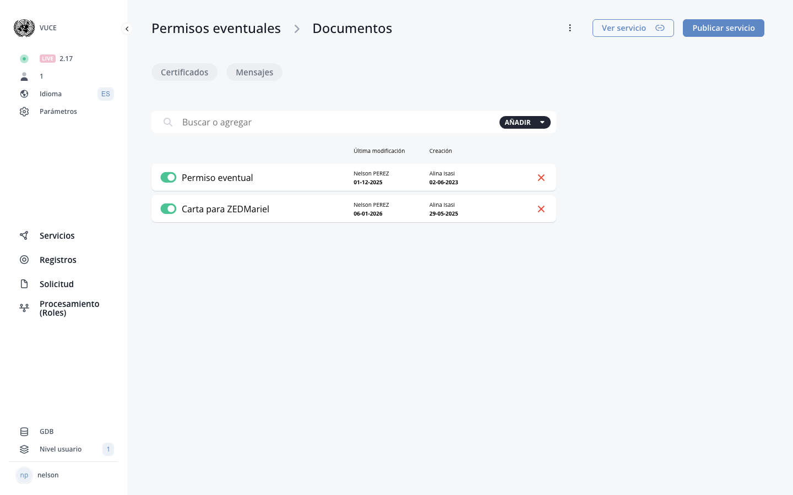

# Effects System


<div class="live-screenshot" markdown>

{ loading=lazy }
*Current BPA view — Effects System*
*The Effects system controls component behaviours via determinant-driven rules.*


</div>

## Overview of the Effects System


The Effects system is an extension of the Determinants functionality in eRegistrations. While determinants define conditions based on field values (e.g., 'if field X equals Y'), Effects define what happens to a component when those conditions are met. Effects provide more granular control over component behavior than the basic determinant show/hide mechanism described in the Determinants section.

Effects work through a layered structure:
- A form component can have a 'component behaviour' attached to it.
- Each component behaviour can contain one or more 'effects'.
- Each effect links one or more determinants to the component and specifies what should happen when the determinant conditions are met.


This service has **64 component behaviours** defined across its forms. Nearly every one of these behaviours carries exactly 1 effect (effect_count: 1), demonstrating that the typical pattern is a one-to-one mapping between a behaviour and its effect. One behaviour has 0 effects, indicating a behaviour record can exist as a placeholder before an effect is attached. The 64 behaviours span a wide range of component types including blocks, columns, tabs, fieldsets, and individual interactive elements.

---

## Effect Types


The following effect types are available when creating an effect:
- activate: Activates a component when the determinant conditions are met.
- deactivate: Deactivates a component when the determinant conditions are met.
- show: Makes a component visible when the determinant conditions are met.
- hide: Hides a component when the determinant conditions are met.
- enable: Enables a component (makes it editable) when the determinant conditions are met.
- disable: Disables a component (makes it read-only) when the determinant conditions are met.

Each effect also has an effect_value (a boolean) that determines the polarity of the effect.


These six types fall into three functional pairs that control different aspects of a component:

| Pair | Effect types | What they control |
|------|-------------|-------------------|
| **Visibility** | `show` / `hide` | Whether the component is visible on the form |
| **Activation** | `activate` / `deactivate` | Whether the component is active in the workflow |
| **Interactivity** | `enable` / `disable` | Whether the user can interact with or edit the component |


---

## Creating an Effect


To create an effect on a form component:
1. Identify the service and the target form component (by its component key).
2. Select one or more determinants that will serve as the conditions for the effect.
3. Choose the logic for combining multiple determinants: 'AND' (all determinants must match) or 'OR' (any determinant must match). The default is 'AND'.
4. Select the effect type (activate, deactivate, show, hide, enable, or disable). The default is 'activate'.
5. Set the effect value (true or false). The default is true.
6. Save the effect.

When an effect is created, the system generates a behaviour record for the component (if one does not already exist) and attaches the effect to it. The system returns a behaviour_id, effect_id, and an audit_id for tracking the change.


**Concrete example:** To make the block `applicantBlock9` ("Provea aqui la fundamentacion") appear only when a specific condition is met, you would:

1. Set the component key to `applicantBlock9`.
2. Select the determinant(s) that represent the condition (for example, a determinant that checks whether the applicant selected a particular permit type).
3. Set the logic to `AND` if multiple determinants must all be true simultaneously.
4. Set the effect type to `show` and the effect value to `true`.
5. Save — the system creates a component behaviour for `applicantBlock9` with one effect attached.

After saving, the behaviour list for the service will show `applicantBlock9` with `effect_count: 1`.

---

## Determinant Logic: AND vs OR


When an effect references multiple determinants, the logic parameter determines how they are combined:
- AND logic: All referenced determinants must have their conditions met for the effect to trigger. This is the default.
- OR logic: The effect triggers if any one of the referenced determinants has its condition met.

This allows for complex conditional behaviors. For example, you could create an effect that shows a field only when both the applicant type is 'company' AND the registration type is 'new registration' (AND logic), or create an effect that disables a field when either the application is in 'draft' status OR the user has selected 'not applicable' (OR logic).


Consider the component `datosComplementariosContinuar`. A behaviour on this component might use AND logic to combine two determinants: one checking that a required classification has been selected, and another checking that supplementary data fields have been filled. Only when both conditions are satisfied does the "Continue" button become active, preventing the applicant from advancing before providing all required information. The sibling component `datosComplementariosContinuar2` can use the same pattern for a different step in the form.

---

## Component Behaviours


Component behaviours are the containers that hold effects for a specific form component. Each form component can have at most one behaviour record, but that behaviour can contain multiple effects.

A component behaviour includes:
- A unique behaviour ID.
- The component key identifying which form component it applies to.
- The service ID.
- A list of effects, each containing its own determinants and property effects.

You can list all component behaviours for a service to see which components have effects configured, along with the effect count for each. You can also retrieve the behaviour for a specific component by its key.


The table below shows a representative selection of the 64 component behaviours in this service. Nearly all have exactly 1 effect; one has 0 effects.

| Component key | Description | effect_count |
|---------------|------------|:------------:|
| `applicantBlock9` | "Provea aqui la fundamentacion" — conditional justification block | 1 |
| `applicantBlock3` | "Datos de contacto" — contact data block | 1 |
| `applicantBlock5` | "Contadores" — counters block | 1 |
| `applicantcolumns2` | Column layout component in the applicant form | 1 |
| `applicantcolumns5` | Column layout component in the applicant form | 1 |
| `applicantTabsFacultades` | Tabs component for "Facultades" (permissions/authorities) | 1 |
| `datosComplementariosContinuar` | "Continue" action in supplementary data section | 1 |
| `datosComplementariosContinuar2` | Second "Continue" action in supplementary data | 1 |
| `datosComplementariosContent` | Content container for supplementary data | 1 |
| `solicitudDescargarElFichero` | "Download the file" action on the application | 1 |
| `solicitudBlock2` | Block within the application step | 1 |
| `revisionTabsNuevasSolicitudes` | Tabs for "New applications" in the review step | 1 |
| `revisionFieldSet2` | Fieldset in the review step | 1 |
| `permisoFirmadoNoSeHanObtenidoDatosVerifiqueElServicioWeb` | Message: "Data not obtained — verify web service" | 1 |
| *(+ 50 more behaviours)* | Various blocks, columns, tabs, fields, and actions | 1 each (one has 0) |

This inventory shows that effects are used throughout the entire service lifecycle — from the applicant form (`applicantBlock*`, `applicantcolumns*`, `applicantTabsFacultades`), through supplementary data collection (`datosComplementarios*`), to the application step (`solicitud*`), the review step (`revision*`), and the final signed-permit step (`permisoFirmado*`).


---

## Deleting an Effect


To delete an effect, you need the behaviour_id of the behaviour containing the effect. Deleting a behaviour removes it and all its associated effects from the component.

The delete operation is audited and returns confirmation of the deletion along with details of the deleted behaviour and an audit_id.


---

## Relationship between Effects and Determinants


It is likely that the existing determinant show/hide behavior described in section D.2 coexists with the newer Effects system. The original determinant-based show/hide may still work for simple cases, while the Effects system provides more advanced options. The exact relationship and whether the Effects system supersedes or complements the older approach needs to be verified.

**Summary of the relationship:**

```
Determinant (condition)          Effect (action)
─────────────────────    +    ─────────────────────
"If permit type = X"     →    show applicantBlock9
"If status = draft"      →    disable solicitudDescargarElFichero
"If classification = Y"  →    activate applicantTabsFacultades
```


---

## Effects System UI Location in BPA


The Effects system is likely accessible through one or more of the following locations in the BPA:
- Within the component edit modal (slider), possibly as a new tab alongside or replacing the existing 'Determinant' tab.
- As a dedicated section in the side menu for managing all effects across the service.
- Through the component's gear/edit icon, similar to how determinants are currently configured.

The exact UI location, navigation path, and visual appearance of the Effects configuration interface need to be verified on the live platform.

---
