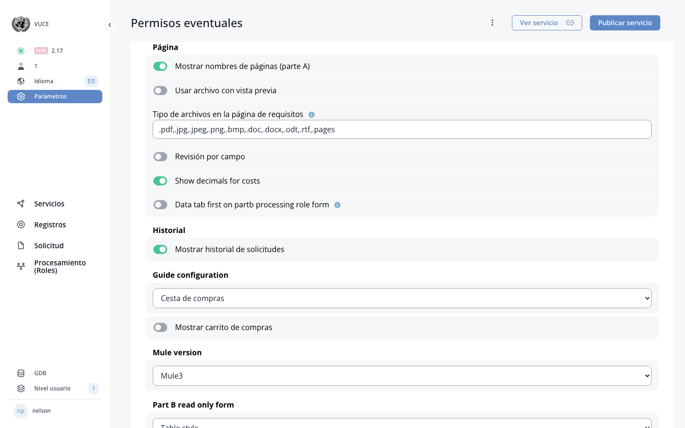

# E-signature

!!! info "Update Summary (7 changes detected)"
    Entirely new section.
    E-signature functionality allows applicants to digitally sign documents or the application itself.
    The original manual describes the Send file page (section D.6) as the 'declaration and signature page' with an 'I Swear' custom component, but does not mention digital or electronic signatures.
    E-signature likely extends the Send page with actual digital signing capability.
    It may involve integration with external e-signature providers, new custom components, or configuration in service settings.
    No direct MCP tool endpoints for e-signature were found, suggesting it may be implemented as a form component configuration or external integration.
    7 blocks identified, all needing verification due to limited concrete information.

<!-- Live BPA Screenshot: live-e-signature -->

{ loading=lazy }
*Current BPA view (2026-02-15) — [E-signature](https://bpa.cuba.eregistrations.org/services/2c918084887c7a8f01887c99ed2a6fd5/settings/configuration){ target=_blank }*
*E-signature is configured in service settings.*

<!-- /Live BPA Screenshot: live-e-signature -->

## Overview of E-signature

!!! question "Needs Verification — [Verify in BPA](https://bpa.cuba.eregistrations.org/services/2c918084887c7a8f01887c99ed2a6fd5/settings/configuration){ target=_blank }"
    The original manual's Send file section (D.6) mentions the 'I Swear' component for declaration and signature but does not describe electronic or digital signature capabilities. E-signature is identified as a new feature in the manual update plan. No MCP tool endpoints specific to e-signature were found in the available tools, suggesting it may be implemented at the form component or service configuration level.

E-signature functionality allows applicants to digitally sign documents or the application itself within the eRegistrations platform. This provides legal validity to the submission and may replace or supplement the traditional 'I Swear' declaration component.

E-signature may be implemented as:
- A new custom component in the form builder that can be placed on the Send page or other pages.
- An enhancement to the existing Send file page workflow.
- An integration with external e-signature providers (e.g., DocuSign, Adobe Sign, or government-provided e-signature infrastructure).

The specific implementation approach needs verification.

---

## E-signature Configuration in BPA

!!! question "Needs Verification — [Verify in BPA](https://bpa.cuba.eregistrations.org/services/2c918084887c7a8f01887c99ed2a6fd5/settings/configuration){ target=_blank }"
    The configuration workflow is speculative. The bpa-settings analysis notes that e-signature may have associated settings at the service level. A human reviewer should document the actual configuration process by accessing the BPA.

To configure e-signature for a service, the analyst likely needs to:
1. Enable e-signature at the service level (possibly through service settings).
2. Add an e-signature component to the appropriate form page (likely the Send page).
3. Configure which documents or forms require a signature.
4. Set up the e-signature provider integration (if using an external provider).
5. Configure the signature validation rules and appearance.

The exact configuration steps and UI location need verification.

---

## E-signature Component in Form Builder

!!! question "Needs Verification — [Verify in BPA](https://bpa.cuba.eregistrations.org/services/2c918084887c7a8f01887c99ed2a6fd5/settings/configuration){ target=_blank }"
    The original manual documents several custom components (I Swear, QR code, Payment Providers) but does not mention an e-signature component. If e-signature is a form component, it would likely appear in the Custom Components tab alongside these. The exact component type and configuration options need verification.

E-signature may be available as a new custom component in the form builder, similar to the existing 'I Swear' component and 'QR code' component found in the Custom Components tab.

The e-signature component would likely allow:
- Capturing a digital signature (drawn, typed, or uploaded).
- Linking the signature to specific form data or documents.
- Displaying a signature verification indicator.

The component may have its own configuration options for signature type, appearance, and validation.

---

## E-signature Provider Integration

!!! question "Needs Verification — [Verify in BPA](https://bpa.cuba.eregistrations.org/services/2c918084887c7a8f01887c99ed2a6fd5/settings/configuration){ target=_blank }"
    The nature of the e-signature integration is entirely speculative. Different eRegistrations deployments may use different e-signature providers depending on local legal requirements. A human reviewer should determine what providers are supported and how they are configured.

E-signature may integrate with external providers for digital signature validation. Common integration patterns include:
- Government PKI (Public Key Infrastructure) systems for legally binding signatures.
- Third-party e-signature services (DocuSign, Adobe Sign, etc.).
- OTP (One-Time Password) based signature verification.
- Certificate-based digital signatures.

The integration may be configured at the instance level (affecting all services) or at the service level.

---

## E-signature on Send Page

!!! question "Needs Verification — [Verify in BPA](https://bpa.cuba.eregistrations.org/services/2c918084887c7a8f01887c99ed2a6fd5/settings/configuration){ target=_blank }"
    The Send page is the most logical location for e-signature since it is already designated as the declaration and signature page. The exact integration of e-signature with the Send page workflow needs verification.

The Send file page (section D.6 of the manual) is described as the 'declaration and signature page.' E-signature functionality likely appears on or is closely associated with this page.

With e-signature enabled, the Send page may include:
- A digital signature pad or upload area.
- A summary of what the applicant is signing.
- Terms and conditions with the signature requirement.
- Signature verification status indicators.

The existing 'I Swear' component may work alongside or be replaced by the e-signature component.

<!-- Screenshot needed: Screenshot of the Send page with e-signature enabled, showing how the signature interface appears to the applicant. -->
*Screenshot: Screenshot of the Send page with e-signature enabled, showing how the signature interface appears to the applicant.*

---

## E-signature in Service Settings

!!! question "Needs Verification — [Verify in BPA](https://bpa.cuba.eregistrations.org/services/2c918084887c7a8f01887c99ed2a6fd5/settings/configuration){ target=_blank }"
    The bpa-settings.json analysis file includes a 'verify' block for 'E-signature related settings'. This section should be consistent with whatever e-signature settings are found in the service settings area.

E-signature may require configuration in the service settings area. Possible settings include:
- Enable/disable e-signature for the service.
- E-signature provider selection.
- Signature requirements (which pages or documents require signatures).
- Signature appearance customization.
- Legal text and terms associated with the signature.

The bpa-settings analysis has already flagged that new settings related to e-signature may exist.

---

## E-signature Applicant Experience (DS)

!!! question "Needs Verification — [Verify in BPA](https://bpa.cuba.eregistrations.org/services/2c918084887c7a8f01887c99ed2a6fd5/settings/configuration){ target=_blank }"
    The applicant-side experience of e-signature is speculative. The exact UI and user flow need to be verified on the Display System. This may also require documentation in the DS section of the manual (Part II).

From the applicant's perspective on the Display System (DS), e-signature likely appears as:
- A signature step or area on the Send page before final submission.
- Instructions for how to complete the digital signature.
- A visual confirmation that the document/application has been signed.
- A record of the signature in the application history.

The signed document or application may be available for download with an embedded signature.

---
