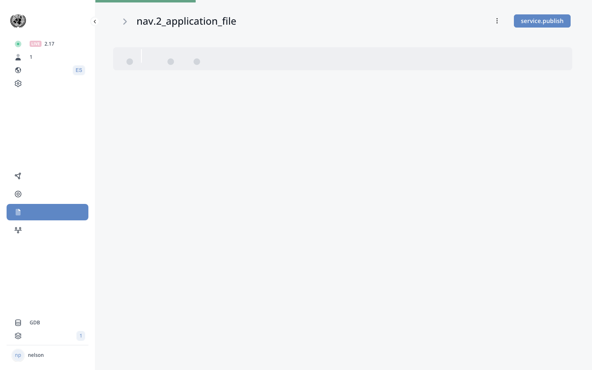

# Card-style Radios

!!! info "Update Summary (5 changes detected)"
    Entirely new section.
    Card-style radios are a new UI pattern for radio buttons that displays options as visual cards rather than traditional radio buttons.
    The original manual documents the 'Radio Switch' custom class (section D.8) which changes radio button appearance, but card-style radios appear to be a further evolution providing a more visual selection interface.
    This may be implemented as a new custom class, a new radio display mode in the form builder, or a new component type.
    5 blocks identified, all needing verification.

<!-- Live BPA Screenshot: live-card-radios -->

{ loading=lazy }
*Current BPA view (2026-02-15) — [Card-style Radios](https://bpa.cuba.eregistrations.org/services/2c918084887c7a8f01887c99ed2a6fd5/forms/applicant-form){ target=_blank }*
*Card-style radios are a display option for radio components in the form builder.*

<!-- /Live BPA Screenshot: live-card-radios -->

## Overview of Card-style Radios

!!! question "Needs Verification — [Verify in BPA](https://bpa.cuba.eregistrations.org/services/2c918084887c7a8f01887c99ed2a6fd5/forms/applicant-form){ target=_blank }"
    Card-style radios are identified as a new feature in the manual update plan. The original manual documents several radio-related custom classes including 'Radio Switch' (section D.8 - Appearance changing classes) but does not mention card-style display. The exact implementation mechanism needs verification.

Card-style radios are a new UI pattern in eRegistrations that displays radio button options as visual cards rather than traditional radio button circles with labels. Each option appears as a distinct card, potentially with an icon, title, and description, providing a more visual and user-friendly selection interface.

This pattern is particularly useful for:
- Guide questions where the applicant needs to make a clear choice between visually distinct options.
- Service type selection where each option has a unique visual identity.
- Any scenario where the visual card layout improves comprehension of the available options.

The original manual documents the 'Radio Switch' custom class which changes radio buttons into a switch-like appearance. Card-style radios are a further evolution of radio button display options.

<!-- Screenshot needed: Screenshot showing card-style radios in use on a form, comparing the visual appearance with traditional radio buttons. -->

---

## Implementing Card-style Radios

!!! question "Needs Verification — [Verify in BPA](https://bpa.cuba.eregistrations.org/services/2c918084887c7a8f01887c99ed2a6fd5/forms/applicant-form){ target=_blank }"
    The implementation mechanism is not confirmed. The custom class approach is most consistent with how eRegistrations handles visual variations (the manual documents numerous custom classes for different visual effects). However, it could also be a component property or a new component type. A human reviewer should verify the implementation.

Card-style radios may be implemented through one of the following mechanisms:

1. Custom class: A new custom class (e.g., 'card-radio' or 'radio-card') applied to a radio component through the Custom Class field in the component edit modal. This would follow the same pattern as the existing 'Radio Switch' custom class.

2. New display mode: A new display mode option in the radio component configuration, alongside existing layout options.

3. New component type: A dedicated 'Card Radio' component in the form builder, separate from the standard radio component.

The implementation mechanism determines how analysts configure card-style radios in the BPA.

<!-- Screenshot needed: Screenshot showing how card-style radios are configured in the BPA form builder -- whether through custom class, display mode, or component type. -->

---

## Card-style Radio Appearance and Customization

!!! question "Needs Verification — [Verify in BPA](https://bpa.cuba.eregistrations.org/services/2c918084887c7a8f01887c99ed2a6fd5/forms/applicant-form){ target=_blank }"
    The visual appearance and customization options are speculative based on common card-radio patterns in web applications. The actual appearance in eRegistrations may be more limited or have different options. A reviewer should capture screenshots of card-style radios in various configurations.

Card-style radios likely display each option as a card element that may include:
- An icon or image representing the option.
- The option label/title displayed prominently.
- An optional description or subtitle.
- A visual selection indicator (highlighted border, checkmark, or color change when selected).

Customization options may include:
- Card size (small, medium, large).
- Card layout (horizontal row, grid, or vertical stack).
- Icon or image support.
- Color theming.

The exact customization options available need verification.

<!-- Screenshot needed: Screenshots showing card-style radios with different configurations: with icons, different sizes, different layouts, and in selected/unselected states. -->

---

## Card-style Radios in the Guide

!!! question "Needs Verification — [Verify in BPA](https://bpa.cuba.eregistrations.org/services/2c918084887c7a8f01887c99ed2a6fd5/forms/applicant-form){ target=_blank }"
    The Guide is a natural use case for card-style radios because it involves clear choice-making. However, whether card-style radios are specifically designed for or restricted to the Guide needs verification. They may be available for any radio component in any form.

Card-style radios may be particularly useful in the Guide section of the application file, where applicants answer questions to determine their registration requirements. The card layout can make guide questions more intuitive by providing visual cards for each option.

For example, a guide question asking 'What type of registration do you need?' could display options as cards with icons representing each registration type, rather than a simple radio button list.

<!-- Screenshot needed: Screenshot of card-style radios used in a Guide question, showing how the card layout improves the question presentation. -->

---

## Relationship to Existing Custom Classes

!!! question "Needs Verification — [Verify in BPA](https://bpa.cuba.eregistrations.org/services/2c918084887c7a8f01887c99ed2a6fd5/forms/applicant-form){ target=_blank }"
    The relationship to existing custom classes determines where card-style radios should be documented in the manual. If it is a custom class, it belongs in section D.8. If it is a new component or display mode, it may belong in section D.3 (Applicant form) or as a standalone section. A reviewer should determine the correct categorization.

The original manual documents the following appearance-changing custom classes that affect radio and selection components:
- Radio Switch: Changes radio buttons into a switch-like appearance.
- Search results list: Changes the display of select/radio options.

Card-style radios may be:
- An addition to this list of custom classes (e.g., 'radio-card' class).
- A replacement for Radio Switch with more advanced visual options.
- An entirely separate feature unrelated to custom classes.

If it is a custom class, it would be documented in section D.8 (Custom classes) rather than as a standalone section. The appropriate location in the manual depends on the implementation.

---
