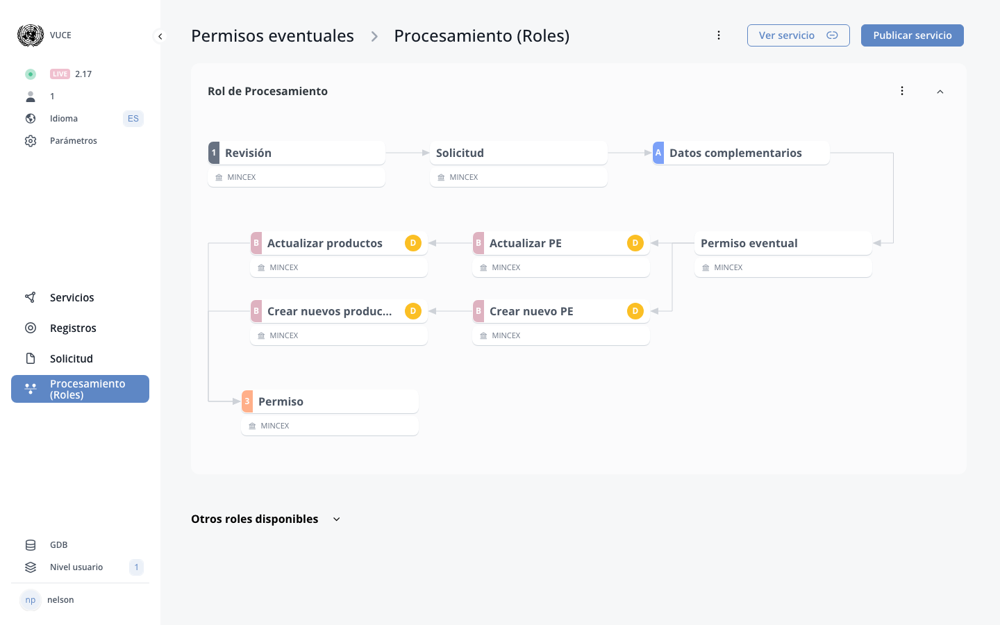

# Part B (Processing)

!!! info "Update Summary (8 changes detected)"
    Expanded documentation for the processing/operator side of eRegistrations.
    The original manual references 'Part B' in multiple places: section I (Settings) mentions 'Part B system actions', 'Part B system buttons', 'visible in Part B', and 'show print buttons on Part B'; section F (Roles) describes processing roles including revision and approval; section II.C (DS) describes operators processing pages.
    However, Part B as a comprehensive concept is not given its own dedicated section.
    This new section consolidates and expands Part B documentation, covering system actions, system buttons, operator-side form visibility, and processing workflow features.
    The MCP tools include componentaction_get_system_actions endpoint which lists built-in system button actions available for form components.
    8 blocks identified.

<!-- Live BPA Screenshot: live-part-b -->

{ loading=lazy }
*Current BPA view (2026-02-15) — [Part B (Processing)](https://bpa.cuba.eregistrations.org/services/2c918084887c7a8f01887c99ed2a6fd5/roles){ target=_blank }*
*Part B configuration is done within the roles/processing section.*

<!-- /Live BPA Screenshot: live-part-b -->

## Overview of Part B (Processing)

!!! success "New Feature"
    The manual references Part B in scattered locations but does not provide a consolidated overview. This overview block brings together the various Part B references from sections F (Roles), I (Settings), and II.C (DS Operators processing pages) into a single introductory block. The concept of Part B as the operator side is well-established in the platform.

Part B refers to the processing/operator side of an eRegistrations service. While Part A is the applicant-facing side (the application file with its guide, form, documents, payment, and send pages), Part B is the operator-facing side where processing roles review, validate, and act on submitted applications.

Part B encompasses:
- The operator processing pages (file list, processing page, revision page).
- System actions and buttons available to operators.
- Form components and data visible to operators during processing.
- Configuration of what applicant data is visible or editable in Part B.
- Automated actions triggered during processing (BOT roles).

Part B is configured through the Roles section (section F) of the BPA and is accessed by operators through the Display System (DS).

<!-- Screenshot needed: Overview screenshot of the Part B interface as seen by an operator, showing the main layout and navigation elements. -->

---

## Part B System Actions

!!! success "New Feature"
    The MCP tool componentaction_get_system_actions is described as 'List built-in system button actions available for form components' and returns 'actions list (id, name, category), count, note'. This confirms the existence of system actions as a platform feature. The original manual's Settings section mentions 'enabling BPA system buttons in Part B' but does not list or describe the available system actions.

Part B system actions are built-in actions that can be triggered during the processing workflow. These are pre-defined actions provided by the platform (as opposed to custom BOT actions created by the analyst).

System actions are available for form components and can be assigned to buttons, fields, or blocks within processing role forms. They provide standard processing functionality without requiring custom BOT configuration.

The list of available system actions can be viewed through the system actions interface. Each action has an ID, name, and category.

<!-- Screenshot needed: Screenshot listing the available Part B system actions with their names and categories. -->

---

## Part B System Buttons

!!! question "Needs Verification — [Verify in BPA](https://bpa.cuba.eregistrations.org/services/2c918084887c7a8f01887c99ed2a6fd5/roles){ target=_blank }"
    The original manual's Settings section mentions 'enabling BPA system buttons in Part B' as a toggle under 'Buttons' in 'Pages, buttons and fields'. The Roles section describes statuses (0=pending, 1=passed, 2=send back, 3=rejected) which correspond to button actions. The exact list of system buttons and their behavior needs verification.

Part B system buttons are pre-defined buttons that can be enabled for operator processing forms. The service settings (section I) mention 'enabling BPA system buttons in Part B' as a toggle option.

System buttons may include:
- Approve/validate button
- Reject button
- Send back for correction button
- Print button
- Generate certificate button
- Other standard processing workflow buttons

These buttons are distinct from custom buttons created by the analyst in the form builder. They provide standardized processing functionality with built-in workflow logic.

<!-- Screenshot needed: Screenshot of the Part B system buttons as they appear to the operator, and the settings toggle for enabling them. -->

---

## Component Actions in Part B

!!! question "Needs Verification — [Verify in BPA](https://bpa.cuba.eregistrations.org/services/2c918084887c7a8f01887c99ed2a6fd5/roles){ target=_blank }"
    Component actions are confirmed by the MCP tool definitions: componentaction_save takes service_id, component_key, and an actions array with support for bot_id, bot_ids (multi-bot), sort_order, parallel, mandatory, json_determinants, multiple_bot, and multiple_field_key. The original manual describes BOT actions on buttons, fields, and blocks (section E) but does not detail all the configuration options revealed by the MCP tool definitions. Some of these features may be specific to Part B processing forms.

Component actions define how BOTs and system actions are linked to form components in Part B. Each form component (button, field, or block) can have actions attached to it that execute when the component is interacted with or rendered.

Component actions support:
- Linking a single BOT to a component.
- Linking multiple BOTs to execute in sequence or concurrently (parallel execution).
- Linking system actions to buttons.
- Configuring sort order for multiple actions on the same component.
- Making actions mandatory or optional.
- Applying determinant conditions to control when actions execute.
- Multiple BOT execution with a field key selector for dynamic BOT selection.

Actions are configured per component and are specific to the service.

<!-- Screenshot needed: Screenshot of the component action configuration interface showing options for BOT linking, parallel execution, and determinant conditions. -->

---

## Part B Form Visibility Configuration

!!! success "New Feature"
    The original manual's Settings section (section I) explicitly mentions 'Option to make blocks/fields visible in Part A and Part B based on registration linkage' under 'Blocks and fields' in service settings. This is documented but only briefly mentioned. This block expands on the concept for the Part B section.

The service settings allow configuration of which form components are visible in Part B. Under 'Pages, buttons and fields' in service settings, there is an option to 'make blocks/fields visible in Part A and Part B based on registration linkage.'

This means:
- Some form components can be configured to appear only in the applicant form (Part A).
- Some components can be configured to appear only in the operator processing form (Part B).
- Some components can appear in both Part A and Part B.

The visibility is typically controlled through the block or field configuration, where the analyst can specify which part the component belongs to.

<!-- Screenshot needed: Screenshot showing the Part A/Part B visibility toggle for a block or field in the form builder, and the corresponding service settings option. -->

---

## Part B Print Functionality

!!! question "Needs Verification — [Verify in BPA](https://bpa.cuba.eregistrations.org/services/2c918084887c7a8f01887c99ed2a6fd5/roles){ target=_blank }"
    The original manual's Settings section mentions 'show print buttons on Guide and Part B' as a toggle option. The exact print capabilities available in Part B need to be documented. The print functionality likely uses the print document templates described in the MCP tools (print_document_list, print_document_get, etc.).

The service settings mention 'show print buttons on Part B' as a configuration option. When enabled, operators can print application data, documents, or certificates directly from the processing page.

Print functionality in Part B may include:
- Printing the complete application file.
- Printing specific documents or certificates.
- Printing a summary of the processing history.

The print button appearance and behavior need verification.

<!-- Screenshot needed: Screenshot of the print button in Part B and the resulting print dialog or preview. -->

---

## Processing Role Form in Part B

!!! question "Needs Verification — [Verify in BPA](https://bpa.cuba.eregistrations.org/services/2c918084887c7a8f01887c99ed2a6fd5/roles){ target=_blank }"
    The original manual describes processing role forms in section F (Roles) and II.C (DS Operators processing pages). This block consolidates that information for the Part B section. The form builder capabilities for Part B may have expanded since the original manual. A reviewer should verify if there are new component types or features available specifically for Part B forms.

Each processing role (human role) has a form that defines what the operator sees and can do. This form is built in the BPA using the same form builder as the applicant form, but it serves a different purpose.

The processing role form in Part B can include:
- Display components showing applicant data (read-only or editable).
- Action buttons linked to BOTs or system actions.
- Data entry fields for operator-added information.
- Document generation and display components.
- Approval/rejection/send-back controls.

The form is configured under the 'Form' tab of each role in the Roles section (section F).

<!-- Screenshot needed: Screenshot of a processing role form being built in the BPA, showing the available components and configuration options for Part B. -->

---

## Part B Data Revision Features

!!! question "Needs Verification — [Verify in BPA](https://bpa.cuba.eregistrations.org/services/2c918084887c7a8f01887c99ed2a6fd5/roles){ target=_blank }"
    The original manual describes revision roles (section F.3) with documents revision and data revision tabs, and mentions 'revision by field' in service settings. There may have been enhancements to the data revision capabilities. A reviewer should verify the current state of Part B data revision features.

Part B includes data revision capabilities where operators can review applicant-submitted data field by field. The original manual mentions 'revision by field' as a service setting toggle and describes the revision role workflow.

Enhanced data revision features in Part B may include:
- Field-by-field verification with approve/reject per field.
- Side-by-side comparison of submitted data with previous versions.
- Inline editing capabilities for operators to correct data.
- Batch approval or rejection of multiple fields.

The data revision features and any enhancements since the original manual need verification.

<!-- Screenshot needed: Screenshot of the Part B data revision interface showing field-by-field verification. -->

---
